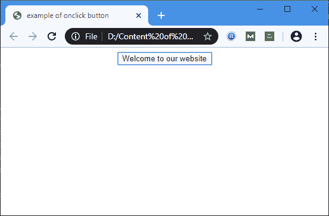

# HTML

> 原文：<https://www.javatpoint.com/html-button-onclick>

**Html <按钮 onclick = ">**是一个事件属性，点击按钮时会执行一个脚本。所有浏览器都支持该属性。它还用于在单击按钮时调用函数。

### 语法:

```html

<button onclick=" single value script">

```

### 示例:

**示例 1:以下示例描述了如何使用按钮标签:**

```html

<!DOCTYPE HTML> 
<html> 
<head>  
<title> 
example of onclick button
</title> 
<script> 
function welcome() { 
window.open("https://www.javatpoint.com/");
} 
</script> 
</head> 
<body style = "text-align:center"> 
<button onclick="welcome()"> Welcome to our website </button>         
</body> 
</html>       

```

[Test it Now](https://www.javatpoint.com/oprweb/test.jsp?filename=html-button-onclick)

**输出:**



## 浏览器支持

| 元素 | 铬 |  IE |  Firefox | 歌剧 |  Safari |
| <【onclick】> | 是 | 是 | 是 | 是 | 是 |

* * *