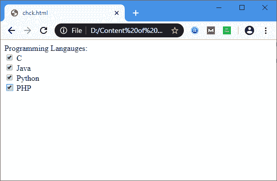

# HTML <checkbox>标签</checkbox>

> 原文：<https://www.javatpoint.com/html-checkbox-tag>

**HTML <复选框>标签**用于定义方块。它是一个表单元素，允许用户从给定的选项中选择一个或多个选项。

它是由输入> 元素的 **<的**类型**属性创建的，如下语法所示:**

```

<input type="checkbox" name="field name" value="Initial value">  

```

如果我们想默认选择任何复选框，那么我们必须用“是”值设置选中的属性，如下语法所述:

```

 <input type="checkbox" name="field name" value="Initial value" checked="yes">  

```

### 例子

```

<html>
<head>
</head>
<body>
<form>
Programming Languages: <br>  
              <input type="checkbox" id="C" name="C" value="C"/>  
                 <label>C</label> <br>  
              <input type="checkbox" id="Java" name="Java" value="Java" checked=?yes?/>  
                 <label>Java</label> <br>  
              <input type="checkbox" id="Python" name="Python" value="Python"/>  
                 <label>Python</label> <br>
	     <input type="checkbox" id="PHP" name="PHP" value="PHP"/>  
                 <label>PHP</label>
</form>
</body>
</html>

```

[Test it Now](https://www.javatpoint.com/oprweb/test.jsp?filename=html-checkbox-tag)

**输出:**



## 浏览器支持

| 元素 | 铬 |  IE |  Firefox | 歌剧 |  Safari |
| **<复选框>** | 是 | 是 | 是 | 是 | 是 |

* * *