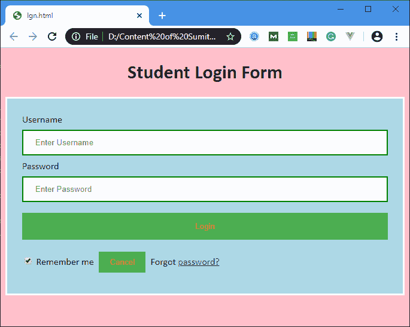

# Html 登录表单

> 原文：<https://www.javatpoint.com/html-login-form>

下面的代码描述了如何使用 CCS 创建响应登录表单:

```

<!DOCTYPE html> 
<html> 
<head>
<meta name="viewport" content="width=device-width, initial-scale=1">
<title> Login Page </title>
<style> 
Body {
  font-family: Calibri, Helvetica, sans-serif;
  background-color: pink;
}
button { 
       background-color: #4CAF50; 
       width: 100%;
        color: orange; 
        padding: 15px; 
        margin: 10px 0px; 
        border: none; 
        cursor: pointer; 
         } 
 form { 
        border: 3px solid #f1f1f1; 
    } 
 input[type=text], input[type=password] { 
        width: 100%; 
        margin: 8px 0;
        padding: 12px 20px; 
        display: inline-block; 
        border: 2px solid green; 
        box-sizing: border-box; 
    }
 button:hover { 
        opacity: 0.7; 
    } 
  .cancelbtn { 
        width: auto; 
        padding: 10px 18px;
        margin: 10px 5px;
    } 

 .container { 
        padding: 25px; 
        background-color: lightblue;
    } 
</style> 
</head>  
<body>  
    <center> <h1> Student Login Form </h1> </center> 
    <form>
        <div class="container"> 
            <label>Username : </label> 
            <input type="text" placeholder="Enter Username" name="username" required>
            <label>Password : </label> 
            <input type="password" placeholder="Enter Password" name="password" required>
            <button type="submit">Login</button> 
            <input type="checkbox" checked="checked"> Remember me 
            <button type="button" class="cancelbtn"> Cancel</button> 
            Forgot <a href="#"> password? </a> 
        </div> 
    </form>   
</body>   
</html>

```

[Test it Now](https://www.javatpoint.com/oprweb/test.jsp?filename=html-login-form)

**输出:**



* * *