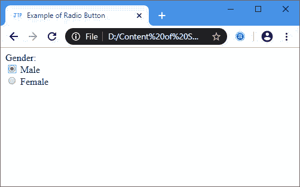

# HTML <radio>标签</radio>

> 原文：<https://www.javatpoint.com/html-radio-tag>

**HTML <单选>** 按钮用于定义小圆圈，选中时高亮显示。它是一个表单元素，允许用户从给定的选项集中只选择一个选项。

它是由输入> 元素的 **<的**类型**属性创建的，如下语法所示:**

```

<input type="radio" name ="Any_name"/>

```

### 例子

```

html>
<head>
</head>
<title> Example of Radio Button</title>
<body>
<form>

<label>
Gender: 
</label>  <br>
<input type="radio" id="gender" name="gender" value="male"/> Male  
<br>
<input type="radio" id="gender" name="gender" value="female"/> Female <br/> 
</form>  
</body>
</html>

```

[Test it Now](https://www.javatpoint.com/oprweb/test.jsp?filename=html-radio-tag)

**输出:**



## 浏览器支持

| 元素 | 铬 |  IE |  Firefox | 歌剧 |  Safari |
| **<电台>** | 是 | 是 | 是 | 是 | 是 |

* * *