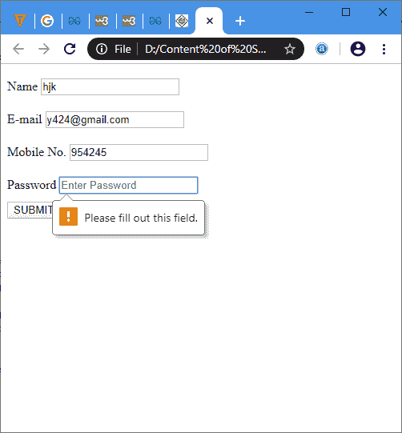
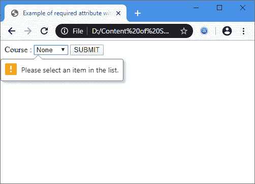
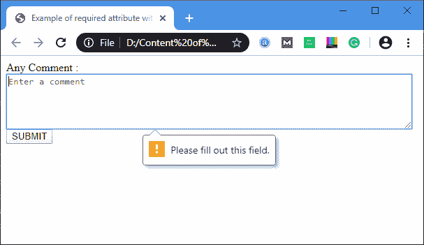

# HTML 必需属性

> 原文:[https://www.javatpoint.com/html-required-attribute](https://www.javatpoint.com/html-required-attribute)

**HTML 必选属性**是一个布尔属性，指定在提交表单之前必须填写输入元素。此属性与以下元素一起使用:

1.  <input>
2.  <textarea></li> </ol> <h3 class="h3"><input/></h3> 
我们可以很容易地将所需的属性与<input/>元素一起使用，如下语法所示:
 
<pre name="code" class="xml"> <input required> </pre>
 
<strong>例</strong>
 
<pre name="code" class="xml"> <html> <head> <title> Example of required attribute with input element </title>  <head> <body> <form> 
 <label>Name</label> <input type="text" placeholder="Enter Name" name="name" required> 
 
 <label> E-mail </label> <input type="email" placeholder="Enter email ID" name="email" required> 
 
 <label> Mobile No. </label> <input type="text" placeholder="Enter Your Mobile No." name="mobileno" required> 
 
 <label>Password</label> <input type="password" placeholder="Enter Password" name="psw" required>   
 <button type="submit" VALUE="SUBMIT"> SUBMIT </button> </form> </body> </html> </pre>
 <a href="https://www.javatpoint.com/oprweb/test.jsp?filename=html-required-attribute" target="_blank">Test it Now</a> 
<strong>输出:</strong>
  <h3 class="h3"><select/></h3> 
我们可以很容易地使用所需的属性与<strong> <选择> </strong>元素，如下语法所示:
 
<pre name="code" class="xml"> <select required> </pre>
 
<strong>例</strong>
 
<pre name="code" class="xml"> <html> <head> <title> Example of required attribute with select option </title>  <head> <body> <form> <label> Course : </label> <select required> <option value="">None</option> <option value="BCA">BCA</option> <option value="BBA">BBA</option> <option value="B.Tech">B.Tech</option> <option value="MBA">MBA</option> <option value="MCA">MCA</option> <option value="M.Tech">M.Tech</option> </select> <button type="submit" VALUE="SUBMIT"> SUBMIT </button> </form> </body> </html> </pre>
 <a href="https://www.javatpoint.com/oprweb/test.jsp?filename=html-required-attribute2" target="_blank">Test it Now</a> 
<strong>输出:</strong>
  <h3 class="h3"><textarea/></h3> 
我们还可以很容易地将所需的属性与<strong> <文本区域> </strong>元素一起使用，如下语法所示:
 
<pre name="code" class="xml"> <textarea required> </pre>
 
<strong>例</strong>
 
<pre name="code" class="xml"> <html> <head> <title> Example of required attribute with textarea </title>  <head> <body> <form> Any Comment :   <textarea cols="80" rows="5" placeholder="Enter a comment" value="address" required> </textarea> <button type="submit" VALUE="SUBMIT"> SUBMIT </button> </form> </body> </html> </pre>
 <a href="https://www.javatpoint.com/oprweb/test.jsp?filename=html-required-attribute3" target="_blank">Test it Now</a> 
<strong>输出:</strong>
  <h2 class="h3">浏览器支持</h2> <table class="alt"> <tr><td>元素</td><td>铬</td><td> IE</td><td> Firefox</td><td>歌剧</td><td> Safari</td></tr> <tr><td><strong> <必选> </strong></td><td>是</td><td>是</td><td>是</td><td>是</td><td>是</td></tr> </table> 
       </body> </html></textarea>