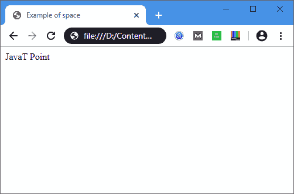

# HTML 空间代码

> 原文：<https://www.javatpoint.com/html-space-code>

有多种方法可以在单词或字符之间插入空格:

## 使用空格键

要在单词之间添加空格，首先我们必须单击要添加空格的位置，然后按空格键。HTML 文档在单词之间只使用一个空格。简单地说，如果我们多次按空格键，那么它将在浏览器上只显示单词之间的一个空格，如下例所述:

### 例子

```html

<head>
<title>
 Example of space 
</title>
<head>
<body>
JavaT   Point
</body>
</html>

```

[Test it Now](https://www.javatpoint.com/oprweb/test.jsp?filename=html-space-code1)

在这个例子中，我们多次按空格键，但是下面的输出只显示了 JavaT 和 Point 之间的一个空格。

### 使用&ampnbsp;

**T2**是在 HTML 文档中使用的非中断空间。这是最常用的间距方法，可以防止线条断裂。以下示例确定了如何使用&:

### 例子

```html

<html>
<head>
<title>
 Example of space 
</title>
<head>
<body>
JavaT  &ampnbsp; &ampnbsp; &ampnbsp; &ampnbsp;  Point
</body>
</html>

```

[Test it Now](https://www.javatpoint.com/oprweb/test.jsp?filename=html-space-code2)

**输出:**



## 浏览器支持

| 元素 | 铬 |  IE |  Firefox | 歌剧 |  Safari |
| **<太空>** | 是 | 是 | 是 | 是 | 是 |

* * *