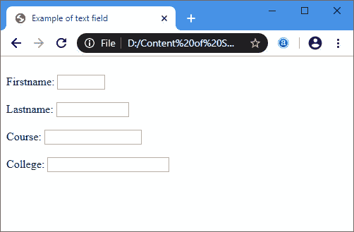

# Html <text>标签</text>

> 原文:[https://www.javatpoint.com/html-text-tag](https://www.javatpoint.com/html-text-tag)

**Html <文本>标签**用于定义网页上的单行文本字段。当我们将值文本设置为输入元素的 type 属性时，如下语法所示:

### 语法:

```

<input type="text" name="firstname"/> 

```

### 例子

```

<html>
<head>
<title> Example of text field </title>
</head>
<body>
<form>
<br>  
<label>
Firstname:
</label> 
<input type="text" name="FN" size="5"/>  
<br>
<br>
<label>
Lastname:
</label>         
<input type="text" name="LN" size="10"/>
<br> 
<br>
<label>
Course:
</label>  
<input type="text" name="Course" size="15"/>  
<br> 
<br>
<label>
College:
</label>  
<input type="text" name="Course" size="20"/>            
</form>
</body>
</html>

```

[Html text tag](https://www.javatpoint.com/oprweb/test.jsp?filename=html-text-tag)

**输出:**



## 文本标签的属性

### 1.大小

**大小**属性用于定义文本字段的长度。该属性接受大于零的数值。如果不指定此属性，默认情况下，它的值为 20。以下语法决定了如何使用该属性:

```

<input type="text" name="firstname" size="Any_numeric_value" /> 

```

### 2.价值

**值**属性用于定义值，显示在文本字段中。以下语法决定了如何使用该属性:

```

<input type="text" name="firstname" value=?Any_value? /> 

```

### 3\. 最大长度

**最大长度**属性用于定义一个值。该值标识输入可接受的最大字符数。以下语法决定了如何使用该属性:

```

<input type="text" name="firstname" maxlength="5" /> 

```

### 4\. 最小长度

**最大长度**属性用于定义一个值。该值标识输入可接受的最小字符数。以下语法决定了如何使用该属性:

```

<input type="text" name="firstname" minlength="5" /> 

```

## 浏览器支持

| 元素 | 铬 |  IE |  Firefox | 歌剧 |  Safari |
| **<文字>** | 是 | 是 | 是 | 是 | 是 |

* * *