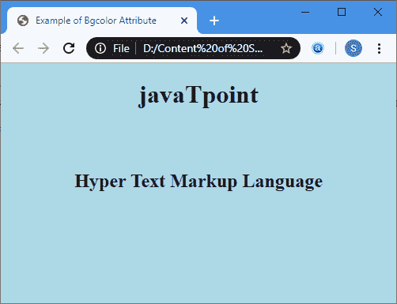
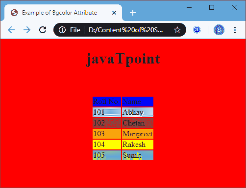
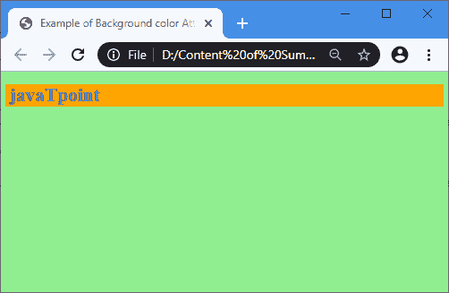

# 背景色

> 原文:[https://www.javatpoint.com/html-background-color](https://www.javatpoint.com/html-background-color)

**< bgcolor >** 是设置 HTML 元素背景颜色的属性。此属性用于以下标签:

*   **<体>**
*   **<表>**
*   **<选框>**
*   **< td >**
*   **<第>**
*   <【tr】>

### 句法

```

<"tag" bgcolor="Color_name|rgb number|Hex number">

```

**示例:**以下示例在不同的标签中使用了< bgcolor >属性。

**示例 1:** 将< bgcolor >属性与<主体>标记一起使用

```

<!DOCTYPE html>  
<html>   
<head>  
<title>  
Example of Background color Attribute  
</title>  
</head>  
<body  bgcolor="lightblue"> 
<!-- The attribute bgcolor use with the body tag to set the background of web page as lightblue --> 
<center>  
<h1> javaTpoint</h1>    
<br> <br>
<center>
<h2> Hyper Text Markup Language </h2>  
</center>  
</body>  
</html>

```

[Test it Now](https://www.javatpoint.com/oprweb/test.jsp?filename=html-background-color)

**输出:**



**示例 2:** 将< bgcolor >属性与< tr >标记一起使用

```

<!DOCTYPE html>  
<html>   
<head>  
<title>  
    Example of Bgcolor Attribute  
</title>  
</head>  
<body  bgcolor="red"> 
<!-- The attribute bgcolor use with the 'body' tag to set the background of web page as red --> 
<center>  
<h1> javaTpoint</h1>    
<br>
<br>
<center>
<table>
<!-- The attribute bgcolor use with the 'tr' tag to set the background of table rows by different colors --> 
	<tr bgcolor="blue">
		<td> Roll No. </td>
		<td> Name </td>
	</tr>
	<tr bgcolor="lightblue">
		<td> 101 </td>
		<td> Abhay </td>
	</tr>
	<tr bgcolor="brown">
		<td> 102 </td>
		<td> Chetan </td>
	</tr>
	<tr bgcolor="orange">
		<td> 103 </td>
		<td> Manpreet </td>
	</tr>
	<tr bgcolor="yellow">
		<td> 104 </td>
		<td> Rakesh </td>
	</tr>
	<tr bgcolor="lightgreen">
		<td> 105 </td>
		<td> Sumit </td>
	</tr>
</table>
</center>  
</body>  
</html>

```

[Test it Now](https://www.javatpoint.com/oprweb/test.jsp?filename=html-background-color2)

**输出:**



**示例 3:** 以下示例使用带有 **<选框>** 标记的 **< bgcolor >** 属性。

```

<!DOCTYPE html>  
<html>   
<head>  
<meta name="viewport" content="width=device-width, initial-scale=1"> 
<title>  
Example of Background color Attribute  
</title>  
</head>  
<body  bgcolor="lightgreen"> 
<!-- The attribute bgcolor use with the body tag to set the background of web page as lightgreen --> 

<h1> <font color="blue">
 <marquee bgcolor="orange"> 
 <!-- The attribute bgcolor use with the marquee tag to set the background of marquee as orange --> 
 javaTpoint
</marquee>  
</font>
</h1> 
</body>  
</html>

```

[Test it Now](https://www.javatpoint.com/oprweb/test.jsp?filename=html-background-color3)

**输出:**



## 浏览器支持

| 元素 | 铬 |  IE |  Firefox | 歌剧 |  Safari |
| **<【bgcolor】>** | 是 | 是 | 是 | 是 | 是 |

* * *