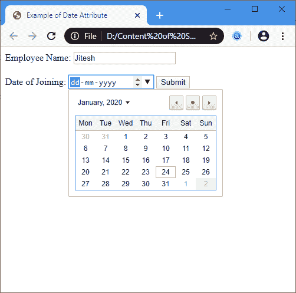

# HTML 日期

> 原文：<https://www.javatpoint.com/html-date>

**日期**是输入> 元素的**类型**属性的值。它创建了一个日历，允许用户选择日期。结果值包括**日、月**和**年**。

### 句法

```

<input type="Date">

```

**示例 1:** 以下示例介绍了如何在 **<中使用日期输入>** 标记:

```

<!DOCTYPE html> 
<html>
<head> 
<title>
Example of Date Attribute
</title>
</head>
<body> 
<form> 
Employee Name: <input type="text" placeholder="Enter Your name" Required>
<br>
<br>
Date of Joining: <input type = "date"> 
<button type="submit" name="btn">Submit</button>
</form> 
</body>
</html>  

```

[Test it Now](https://www.javatpoint.com/oprweb/test.jsp?filename=html-date)

**输出:**



**示例 2:** 以下示例使用 JavaScript 代码显示表单中输入的日期。

```

<!DOCTYPE html>
<html> 
<head> 
<title> Example of Date Attribute </title> 
<script> 
function viewdate() { 
var x = document.getElementById("dob").value; 
document.getElementById("demo").innerHTML = x; 
</script> 
</head> 
<body> 
Employee Name: <input type="text" placeholder="Your Good name"/> 
<br>
<br>
Date of Joining: 
<input type="date" id="dob">
<br> 
<button onclick="viewdate()"> Submit 
</button> 
<br>
<h2 id="demo"> </h2> 
</body> 
</html>

```

[Test it Now](https://www.javatpoint.com/oprweb/test.jsp?filename=html-date2)

**输出:**


## 浏览器支持

| 元素 | 铬 |  IE |  Firefox | 歌剧 |  Safari |
| **< type="Date" >** | 是 | 是 | 是 | 是 | 是 |

* * *