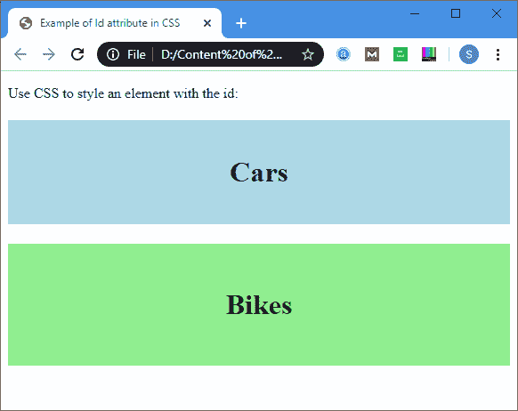

# HTML标识属性

> 原文：<https://www.javatpoint.com/html-id-attribute>

**标识属性**用于为 HTML 文档的一个元素指定唯一的标识。它分配唯一标识符，该标识符由 **CSS** 和 **JavaScript** 用于执行特定任务。

#### 注意:在级联样式表(CSS)中，我们可以通过使用#符号后跟 id 来轻松选择具有特定 id 的元素。

#### 注意:JavaScript 可以通过使用 getElementById()方法访问具有给定 ID 的元素。

### 句法

```
<tag id="value">

```

**示例 1:** 下面的示例描述了如何在 CSS 文档中使用 id 属性:

```
<!DOCTYPE html>
<html>
<head>
<title>
Example of Id attribute in CSS
</title>
<style>
#Cars {
padding: 40px;
background-color: lightblue;
color: black;    
text-align: center;
} 

#Bikes
{
padding: 50px;
background-color: lightGreen;
text-align: center;
}
</style>
</head>
<body>
<p> Use CSS to style an element with the id: </p>
<h1 id="Cars"> Cars </h1>
<h1 id="Bikes"> Bikes </h1>
</body>
</html> 

```

[Test it Now](https://www.javatpoint.com/oprweb/test.jsp?filename=html-id-attribute)

**输出:**



**示例 2:** 下面的示例描述了如何在 JavaScript 中使用 ID 属性。

```
<!DOCTYPE html>
<html> 
<head> 
<title> Date Attribute </title> 
<script> 
function viewdate() { 
var x = document.getElementById("dob").value; 
document.getElementById("demo").innerHTML = x; 
</script> 
</head> 
<body> 
Employee Name: <input type="text" placeholder="Your Good name"/> 
<br>
<br>
Date of Joining: 
<input type="date" id="dob">
<br> 
<button onclick="viewdate()"> Submit 
</button> 
<br>
<h2 id="demo"> </h2> 
</body> 
</html>

```

[Test it Now](https://www.javatpoint.com/oprweb/test.jsp?filename=html-id-attribute2)

**输出:**


## 浏览器支持

| 元素 | 铬 |  IE |  Firefox | 歌剧 |  Safari |
| **< id >** | 是 | 是 | 是 | 是 | 是 |

* * *