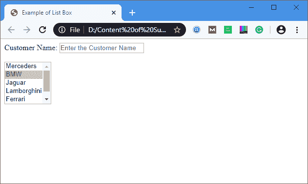
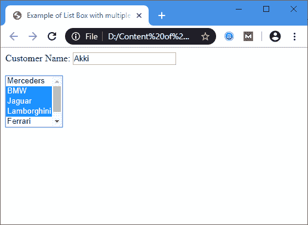

# html 列表框

> 原文：<https://www.javatpoint.com/html-list-box>

**列表框**是 HTML 文档中的图形控制元素，允许用户从选项列表中选择一个或多个选项。

### 句法

要创建列表框，使用 [HTML 元素](https://www.javatpoint.com/html-elements) **<选择>** ，其中包含两个属性**名称**和**大小**。**名称**属性用于定义调用列表框的名称，**大小**属性用于指定显示其包含多少选项的数值。

```

<select Name="Name_of_list_box" Size="Number_of_options">
  <option> List item 1 </option>
  <option> List item 2 </option>
  <option> List item 3 </option>
  <option> List item N </option>
</select>

```

### 示例:

**示例 1:** 考虑下面创建简单列表框的示例。

```

<!DOCTYPE html>  
<html>  
<title>
Example of List Box
</title>
<body>  
Customer Name:  <input type="text" Placeholder="Enter the Customer Name"/>
<br>
<br>
<select name="Cars" size="5">
    <option value="Merceders"> Merceders </option>
    <option value="BMW"> BMW </option>
    <option value="Jaguar"> Jaguar </option>
    <option value="Lamborghini"> Lamborghini </option>
    <option value="Ferrari"> Ferrari </option>
    <option value="Ford"> Ford </option>
</select>
</body>  
</html>  

```

[Test it Now](https://www.javatpoint.com/oprweb/test.jsp?filename=html-list-box)

**输出:**



**示例 2:** 以下示例使用**多个**属性来选择列表中的多个选项。我们可以通过按住 ctrl 键从列表框中选择多个选项。

```

<!DOCTYPE html>  
<html>  
<title>
Example of List Box with multiple attribute
</title>
<body>  
Customer Name:  <input type="text" Placeholder="Enter the Customer Name"/>
<br>
<br>
<select name="Cars" size="5" multiple="multiple">
    <option value="Merceders"> Merceders </option>
    <option value="BMW"> BMW </option>
    <option value="Jaguar"> Jaguar </option>
    <option value="Lamborghini"> Lamborghini </option>
    <option value="Ferrari"> Ferrari </option>
    <option value="Ford"> Ford </option>
</select>
</body>  
</html>  

```

[Test it Now](https://www.javatpoint.com/oprweb/test.jsp?filename=html-list-box2)

**输出:**



* * *