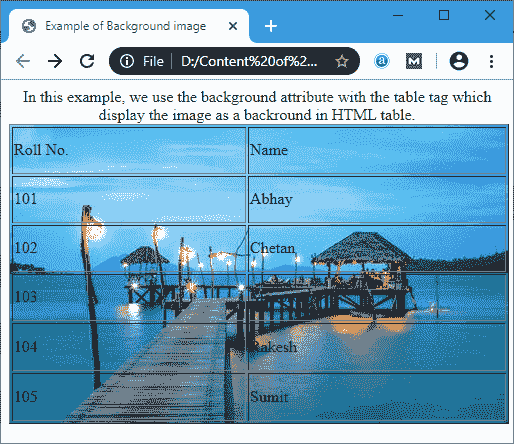
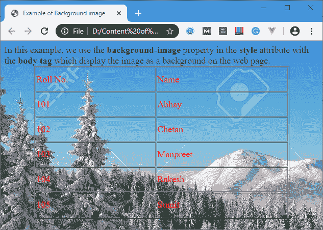
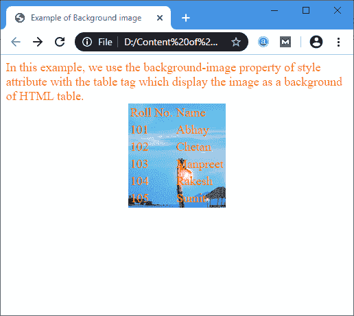
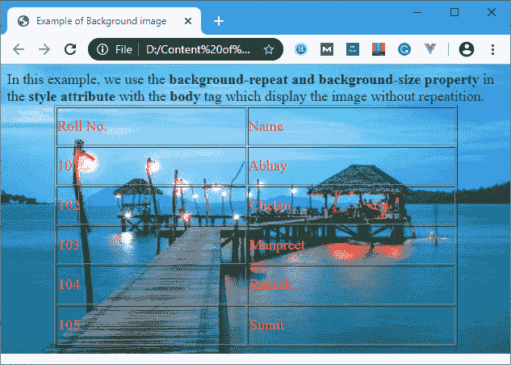

# HTML 背景图像

> 原文：<https://www.javatpoint.com/html-background-image>

**HTML** 文档中的 **<背景>** 属性用于指定 HTML 页面或表格上的背景图像。您可以将图像的路径作为**背景属性**的值传递，以设置您的 HTML 页面或表格的图像。

### 句法

```html

<tag background="Path_of_an_image">

```

#### 注意:HTML5 不支持背景属性。使用以下 CSS 语法:

```html

<tag style="background-image:Path_of_an_image)">

```

**示例:**以下示例以不同的样式设置背景图像:

**示例 1:** 本示例使用带有[身体标签](https://www.javatpoint.com/html-body-tag)的**背景**属性来显示图像作为网页的背景。

```html

<!DOCTYPE html>
<html>
<head>
<title> 
Example of Background image
</title>
</head>
<body background="https://previews.123rf.cimg/kotenko/kotenko1403/kotenko140300008/26854631-snowy-winter-in-a-mountain-forest-sunny-cold-day-with-snow-covered-trees-carpathian-mountains-ukrain.jpg">

<font color="red">
<h1> click on this <a href="https://www.javatpoint.com/"> link </a> for the Home page of Our Website </h1>
</font>
</body>
</html>

```

[Test it Now](https://www.javatpoint.com/oprweb/test.jsp?filename=htmlBackgroundImage1)

**输出:**


**示例 2:** 本示例使用带有[表格标签](https://www.javatpoint.com/html-table)的**背景**属性，将图像显示为 [html](https://www.javatpoint.com/html-tutorial) 表格的背景。

```html

<!DOCTYPE html>  
<html>   
<head>  
<title>  
    Example of Background image 
</title>  
</head>  
<body>
<center>

In this example, we use the background attribute with the table tag, which displays the image as a background of the HTML table. 

<table background="https://images.pexels.com/photos/237272/pexels-photo-237272.jpeg?auto=compress&cs=tinysrgb&dpr=1&w=500" height="300" border="1" width="500">

	<tr>
		<td> Roll No. </td>
		<td> Name </td>
	</tr>
	<tr>
		<td> 101 </td>
		<td> Abhay </td>
	</tr>
	<tr>
		<td> 102 </td>
		<td> Chetan </td>
	</tr>
	<tr>
		<td> 103 </td>
		<td> Manpreet </td>
	</tr>
	<tr>
		<td> 104 </td>
		<td> Rakesh </td>
	</tr>
	<tr>
		<td> 105 </td>
		<td> Sumit </td>
	</tr>
</table>
</center>  
</body>  
</html>

```

[Test it Now](https://www.javatpoint.com/oprweb/test.jsp?filename=htmlBackgroundImage2)

**输出:**



**示例 3:** 本示例将 [CSS 语法](https://www.javatpoint.com/css-syntax)用于带有正文标签的样式属性的**背景图像**属性。

```html

<!DOCTYPE html>  
<html>   
<head>  
<title>  
    Example of Background image 
</title>  
</head>  

<body style="background-image:url('https://previews.123rf.cimg/kotenko/kotenko1403/kotenko140300008/26854631-snowy-winter-in-a-mountain-forest-sunny-cold-day-with-snow-covered-trees-carpathian-mountains-ukrain.jpg');"> 

<font size="4" color="green">

In this example, we use the <b> background-image </b> property in the <b>style</b> attribute with the <b> body tag </b> which display the image as a background on the web page. 

</font>
<center>
<font size="4" color="red">
<table height="300" border="1" width="500">
	<tr>
		<td> Roll No. </td>
		<td> Name </td>
	</tr>
	<tr>
		<td> 101 </td>
		<td> Abhay </td>
	</tr>
	<tr>
		<td> 102 </td>
		<td> Chetan </td>
	</tr>
	<tr>
		<td> 103 </td>
		<td> Manpreet </td>
	</tr>
	<tr>
		<td> 104 </td>
		<td> Rakesh </td>
	</tr>
	<tr>
		<td> 105 </td>
		<td> Sumit </td>
	</tr>
</table>
</font>
</center>  
</body>  
</html>

```

[Test it Now](https://www.javatpoint.com/oprweb/test.jsp?filename=htmlBackgroundImage3)

**输出:**



**示例 4:** 本示例使用带有表格标签的样式属性中的背景图像属性的 [CSS](https://www.javatpoint.com/css-tutorial) 语法。

```html

<!DOCTYPE html>  
<html>   
<head>  
<title>  
    Example of Background image 
</title>  
</head>  
<body>
<font size="4" color="orange">
In this example, we use the <b> background-image property </b> in the <b> style attribute </b> with the <b> table tag </b> which display the image as a background of HTML table. 
</font>
<font size="4" color="red">
<center>

<table style="background-image:url('https://images.pexels.com/photos/237272/pexels-photo-237272.jpeg?auto=compress&cs=tinysrgb&dpr=1&w=500');"> 
	<tr>
		<td> Roll No. </td>
		<td> Name </td>
	</tr>

	<tr>
		<td> 101 </td>
		<td> Abhay </td>
	</tr>
	<tr>
		<td> 102 </td>
		<td> Chetan </td>
	</tr>
	<tr>
		<td> 103 </td>
		<td> Manpreet </td>
	</tr>
	<tr>
		<td> 104 </td>
		<td> Rakesh </td>
	</tr>
	<tr>
		<td> 105 </td>
		<td> Sumit </td>
	</tr>
</table>
</center>  
</font>
</body>  
</html>

```

[Test it Now](https://www.javatpoint.com/oprweb/test.jsp?filename=htmlBackgroundImage4)

**输出:**



**示例 5:** 本示例使用带有正文标签的样式属性的**背景重复和背景大小**属性的 CSS 语法。

```html

<!DOCTYPE html>  
<html>   
<head>  
<title>  
    Example of Background image 
</title>  
</head>  

<body style="background-image:url('https://images.pexels.com/photos/237272/pexels-photo-237272.jpeg?auto=compress&cs=tinysrgb&dpr=1&w=500'); 
background-repeat:no-repeat; background-size: 100% 100%"> 

<font size="4" color="green">

In this example, we use the <b> background-repeat and background-size property </b> in the <b> style attribute </b> with the <b> body </b> tag 
which display the image without repeatition. 

</font>
<center>

<font size="4" color="red">
<table height="300" border="1" width="500">
	<tr>
		<td> Roll No. </td>
		<td> Name </td>
	</tr>
	<tr>
		<td> 101 </td>
		<td> Abhay </td>
	</tr>
	<tr>
		<td> 102 </td>
		<td> Chetan </td>
	</tr>
	<tr>
		<td> 103 </td>
		<td> Manpreet </td>
	</tr>
	<tr>
		<td> 104 </td>
		<td> Rakesh </td>
	</tr>
	<tr>
		<td> 105 </td>
		<td> Sumit </td>
	</tr>
</table>
</font>
</center>  
</body>  
</html>

```

[Test it Now](https://www.javatpoint.com/oprweb/test.jsp?filename=htmlBackgroundImage5)

**输出:**



## 浏览器支持

| 元素 | 铬 |  IE |  Firefox | 歌剧 |  Safari |
| **背景图像** | 是 | 是 | 是 | 是 | 是 |

* * *