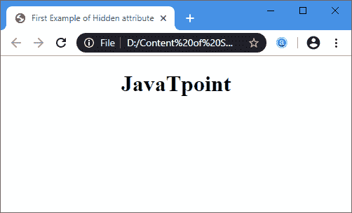
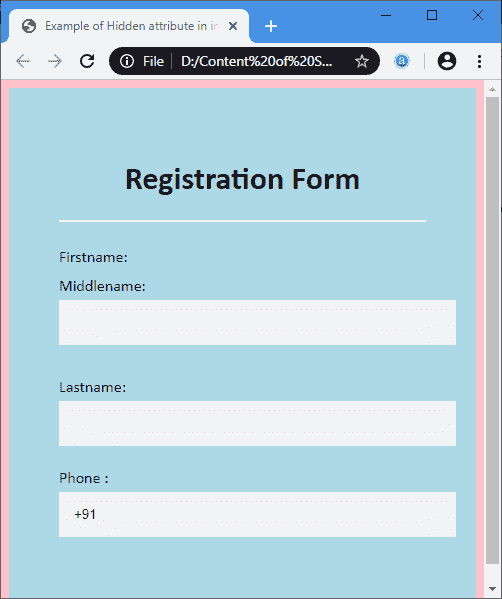

# 隐藏元素

> 原文:[https://www.javatpoint.com/html-hide-element](https://www.javatpoint.com/html-hide-element)

您可以使用布尔属性**隐藏元素的**来隐藏元素。当您在 [HTML](https://www.javatpoint.com/html-tutorial) 文件中指定隐藏属性时，浏览器将不会显示用该属性指定的元素。

### 句法

```

<element or tag hidden> Any statement or content </element or tag>

```

**示例:**指定以下示例是为了便于理解如何使用不同元素或标签的隐藏属性:

**示例 1:** 本示例使用带有[段落标记](https://www.javatpoint.com/html-paragraph)的隐藏属性。

```

<!DOCTYPE html>
<html>
<head>
<title> 
First Example of Hidden attribute
</title>
</head>
<body>
<center>
<h1> JavaTpoint </h1>
</center>
<p hidden> This paragraph should be hidden.
</p>
</body>
</html>

```

[Test it Now](https://www.javatpoint.com/oprweb/test.jsp?filename=HTMLHideElement1)

**输出:**



**示例 2:** 以下示例使用带有<输入类型=文本>元素的隐藏属性。

在这个例子中，我们使用了带有两个[输入标签](https://www.javatpoint.com/html-input-tag)的隐藏属性。当以下程序执行时，这些输入字段不会显示在网页上。

```

<!DOCTYPE html>
<html>
<head>
<meta name="viewport" content="width=device-width, initial-scale=1">
<title>
Example of Hidden attribute in input tag
</title>
<style>
/* The following tag selector body use the font-family and background-color properties for body of a page*/
body {
font-family: Calibri, Helvetica, sans-serif;
background-color: pink;
} 
/* Following container class used padding for generate space around it, and also use a background-color for specify the color lightblue as a background */  
.container {
padding: 50px;
background-color: lightblue;
}
/* The following tag selector input use the different properties for the text filed. */
input[type=text] {
  width: 100%;
  padding: 15px;
margin: 5px 0 22px 0;
 border: none;
 background: #f1f1f1;
}

input[type=text]:focus {
background-color: orange;
outline: none;
}
/* The following div tag selector is used to provide the space or gap between the content or elements on a web page. */
div {
            padding: 10px 0;
}    
hr {
  border: 1px solid #f1f1f1;
  margin-bottom: 25px;
}
</style>
</head>
<body>
<form>
<div class="container">
<center>  <h1> Registration Form</h1> </center>

<hr>
<label for="fn"> Firstname: </label> 
<!-- The following input field not display on the web page because the hidden attribute is used in this <input> tag. -->
<input hidden type="text"  name="firstname" id= "fn" size="15" required /> 
<div>
<label for="mn"> Middlename: </label> 
<input type="text" name="middlename" id="mn" size="15" required /> 
</div>
<label for="Ln"> Lastname: </label>  
<input type="text" name="lastname" id="Ln" size="15"required /> 

<label for="pn"> 
Phone :
</label>
<input type="text" name="country code" placeholder="Country Code"  value="+91" size="2"/> 
<!-- The following input field not display on the web page because it is also use the hidden attribute-->
<input hidden type="text"  name="phone" id="pn" size="10"/ required> 
</hr>
</div>
</form>
</body>
</html>

```

[Test it Now](https://www.javatpoint.com/oprweb/test.jsp?filename=HTMLHideElement2)

**输出:**



## 浏览器支持

| 元素 | 铬 |  IE |  Firefox | 歌剧 |  Safari |
| **<标记隐藏>** | Six | Eleven | Four | Eleven point one | Five point one |

* * *