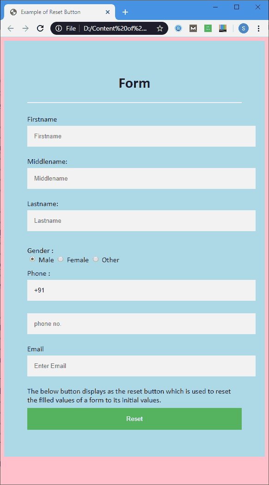

# 重置按钮

> 原文：<https://www.javatpoint.com/html-reset-button>

**重置**是 **<按钮>** 元素的**类型**属性的值。它用于将表单的填充值重置为初始值。

### 句法

```html

<Button type="reset">

```

### 例子

**示例:**

```html

<!DOCTYPE html>
<html>
<head>
<meta name="viewport" content="width=device-width, initial-scale=1">
<title>
Example of Reset Button
</title>
<style>
/* The following tag selector body use the font-family and background-color properties for body of a page*/

body {
font-family: Calibri, Helvetica, sans-serif;
background-color: pink;
} 
/* Following container class used padding for generate space around it, and also use a background-color for specify the color lightblue as a background */  
.container {
padding: 50px;
background-color: lightblue;
}
/* The following tag selector input use the different properties for the text filed. */
input[type=text] {
  width: 100%;
  padding: 15px;
margin: 5px 0 22px 0;
display: inline-block;
 border: none;
 background: #f1f1f1;
}
input[type=text]:focus {
background-color: orange;
outline: none;
}
 div {
            padding: 10px 0;
}    
hr {
  border: 1px solid #f1f1f1;
  margin-bottom: 25px;
}
/* The following tag selector button use the different properties for the Button. */
button {
  background-color: #4CAF50;
  color: white;  
margin: 8px 0;
  border: none;
  cursor: pointer;

 padding: 16px 20px;
  width: 100%;
  opacity: 0.9;
}
/* The following tag selector hover use the opacity property for the Button which select button when you mouse over it. */
button:hover {
opacity: 1;
}

</style>
</head>
<body>
<form>
<div class="container">
<center>  <h1> Form</h1> </center>

<hr>
<label for="fn"> Firstname </label> 
<input type="text" id="fn" name="firstname" placeholder= "Firstname" size="15" required /> 
<label for="mn"> Middlename: </label> 
<input type="text" id="mn" name="middlename" placeholder="Middlename" size="15" required /> 
<label for="ln"> Lastname: </label>  
<input type="text" id="ln" name="lastname" placeholder="Lastname" size="15"required /> 

<div>
<label> 
Gender :
</label><br>
<input type="radio" value="Male" name="gender" checked > Male 
<input type="radio" value="Female" name="gender"> Female 
<input type="radio" value="Other" name="gender"> Other

</div>
<label for="phn"> 
Phone :
</label>
<input type="text" name="country code" placeholder="Country Code"  value="+91" size="2"/> 
<input type="text" id="phn" name="phone" placeholder="phone no." size="10"/ required/> 

<label for="em"> 
Email
</label>
<input type="text" id="em" placeholder="Enter Email"  name="email" required>

The below button displays as the reset button which is used to reset the filled values of a form to its initial values. 
<button type="reset" value="submit">Reset</button>
</form>
</body>
</html>

```

[Test it Now](https://www.javatpoint.com/oprweb/test.jsp?filename=HTMLResetButton1)

**输出:**



## 浏览器支持

| 元素 | 铬 |  IE |  Firefox | 歌剧 |  Safari |
| **复位按钮** | 是 | 是 | 是 | 是 | 是 |

* * *