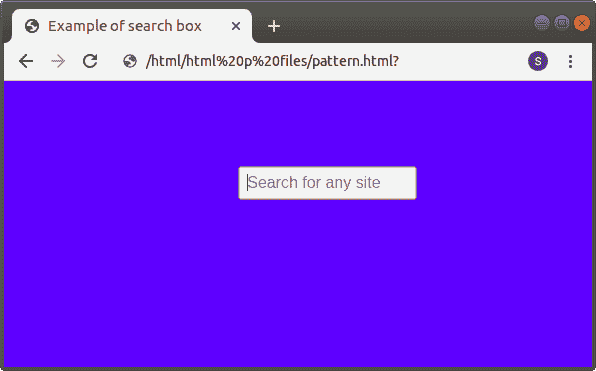
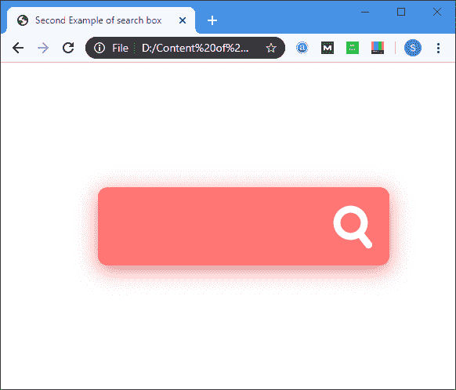

# HTML搜索框

> 原文：<https://www.javatpoint.com/html-search-box>

**HTML 搜索框**允许用户搜索内容。**搜索**是输入> 元素的**类型**属性的值。

### 句法

```

<input type="search">

```

**示例:**以下示例使用了不同的 CSS 代码在网页上显示不同的搜索框。

**例 1:**

```

<!DOCTYPE html>  
<html>  
<head>  
<title> 
Example of search box 
</title>  
<style>  
/* The following tag selector body use the text-align and background-color properties. The text-align property is used to align the text as center, and the background-color is used to specify the blue colour as a background of a page*/
body {  
text-align: center; 
background-color: blue;
}     
/* The following tag selector form uses the different properties for displaying a form. */

form{
  display: block;
  left: 30%;
  position: absolute;
  top: 30%;
}
/* The following tag selector input uses the different properties for the search box. */
  input[type=search]{
    border: 5px  orange;
    box-sizing: border-box;
    font-size:1em;
    height: 2em;
    margin-left: 10vw;
    padding: .5em;
    transition: all 2s ease-in;
    width: 30vw;
    z-index:1;
    &:focus {
      border: solid 3px #09f;      
      outline: solid #fc0 2000px;
    }
  }
</style>  
</head>  
<body>      
<form> 
<input type="search" placeholder="Search for any site"/>
</form>
</body>  
</html> 

```

[Test it Now](https://www.javatpoint.com/oprweb/test.jsp?filename=HTMLSearchBox1)

**输出:**



**示例 2:** 在本例中，我们没有使用[输入](https://www.javatpoint.com/html-input-tag)元素的类型属性的搜索值。但是我们已经使用了使用 [CSS](https://www.javatpoint.com/css-tutorial) 的文本输入字段，它作为一个搜索字段。

```

<!DOCTYPE html>  
<html>  
<head>  
<title> 
Second Example of search box 
  </title>  
  <style>                  
*
{
    outline: none;
}
/* The following tag selector form uses one property for specifying the height of a form. */

form
{
    height: 96px;
}
/* The following tag selector input use the different properties for specifying the text field. */

input[type="text"]
{
    width: 100%;
    height: 80px;
    font-size: 40px;
    line-height: 1;
}
/* The following tag selector uses the color of placeholder as orange for the input text field. */
input[type="text"]::placeholder
{
    color: orange;
}

.tb
{
    display: table;
    width: 100%;
}
.td
{
    display: table-cell;
    vertical-align: middle;
}
/* The following tag selector uses the different properties for specifying all the inputs and buttons used in the body tag in this html file. */

input, button
{
    color: #fff;
    font-family: Arial;
    padding: 0;
    margin: 0;
    border: 0;
    background-color: transparent;
}
/* the following id selector cover uses the different attribute which are used between the body tag */
#cover
{
    position: absolute;
    top: 50%;
 width: 550px;
    padding: 35px;
    margin: -83px auto 0 auto;
    background-color: #ff7575;
    border-radius: 20px;
    left: 0;
    right: 0;
    box-shadow: 0 10px 40px #ff7c7c, 0 0 0 20px #ffffffeb;
    transform: scale(0.6);
}
/* The following tag selector button uses the different proprties for specifying the button on a web page. */
button
{
    position: relative;
    display: block;
    width: 84px;
    height: 96px;
    cursor: pointer;
}
/* The following id selector uses the different properties for searching button */ 
#s-circle
{
    position: relative;
    top: -8px;
    left: 0;
    width: 43px;
    height: 43px;
    margin-top: 0;
    border-width: 15px;
    border: 15px solid #fff;
    background-color: transparent;
    border-radius: 50%;
    transition: 0.5s ease all;
}
button span
{
    position: absolute;
    top: 68px;
    left: 43px;
    display: block;
    width: 45px;
    height: 15px;
    background-color: transparent;
    border-radius: 10px;
    transform: rotateZ(52deg);
    transition: 0.5s ease all;
}
button span:before, button span:after
{
    content: '';
    position: absolute;
    bottom: 0;
    right: 0;
    width: 45px;
    height: 15px;
    background-color: #fff;
    border-radius: 10px;
    transform: rotateZ(0);
    transition: 0.5s ease all;
}
#s-cover:hover #s-circle
{
    top: -1px;
    width: 67px;
    height: 15px;
    border-width: 0;
    background-color: #fff;
    border-radius: 20px;
}
/* The following hover effect use the different properties when you take mouse to that element where thr s-cover is selector is used. */
#s-cover:hover span
{
    top: 50%;
    left: 56px;
    width: 25px;
    margin-top: -9px;
    transform: rotateZ(0);
}
#s-cover:hover button span:before
{
    bottom: 11px;
    transform: rotateZ(52deg);
}
#s-cover:hover button span:after
{
    bottom: -11px;
    transform: rotateZ(-52deg);
}
#s-cover:hover button span:before, #s-cover:hover button span:after
{
    right: 6px;
    width: 40px;
    background-color: #fff;
}
        </style>  
    </head>  
    <body>  
<div id="cover">
  <form method="get" action="">
<div class="tb">
<div class="td">
<!-- The following tag is input for the text input field which is used as a seach field on a web page -->
<input type="text" placeholder="Search" required></div>
      <div class="td" id="s-cover">
        <button type="submit">
          <div id="s-circle"> </div>
          <span> </span>
        </button>
      </div>
    </div>
  </form>
</div>
    </body>  
</html>

```

[Test it Now](https://www.javatpoint.com/oprweb/test.jsp?filename=HTMLSearchBox2)

**输出:**



## 浏览器支持

| 元素 | 铬 |  IE |  Firefox | 歌剧 |  Safari |
| **搜索框** | 是 | 是 | 是 | 是 | 是 |

* * *