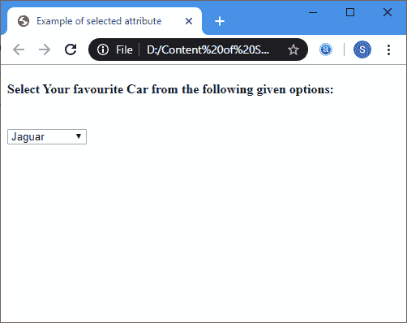
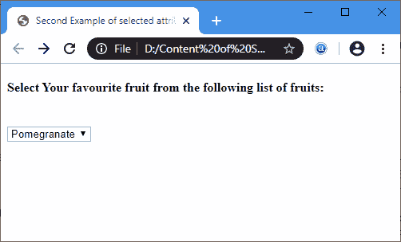

# 选定的属性

> 原文:[https://www.javatpoint.com/html-selected-attribute](https://www.javatpoint.com/html-selected-attribute)

选择的**是 **<选项>** 元素的属性，用于在下拉列表中定义默认选择。**

 **当任何选项使用此属性时，在加载网页时，应该首先预先选择并显示该选项。

### 句法

```

<option selected>

```

**示例:**以下示例使用 **<选项>** 中的**选定**属性，标记为**捷豹**值。

```

<!DOCTYPE html>
<html>
<head>
<title> 
Example of selected attribute
</title>
</head>
<body>
<h4> Select Your favourite Car from the following given options: </h4>
<br>
<select name="cars"> 
  <option value="Mercedes"> Mercedes </option>
   <option value="Lamborghini"> Lamborghini </option>
<!-- In the following option tag we specify the selected attribute for the Jaguar value, which is display as selected on the web page by default. -->
  <option value="Jaguar" selected> Jaguar </option>
  <option value="BMW" > BMW </option>
  <option value="Audi"> Audi </option> 
</select>
</body>
</html>

```

[Test it Now](https://www.javatpoint.com/oprweb/test.jsp?filename=HTMLSelectedAttribute1)

**输出:**



**示例 2:** 以下示例使用 **<选项>** 中的 **Selected** 属性，标记为**石榴**值。

```

<!DOCTYPE html>
<html>
<head>
<title> 
Second Example of selected attribute
</title>
</head>
<body>
<h4> Select Your favourite fruit from the following list of fruits: </h4>
<br>
<select name="fruits"> 
  <option value="Apple"> Apple </option>
   <option value="Banana"> Banana </option>
  <option value="Orange"> Orange </option>
<!-- In the following option tag we specify the selected attribute for the Pomegranate value, which is display as selected on the web page by default.-->
  <option value="Pomegranate" selected> Pomegranate </option>
  <option value="Grapes"> Grapes </option> 
   <option value="Mango"> Mango </option> 
</select>
</body>
</html>

```

[Test it Now](https://www.javatpoint.com/oprweb/test.jsp?filename=HTMLSelectedAttribute2)

**输出:**



## 浏览器支持

| 元素 | 铬 |  IE |  Firefox | 歌剧 |  Safari |
| **<选中>** | 是 | 是 | 是 | 是 | 是 |

* * ***