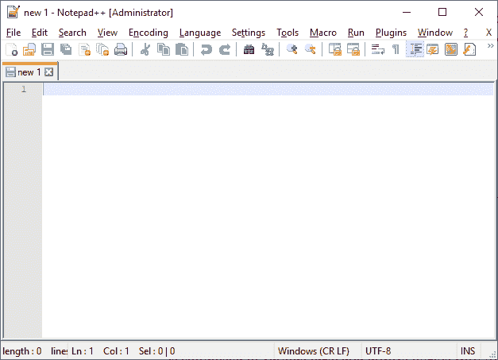
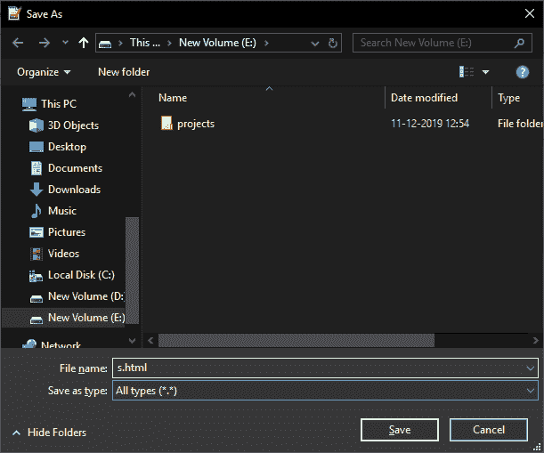
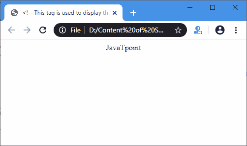

# 创建 Html 页面

> 原文：<https://www.javatpoint.com/create-html-page>

您可以通过以下步骤创建第一个网页:

### 步骤 1:打开文本编辑器

在这一步中，我们必须打开任何文本编辑器，如记事本或记事本++来编写一个 HTML 代码。下图是用于编写 HTML 代码的文本编辑器(记事本++)的截图。



### 第二步:输入 HTML 代码。

在这一步中，我们必须在文本编辑器中键入 HTML 代码。HTML 代码由各种标签组成，总是以 HTML 的开始标签开始，以 HTML 的结束标签结束。

以下模块描述了创建任何网页的语法:

```html

<HTML> 
<HEAD>
<!-- The Head tag is used to create a title of web page, CSS syntax for a web page, and helps in written a JavaScript code. -->
</HEAD>
<BODY>
<!-- The Body tag is used to display the content on a web page, which is specified between the body tag.  -->
</BODY>
</HTML> <!-- It is the opening tag of any HTML -->

```

在上面的语法中，使用了一些重要的标签或元素，如下所示:

**< HTML > :** 它是任何 HTML 代码的开始标记。

**<HEAD>:**HEAD 标签用于创建网页的标题、网页的 CSS 语法，并帮助编写 JavaScript 代码< head >必须在< body >标签打开之前关闭。

**<BODY>:**BODY 标签用于显示网页上的内容或文字，在 BODY 标签之间指定。- >

**< /HTML > :** 是任何 HTML 代码的结束标记。

**示例:**以下示例创建了一个简单的 HTML 页面作为示例，通过它您可以轻松理解:

```html

<HTML> <!-- It is the opening tag of any HTML -->
<HEAD>
<!-- The Head tag is used to create a title of web page, CSS syntax for a web page, and helps in written a JavaScript code. -->
<title> <!-- This tag is used to display the title of the Web Page -->
Simple HTML Page
</title>
<script>
<!-- This tag helps in written the JavaScript Code -->
</script>
<style>. 2
/* This tag is used to create a Cascading Style Sheet for displaying the attractive web page. */
</style>
</HEAD>
<BODY>
<center> <!-- This tag align the text as center -->
JavaTpoint
<!-- The Body tag is used to display the content on a web page which is specify between the body tag.  -->
</center>
</BODY>
</HTML>

```

[Test it Now](https://www.javatpoint.com/oprweb/test.jsp?filename=CreateHtmlPage)

### 第三步:保存 HTML 代码。

在输入完整的 HTML 代码后，我们必须将该文件保存在带有**的文件夹中。html** 扩展。我们可以通过点击**文件**菜单，然后点击**另存为**选项，轻松保存 html 文件。然后，键入文件名。html 扩展。下面的截图描述了我们如何在文本编辑器中保存上面的 html 代码。



### 第四步:运行 HTML 文件。

在最后一步，我们必须从保存文件的位置执行或运行一个 HTML 文件。该文件将在默认浏览器上运行。考虑以下输出:



* * *