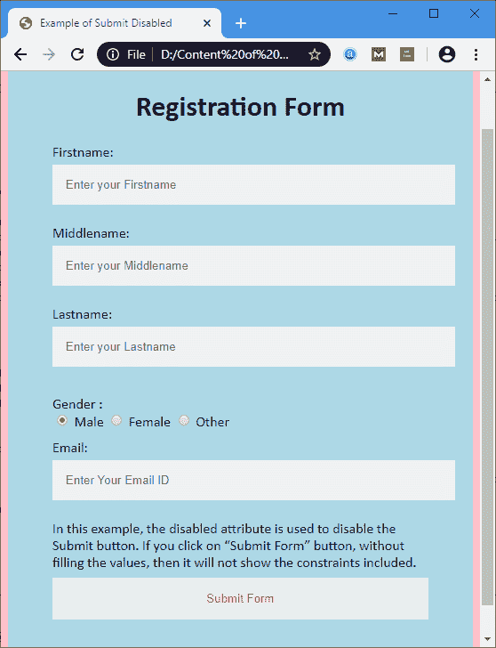
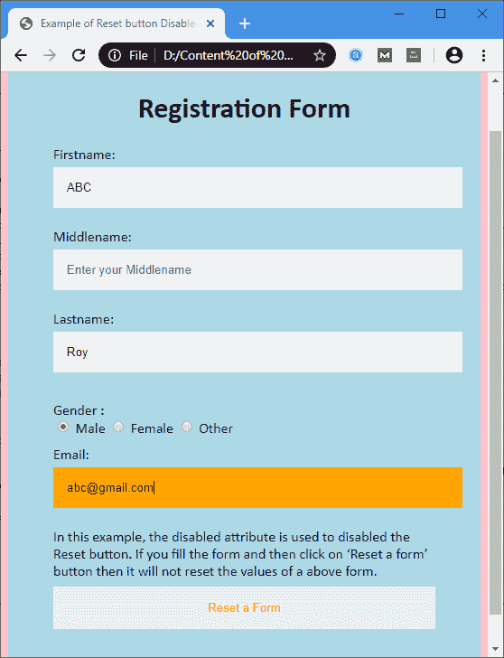

# HTML 按钮已禁用

> 原文:[https://www.javatpoint.com/html-button-disabled](https://www.javatpoint.com/html-button-disabled)

“**禁用**”是 HTML 中<按钮>标签的一个属性，用来表示按钮被禁用。它是一个布尔属性。禁用的按钮不能用于单击，并且显示为灰色。

### 句法

```

<button disabled> Text you want to show on the button </button>

```

**示例:**以下示例使用不同的按钮并将其禁用。

**示例 1:** 以下示例禁用提交按钮。

```

<!DOCTYPE html>
<html>
<head>
<meta name="viewport" content="width=device-width, initial-scale=1">
<title>
Example of Submit Disabled
</title>
<style>
/* The following tag selector body use the font-family and background-color properties for body of a page*/

body {
font-family: Calibri, Helvetica, sans-serif;
background-color: pink;
}
/* Following container class used padding for generate space around it, and also use a background-color for specify the color lightblue as a background */  
.container {
padding: 50px;
background-color: lightblue;
}
/* The following tag selector input uses the different properties for the text filed. */

input[type=text] {
  width: 100%;
  padding: 15px;
margin: 5px 0 22px 0;
display: inline-block;
 border: none;
 background: #f1f1f1;
}
input[type=text]:focus {
background-color: orange;
outline: none;
}
 div {
            padding: 10px 0;
        }
/* The following tag selector button uses the different properties for the Button. */

button {
  color: red;
  padding: 16px 20px;  
  margin: 8px 0;
  border: none;
  cursor: pointer;
  width: 100%;

  opacity: 0.9;
}
</style>
</head>
<body>
<form>
<div class="container">
<center>  
<h1> Registration Form </h1> 
</center>
<label> Firstname: </label> 
<input type="text" name="firstname" placeholder= "Enter your Firstname" size="15" required /> 
<label> Middlename: </label> 
<input type="text" name="middlename" placeholder="Enter your Middlename" size="15" /> 
<label> Lastname: </label>  
<input type="text" name="lastname" placeholder="Enter your Lastname" size="15"required /> 
<div>
<label> 
Gender :
</label><br>
<input type="radio" value="Male" name="gender" checked > Male 
<input type="radio" value="Female" name="gender"> Female 
<input type="radio" value="Other" name="gender"> Other
</div>
<label for="email"> Email: <label>
<input type="text" placeholder="Enter Your Email ID" name="email" required>

In this example, the disabled attribute is used to disable the Submit button. If you click on the "Submit Form" button, without filling the values, then it will not show the constraints included. 

<button type="submit" value="submit" disabled> Submit Form </button>
</form>
</body>
</html>

```

[Test it Now](https://www.javatpoint.com/oprweb/test.jsp?filename=HTMLButtonDisabled)

**输出:**



**示例 2:** 以下示例禁用复位按钮。

```

<!DOCTYPE html>
<html>
<head>
<meta name="viewport" content="width=device-width, initial-scale=1">
<title>
Example of Reset button disabled
</title>
<style>
/* The following tag selector body use the font-family and background-color properties for body of a page*/

body {
font-family: Calibri, Helvetica, sans-serif;
background-color: pink;
}
/* Following container class used padding for generate space around it, and also use a background-color for specify the color lightblue as a background */  

.container {
padding: 50px;
background-color: lightblue;
}
/* The following tag selector input uses the different properties for the text filed. */
input[type=text] {
  width: 100%;
  padding: 15px;
margin: 5px 0 22px 0;
display: inline-block;
 border: none;
 background: #f1f1f1;
}
input[type=text]:focus {
background-color: orange;
outline: none;
}
 div {
            padding: 10px 0;
        }
/* The following tag selector button uses the different properties for the Button. */
button {
  color: red;
  padding: 16px 20px;
  margin: 8px 0;
  border: none;
  cursor: pointer;
  width: 100%;
  opacity: 0.9;
}
</style>
</head>
<body>
<form>
<div class="container">
<center>  
<h1> Registration Form </h1> 
</center>
<label> Firstname: </label> 
<input type="text" name="firstname" placeholder= "Enter your Firstname" size="15" required /> 
<label> Middlename: </label> 
<input type="text" name="middlename" placeholder="Enter your Middlename" size="15" /> 
<label> Lastname: </label>  
<input type="text" name="lastname" placeholder="Enter your Lastname" size="15"required /> 
<div>
<label> 
Gender :
</label><br>
<input type="radio" value="Male" name="gender" checked > Male 
<input type="radio" value="Female" name="gender"> Female 
<input type="radio" value="Other" name="gender"> Other
</div>
<label for="email"> Email: <label>
<input type="text" placeholder="Enter Your Email ID" name="email" required>

In this example, the disabled attribute is used to disable the Reset button. If you fill the form and then click on the 'Reset a form' button, then it will not reset the values of the above form.

<button type="reset" value="submit" disabled> Reset a Form </button>

</form>
</body>
</html>

```

[Test it Now](https://www.javatpoint.com/oprweb/test.jsp?filename=HTMLButtonDisabled2)

**输出:**



## 浏览器支持

| 元素 | 铬 |  IE |  Firefox | 歌剧 |  Safari |
| **<按钮禁用>** | 是 | 是 | 是 | 是 | 是 |

* * *