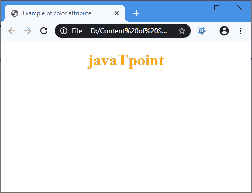
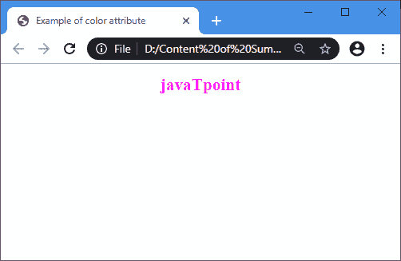
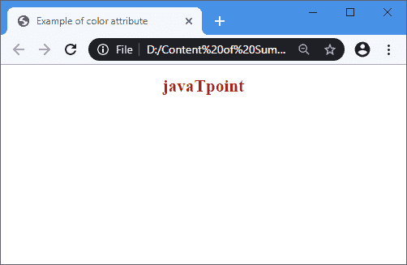
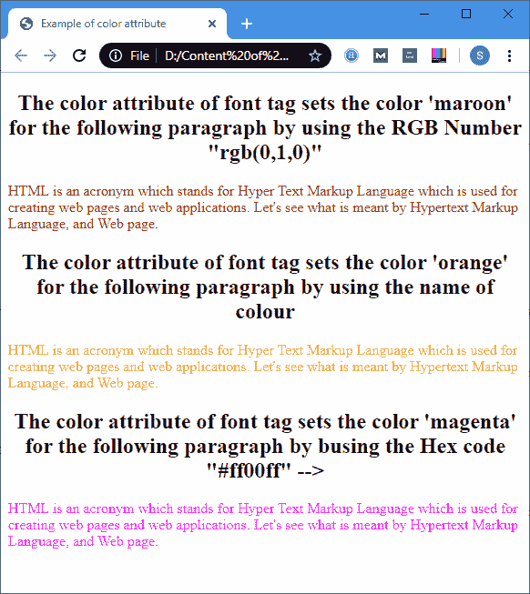

# HTML 颜色源

> 原文：<https://www.javatpoint.com/html-font-color>

**颜色**是 **<字体>** 标签的属性，指定**文字颜色**。

### 句法

```html

<font color="Color_name|rgb_number|hex_number"> 

```

我们可以使用以下不同的属性值来指定文本颜色:

*   **Color_name:** 该值通过颜色的名称设置文本的颜色。

**示例:**

```html

<font Color="Blue">

```

*   **Rgb_number:** 该值通过 Rgb 代码设置文本的颜色。

**示例:**

```html

<font color="rgb(128,128,0)"

```

*   **十六进制数:**该值通过十六进制代码设置文本的颜色。

```html

<font color="#00FF00">

```

**示例:**以下示例使用了**颜色**属性的不同值:

**示例 1:** 以下示例使用了颜色的**名称:**

```html

<!DOCTYPE html>  
<html>   
<head>  
<title>  
 Example of color attribute 
</title>  
</head>  
<body> 
<font color="orange"> 
<!-- The color attribute of font tag sets the color name 'orange' for the word javaTpoint--> 
<center>  
<h1> 
javaTpoint
</h1> 
</center>
</font>   
</body>  
</html>

```

[Test it Now](https://www.javatpoint.com/oprweb/test.jsp?filename=HTMLfontcolor1)

**输出:**



**示例 2:** 以下示例使用**十六进制代码**来定义文本颜色:

```html

<!DOCTYPE html>  
<html>   
<head>  
<title>  
 Example of color attribute 
</title>  
</head>  
<body> 
<font color="#ff00ff"> 
<!-- The color attribute of font tag sets the color 'magenta' for the word javaTpoint by busing the Hex code "#ff00ff" --> 
<center>  
<h1> 
javaTpoint
</h1> 
</center>
</font>   
</body>  
</html>

```

[Test it Now](https://www.javatpoint.com/oprweb/test.jsp?filename=HTMLfontcolor2)

**输出:**



**示例 3:** 以下示例使用 **rgb 数字**来定义文本颜色:

```html

<!DOCTYPE html>  
<html>   
<head>  
<title>  
 Example of color attribute 
</title>  
</head>  
<body> 
<font color="rgb(0,1,0)"> 
<!-- The color attribute of font tag sets the color 'maroon' for the word javaTpoint by using the RGB Number "rgb(0,1,0)" --> 
<center>  
<h1> 
javaTpoint
</h1> 
</center>
</font>   
</body>  
</html>

```

[Test it Now](https://www.javatpoint.com/oprweb/test.jsp?filename=HTMLfontcolor3)

**输出:**



**示例 4:** 以下示例使用字体颜色的所有属性值。

```html

<!DOCTYPE html>  
<html>   
<head>  
<title>  
 Example of color attribute 
</title>  
</head>  
<body> 
<center>
<h2> The color attribute of font tag sets the color 'maroon' for the following paragraph by using the RGB Number "rgb(0,1,0)" </h2>
</center>
<font color="rgb(0,1,0)">
<p>
HTML is an acronym which stands for Hyper Text Markup Language which is used for creating web pages and web applications. Let's see what is meant by Hypertext Markup Language, and Web page.
</p> 
</font>
<center> 
 <h2> The color attribute of font tag sets the color 'orange' for the following paragraph by using the name of colour </h2>
</center>
<font color="orange"> 
<p>
HTML is an acronym which stands for Hyper Text Markup Language which is used for creating web pages and web applications. Let's see what is meant by Hypertext Markup Language, and Web page.
</p> 
</font>
<center> 
 <h2>  The color attribute of font tag sets the color 'magenta' for the following paragraph by busing the Hex code "#ff00ff"   </h2>
</center>
<font color="#ff00ff"> 
<p>
HTML is an acronym which stands for Hyper Text Markup Language which is used for creating web pages and web applications. Let's see what is meant by Hypertext Markup Language, and Web page.
</p> 
</font>   
</body>  
</html>

```

[Test it Now](https://www.javatpoint.com/oprweb/test.jsp?filename=HTMLfontcolor4)

**输出:**



## 浏览器支持

| 元素 | 铬 |  IE |  Firefox | 歌剧 |  Safari |
| **<字体颜色= '>** | 是 | 是 | 是 | 是 | 是 |

* * *