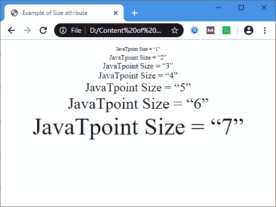

# HTML 字体大小

> 原文：<https://www.javatpoint.com/html-font-size>

**大小**是 **<字体>** 标签的属性，指定文本大小。

### 句法

```html

<font size="number">

```

在上面的语法中，数字是 **Size** 属性的值，表示文本大小。字体大小的数字介于 1 和 7 之间。默认情况下，网页上文本的字体大小为 3。

#### 注意:HTML5 不支持<font>标签的大小属性。我们可以用 CSS 代替它。</font>

**示例 1:** 以下示例使用从 1 到 7 的不同数字作为文本的大小:

```html

<!DOCTYPE html>
<html>
<title>
Example of Size attribute
</title>
<body>
<Center> 
<font size="1"> 
JavaTpoint Size = "1"
</font>
<br>
<font size="2"> 
JavaTpoint Size = "2"
</font>
<br>
<font size="3"> 
JavaTpoint Size = "3"
</font>
<br>
<font size="4"> 
JavaTpoint Size = "4"
</font>
<br>
<font size="5"> 
JavaTpoint Size = "5"
</font>
<br>
<font size="6"> 
JavaTpoint Size = "6"
</font>
<br>
<font size="7">
JavaTpoint Size = "7"
</font>
</Center>
</body>
</html>

```

[Test it Now](https://www.javatpoint.com/oprweb/test.jsp?filename=HTMLFontSize1)

**输出:**



## 浏览器支持

| 元素 | 铬 |  IE |  Firefox | 歌剧 |  Safari |
| **<字体大小=>** | 是 | 是 | 是 | 是 | 是 |

* * *