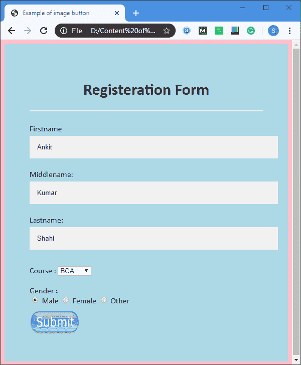
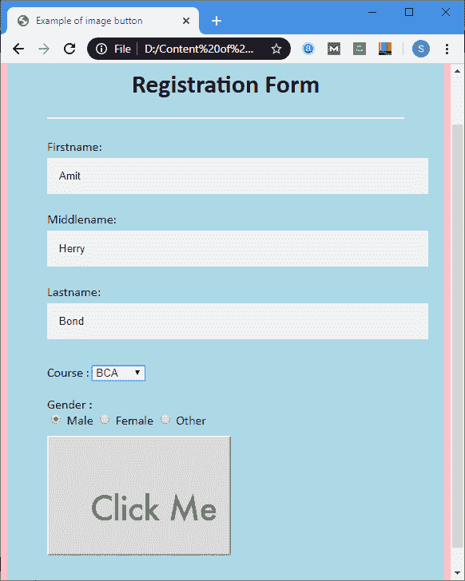

# HTML 图像按钮

> 原文：<https://www.javatpoint.com/html-image-button>

HTML 文档中的**图像按钮**可以通过使用 **<输入>** 元素的**类型**属性来创建。图像按钮也执行与提交按钮相同的功能，但是它们之间唯一的区别是您可以将您选择的图像保留为按钮。

### 句法

```

<input type="image" name="Name of image button" src="Path of the Image file? border="Specfiy Image Border " alt="text">

```

### 例子

**示例 1:** 本示例用于在不使用 CSS 的情况下指定图像按钮。

```

<!DOCTYPE html>
<html>
<head>
<meta name="viewport" content="width=device-width, initial-scale=1">
<title>
Example of image button
</title>
<style>
/* The following tag selector body use the font-family and background-color properties for body of a page*/
Body {
  font-family: Calibri, Helvetica, sans-serif;
  background-color: pink;
}
/* Following container class used padding for generate space around it, and also use a background-color for specifying the lightblue color as a background */  
.container {
    padding: 50px;
  background-color: lightblue;
}
/* The following tag selector input uses the different properties for specifying the text field. */
input[type=text] {
  width: 100%;
  padding: 15px;
  margin: 5px 0 22px 0;
  display: inline-block;
  border: none;
  background: #f1f1f1;
}
input[type=text]:focus {
  background-color: orange;
  outline: none;
}
 div {
            padding: 10px 0;
         }
hr {
  border: 1px solid #f1f1f1;
  margin-bottom: 25px;
}
</style>
</head>
<body>
<form>
<div class="container">
<center>  <h1> Registration Form</h1> </center>
<hr>
<label> Firstname: </label> 
<input type="text" name="firstname" placeholder= "Firstname" size="15" required /> 
<label> Middlename: </label> 
<input type="text" name="middlename" placeholder="Middlename" size="15" required /> 
<label> Lastname: </label>  
<input type="text" name="lastname" placeholder="Lastname" size="15"required /> 
<div>
<label> 
Course :
</label> 
<select>
<option value="Course">Course</option>
<option value="BCA">BCA</option>
<option value="BBA">BBA</option>
<option value="B.Tech">B.Tech</option>
<option value="MBA">MBA</option>
<option value="MCA">MCA</option>
<option value="M.Tech">M.Tech</option>
</select>
</div>
<div>
<label> 
Gender :
</label>
<br>
<input type="radio" value="Male" name="gender" checked > Male 
<input type="radio" value="Female" name="gender"> Female 
<input type="radio" value="Other" name="gender"> Other
</div>
<!-- The following tag input uses the type attribute which specifies the image, and the src attribute for specifying the path of an image, with the height and width attributes. -->
<input type="image" src="https://www.freepngimg.com/thumb/submit_button/25497-9-submit-button-photos.png" name="submit" width="100" height="48" alt="submit"/>

</form>
</body>  
</html>

```

[Test it Now](https://www.javatpoint.com/oprweb/test.jsp?filename=HTMLImageButton1)

**输出:**



**示例 2:** 本示例用于使用 CSS 样式指定图像按钮。它的输出也与上面的例子相同，但是实现不同。

在下面的例子中，我们使用<button>标签来指定网页上的图像按钮。</button>

```

<!DOCTYPE html>
<html>
<head>
<meta name="viewport" content="width=device-width, initial-scale=1">
<title>
Example of image button
</title>
<style>
/* The following tag selector body use the font-family and background-color properties for body of a page*/
Body {
  font-family: Calibri, Helvetica, sans-serif;
  background-color: pink;
}
/* Following container class used padding for generate space around it, and also use a background-color for specifying the lightblue color as a background */  
.container {
    padding: 50px;
  background-color: lightblue;
}
/* The following tag selector input uses the different properties for specifying the text field. */
input[type=text] {
  width: 100%;
  padding: 15px;
  margin: 5px 0 22px 0;
  display: inline-block;
  border: none;
  background: #f1f1f1;
} 
/* The following tag selector button uses the different properties for specifying the image button on a page. */
  button { 
            background-image: url( 
'https://encrypted-tbn0.gstatic.com/images?q=tbn%3AANd9GcTP6zIlxzaUIA_CPMpDXoJXporQUagBpwplwm3tUro3BQDZgNaa'); 
            width: 230px; 
            height: 150px;     
        } 

input[type=text]:focus {
  background-color: orange;
  outline: none;
}
 div {
            padding: 10px 0;
         }
hr {
  border: 1px solid #f1f1f1;
  margin-bottom: 25px;
}
</style>
</head>
<body>
<form>
<div class="container">
<center>  <h1> Registration Form</h1> </center>
<hr>
<label> Firstname: </label> 
<input type="text" name="firstname" placeholder= "Firstname" size="15" required /> 
<label> Middlename: </label> 
<input type="text" name="middlename" placeholder="Middlename" size="15" required /> 
<label> Lastname: </label>  
<input type="text" name="lastname" placeholder="Lastname" size="15"required /> 
<div>
<label> 
Course :
</label> 
<select>
<option value="Course">Course</option>
<option value="BCA">BCA</option>
<option value="BBA">BBA</option>
<option value="B.Tech">B.Tech</option>
<option value="MBA">MBA</option>
<option value="MCA">MCA</option>
<option value="M.Tech">M.Tech</option>
</select>
</div>
<div>
<label> 
Gender :
</label>
<br>
<input type="radio" value="Male" name="gender" checked > Male 
<input type="radio" value="Female" name="gender"> Female 
<input type="radio" value="Other" name="gender"> Other
</div>
<button type="submit"> </Button>

</form>
</body>  
</html>

```

[Test it Now](https://www.javatpoint.com/oprweb/test.jsp?filename=HTMLImageButton2)

**输出:**



## 浏览器支持

| 元素 | 铬 |  IE |  Firefox | 歌剧 |  Safari |
| **图像按钮** | 是 | 是 | 是 | 是 | 是 |

## 属性

**年龄:**

此属性用于指定替代文本，当图像无法在用户上显示时，将显示替代文本？s 屏幕。

**边框:**

该属性用于指定图像边框。如果将其值设为 0，则不会显示边框。

**高度:**

该属性用于定义图像高度的像素。

**名称:**

该属性用于定义图像的名称。

**Src:**

该属性用于指定需要显示为按钮的图像路径。

**宽度:**

该属性用于定义图像宽度的像素。

* * *