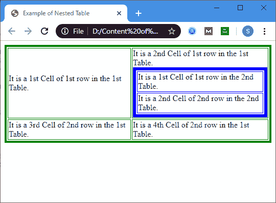

# HTML 嵌套表格

> 原文：<https://www.javatpoint.com/html-nested-table>

HTML 中的嵌套表格意味着在同一网页的另一个表格内的网页上创建一个表格。

#### 注意:内桌必须放在between外桌。

**示例:**以下示例描述了如何创建嵌套表。在本例中，我们创建了一个表，该表在第一行的第 2 <sup>和第</sup>单元格中包含另一个表。

```

<!DOCTYPE html>
<html>
<head>
<title> 
Example of Nested Table
</title>
</head>
<body>
<!?The following table tag is used to create outer table on a webpage.  
This table tag contains two attributes border and bordercolor.
 The border attribute is used to specify the border (4) of the outer table, and the bordercolor is used to specify the green colour of border of an outer table. -->
<table border="4" bordercolor="green"> 
<tr>
<td> It is a 1st Cell of 1st row in the 1st Table. </td>
<td> It is a 2nd Cell of 1st row in the 1st Table.

<!?The following table tag is used to create an inner table which is shown in the second cell of the first row in the outer table on a webpage.  
This table tag also contains two attributes border and bordercolor. 
The border attribute is used to specify the border (6) of the inner table, and the bordercolor is used to specify the blue colour of border of an inner table. -->
<table border="6" bordercolor="blue">
<tr>
<td> It is a 1st Cell of 1st row in the 2nd Table. </td>
</tr>
<tr>
<td> It is a 2nd Cell of 2nd row in the 2nd Table. </td></tr>
</table>
</td>
</tr>
<tr>
<td> It is a 3rd Cell of 2nd row in the 1st Table. </td>
<td> It is a 4th Cell of 2nd row in the 1st Table. </td>
</tr>
</table>
</body>
</html>

```

[Test it Now](https://www.javatpoint.com/oprweb/test.jsp?filename=HTMLNestedTable1)

**输出:**



## 浏览器支持

| 元素 | 铬 |  IE |  Firefox | 歌剧 |  Safari |
| **嵌套表** | 是 | 是 | 是 | 是 | 是 |

* * *