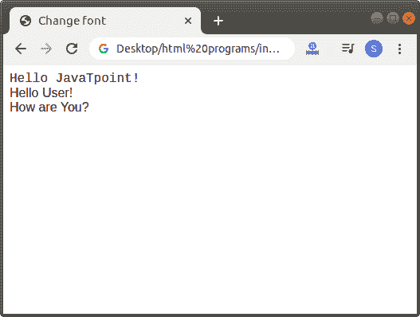
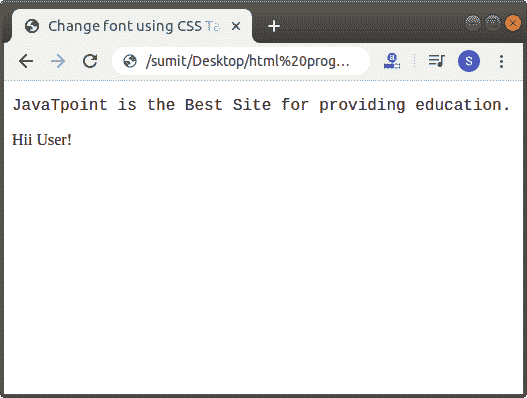

# 如何在 HTML 中更改字体

> 原文:[https://www.javatpoint.com/how-to-change-font-in-html](https://www.javatpoint.com/how-to-change-font-in-html)

在 HTML 中，我们可以使用以下两种方式更改字体:

1.  使用 HTML 标记
2.  使用样式属性

## 1.使用 HTML 标记

如果我们想使用显示在网页上的 Html 标签来改变文本的字体，我们必须遵循下面给出的步骤。使用这些步骤，我们可以轻松更改字体:

**第一步:**首先，我们必须在任何文本编辑器中键入 Html 代码，或者在文本编辑器中打开现有的 [Html](https://www.javatpoint.com/html-tutorial) 文件，我们要在其中使用 [Html 标签](https://www.javatpoint.com/html-tags)。

```

<!Doctype Html>
<Html>   
<Head>    
<Title>   
Change font Using HTML tag
</Title>
</Head>
<Body> 
Hello JavaTpoint! <br>
Hello User! <br>
How are You?  
</Body>
</Html>

```

**第二步:**现在，将光标移动到我们想要更改字体的文本的开头。然后，在该点输入空的 Html **<字体>** 标签。

```

<font> Single Line text and statements

```

**第三步:**然后，你要关闭我们要更改字体的文本末尾的字体标签。

```

<font> Single Line text and statements </font>

```

**第四步:**现在我们要添加名为“**脸**的字体标签的属性。所以，在起始 **<字体>** 标签内输入人脸属性。然后，我们必须给出字体的名称。因此，在 face 属性中键入字体名称，如下块所述。

```

<!Doctype Html>
<Html>   
<Head>    
<Title>   
Change font Using HTML tag
</Title>
</Head>
<Body> 
<font face="Courier">
Hello JavaTpoint! <br> 
</font>
<font face="Arial">
Hello User! <br>
How are You?  
</font>
</Body>
</Html>

```

[Test it Now](https://www.javatpoint.com/oprweb/test.jsp?filename=ChangeFontinHTML1)

**第五步:**最后，我们必须保存 Html 代码并运行代码。执行后，我们将在浏览器中看到以下输出:



## 2.使用样式属性

如果我们想使用样式属性来改变显示在网页上的文本的字体，我们必须遵循下面给出的步骤。使用这些步骤，我们可以很容易地改变字体。

**第一步:**首先，我们必须在任何文本编辑器中键入[的 Html 代码](https://www.javatpoint.com/html-code-tag)或者在我们想要使用样式属性的文本编辑器中打开现有的 Html 文件。

```

<!Doctype Html>
<Html>   
<Head>    
<Title>   
Change font using CSS Tag
</Title>
</Head>
<Body> 
JavaTpoint is the Best Site for providing education. 
</Body>
</Html>

```

**第二步:**现在，将光标移动到我们想要更改字体的文本的开头。然后，在< p >(段落)标签内输入 CSS **样式**属性。

```

<p style="font-family:Courier; "> Any Text

```

**第三步:**然后，你要关闭[段落标签](https://www.javatpoint.com/html-paragraph)在我们想要改变字体的文本的末尾。

```

<p style="font-family:Courier; "> Any Text </p>

```

**第 4 步:**最后，保存以下使用 CSS 样式属性改变字体的 Html 代码。

```

<!Doctype Html>
<Html>   
<Head>    
<Title>   
Change font using CSS Tag
</Title>
</Head>
<Body> 
<p style="font-family:Courier; ">
JavaTpoint is the Best Site for providing education. 
</p>
Hii User!
</Body>
</Html>

```

[Test it Now](https://www.javatpoint.com/oprweb/test.jsp?filename=ChangeFontinHTML2)

当我们运行上述 Html 代码时，我们将在浏览器中看到以下输出:



* * *