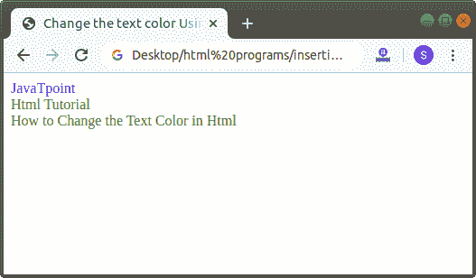

# 如何在 Html 中更改文本颜色

> 原文：<https://www.javatpoint.com/how-to-change-text-color-in-html>

在 HTML 中，我们可以使用以下不同方式更改任何文本的颜色:

1.  使用 HTML 标记
2.  使用内联样式属性
3.  使用内部 CSS

## 1.使用 HTML 标记

#### 注意:HTML 5 不支持字体的颜色属性，所以我们必须使用内联样式属性和内部 CSS 选项来更改文本的颜色。

如果我们想使用显示在网页上的 Html 标签来改变文本的颜色，我们必须遵循下面给出的步骤。使用这些步骤，我们可以轻松更改任何文本的颜色:

**第一步:**首先，我们必须在任何文本编辑器中键入 Html 代码，或者在文本编辑器中打开现有的 [Html](https://www.javatpoint.com/html-tutorial) 文件，我们要在其中使用 [Html 标签](https://www.javatpoint.com/html-tags)。

```html

<!Doctype Html>
<Html>   
<Head>    
<Title>   
Change the text color Using HTML tag
</Title>
</Head>
<Body> 
JavaTpoint   <br>
Html Tutorial   <br>
How to Change the Text Color in Html
</Body>
</Html>

```

**第二步:**现在，将光标移动到我们想要改变颜色的文本的开始处。然后，在那个位置输入空的 Html **<字体>** 标签。

```html

<font> Single Line text and statements

```

**第三步:**然后，我们要关闭想要改变颜色的文本末尾的字体标签。

```html

<font> Single Line text and statements </font>

```

**第四步:**现在我们要添加名称为“**颜色**的字体标签的属性。所以，在起始 **<字体>** 标签内输入**颜色**属性。然后，我们必须给出我们想要用在文本上的颜色。因此，如下块所述，在**颜色属性**中键入颜色名称。

```html

<!Doctype Html>
<Html>   
<Head>    
<Title>   
Change the text color Using HTML tag
</Title>
</Head>
<Body> 
<font color="blue">
JavaTpoint   <br>
</font>
<font color="green">
Html Tutorial   <br>
How to Change the Text Color in Html
</font>
</Body>
</Html>

```

[Test it Now](https://www.javatpoint.com/oprweb/test.jsp?filename=How-to-Change-Text-Color-in-Html1)

**第五步:**最后，我们必须在文本编辑器中保存 Html 代码并运行代码。执行后，我们将在浏览器中看到输出。下面的截图显示了上述 Html 代码的输出:



## 2.使用内嵌样式属性

如果我们想使用要在网页上显示的内嵌样式属性来更改文本的颜色，我们必须遵循下面给出的步骤。使用这些步骤，我们可以很容易地改变文本的颜色。

**第一步:**首先，我们必须在任何文本编辑器中键入 Html 代码，或者在文本编辑器中打开现有的 Html 文件，我们希望在其中使用样式属性来更改文本的颜色。

```html

<!Doctype Html>
<Html>   
<Head>    
<Title>   
Change color using style attribute
</Title>
</Head>
<Body> 
This page helps you to understand how to change the color of a text.
And, this section helps you to understand how to change the text color using the style attribute.
</Body>
</Html>

```

**第二步:**现在，将光标移动到我们想要改变颜色的文本的开始处。然后，在任何元素中键入内嵌的**样式**属性。这里，我们使用< p >(段落)标记:

```html

<p style="color: ; "> Any Text

```

**第三步:**在这一步中，我们必须给出一个颜色的名称作为值。我们可以用三种形式给出颜色名称:

1.  我们可以输入颜色的名称
2.  我们也可以输入颜色的 RGB 值
3.  我们也可以输入颜色的十六进制值。

**第四步:**然后，我们必须关闭文本末尾想要改变颜色的元素。

```html

<p style="color :red; "> Any Text </p>

```

**第四步:**最后，保存使用 [CSS](https://www.javatpoint.com/css-tutorial) 样式属性改变文本颜色的 Html 代码。

```html

<!Doctype Html>
<Html>   
<Head>    
<Title>   
Change color using style attribute
</Title>
</Head>
<Body> 
<p style="color :red;">
This page helps you to understand how to change the color of a text.
</p>
<p style="color :pink; ">
And, this section helps you to understand how to change text color using style attribute. 
</p>
</Body>
</Html>

```

[Test it Now](https://www.javatpoint.com/oprweb/test.jsp?filename=How-to-Change-Text-Color-in-Html2)

下面的截图显示了上述代码的输出:


## 2.使用内部 CSS

如果我们想使用要在网页上显示的内部级联样式表来更改文本的颜色，我们必须遵循下面给出的步骤。使用这些步骤，我们可以很容易地改变文本的颜色。

**第一步:**首先，我们必须在任何文本编辑器中键入 Html 代码，或者在文本编辑器中打开现有的 Html 文件，我们希望在其中使用[内部 CSS](https://www.javatpoint.com/internal-css) 来更改文本的颜色。

```html

<!Doctype Html>
<Html>   
<Head>    
<Title>   
Change color using Internal CSS
</Title>
</Head>
<Body> 
This page helps you to understand how to change the color of a text.
In this Section, we used the internal CSS for changing the text color. 
</Body>
</Html>

```

**第二步:**现在，我们必须将光标放在 Html 文档的头部标签中，然后在 **<样式>** 标签中定义样式，如下图所示。然后，在元素选择器中输入**颜色**属性。

```html

<Head>
<style>
Body
{
color:orange;
}
p
{
color:green;
}
</style>
</Head>

```

**步骤 3:** 现在，我们必须在要更改颜色的文本之前键入定义的元素选择器。

```html

<!Doctype Html>
<Html>   
<Head>    
<Title>   
Change color using Internal CSS
</Title>
<style>
Body
{
color:orange;
}
p
{
color:green;
}
</style>
</Head>
<Body> 
This page helps you to understand how to change the color of a text.
<p>
In this Section, we used the internal CSS for changing the text color. 
</p>
</Body>
</Html>

```

[Test it Now](https://www.javatpoint.com/oprweb/test.jsp?filename=How-to-Change-Text-Color-in-Html3)

下面的截图显示了上述 Html 代码的输出:


* * *