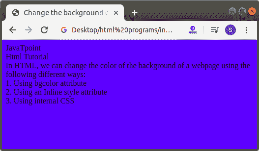
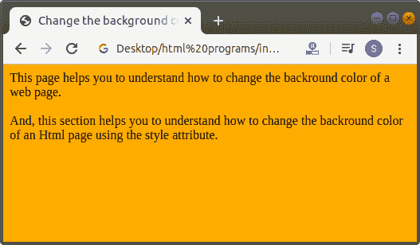
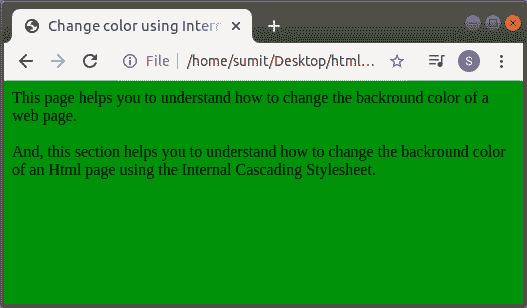

# 如何在 Html 中改变背景颜色

> 原文：<https://www.javatpoint.com/how-to-change-background-color-in-html>

在 HTML 中，我们可以使用以下不同方式更改网页背景的颜色:

1.  使用 bgcolor 属性
2.  使用内联样式属性
3.  使用内部 CSS

## 1.使用 bgcolor 属性

#### 注意:HTML 5 不支持标签的 bgcolor 属性，所以我们必须使用内联样式属性和内部 CSS 选项来改变网页的颜色。

如果我们想使用 bgcolor 属性改变网页背景的颜色**，我们必须遵循下面给出的步骤。使用这些步骤，我们可以轻松更改背景颜色:**

**第一步:**首先，我们必须在任何文本编辑器中键入 Html 代码，或者在文本编辑器中打开现有的 [Html](https://www.javatpoint.com/html-tutorial) 文件，在该文件中我们要使用 **bgcolor 属性**来更改该 Html 页面的**背景颜色**。

```

<!Doctype Html>
<Html>   
<Head>    
<Title>   
Change the background color using Bgcolor attribute 
</Title>
</Head>
<Body> 
JavaTpoint   <br>
Html Tutorial   <br>
In HTML, we can change the color of the background of a webpage using the following different ways: <br>
1\. Using bgcolor attribute  <br>
2\. Using an Inline style attribute  <br>
3\. Using internal CSS  
</Body>
</Html>

```

**第二步:**现在，在我们的 Html 文档中，将光标移动到**开始的<正文>标签**内。然后输入 **bgcolor 属性**，如下图所示:

```

<Body bgcolor=" ">

```

**第三步:**现在，我们必须给出我们想要在网页背景上使用的颜色。因此，在 **bgcolor 属性**中键入颜色名称，如下图所示。

```

<!Doctype Html>
<Html>   
<Head>    
<Title>   
Change the background color using Bgcolor attribute 
</Title>
</Head>
<Body bgcolor="blue"> 
JavaTpoint   <br>
Html Tutorial   <br>
In HTML, we can change the color of the background of a webpage using the following different ways: <br>
1\. Using bgcolor attribute  <br>
2\. Using an Inline style attribute  <br>
3\. Using internal CSS  
</Body>
</Html>

```

[Test it Now](https://www.javatpoint.com/oprweb/test.jsp?filename=how-to-change-background-color-in-html1)

**第四步:**最后，我们必须在文本编辑器中保存 Html 代码并运行代码。执行后，我们将看到网页的背景与文档中指定的颜色相同。下面的截图显示了上述 Html 代码的输出:



## 2.使用内嵌样式属性

如果我们想使用内嵌样式属性改变网页背景的颜色，我们必须遵循下面给出的步骤。使用这些步骤，我们可以很容易地改变背景的颜色。

**第一步:**首先，我们必须在任何文本编辑器中键入 Html 代码，或者在文本编辑器中打开现有的 Html 文件，我们希望在其中使用**内联样式属性**来更改该 Html 页面的**背景颜色**。

```

<!Doctype Html>
<Html>   
<Head>    
<Title>   
Change the background color using Inline style attribute
</Title>
</Head>
<Body> 
This page helps you to understand how to change the backround color of a web page. <br>
<br>
And, this section helps you to understand how to change the backround color of an Html page using the style attribute.
</Body>
</Html>

```

**第二步:**现在，在我们的 Html 文档中，将光标移动到**开始的<正文>标签**内。然后输入**风格属性**，如下图所示:

```

<body style="background-color:">

```

**第三步:**现在，我们必须给出我们想要在网页背景上使用的颜色。因此，在样式属性的**背景色属性中键入颜色名称，如下图所示。**

```

<!Doctype Html>
<Html>   
<Head>    
<Title>   
Change the background color using Inline style attribute
</Title>
</Head>
<Body style="background-color:orange"> 
This page helps you to understand how to change the backround color of a web page. <br>
<br>
And, this section helps you to understand how to change the backround color of an Html page using the style attribute.
</Body>
</Html> 

```

[Test it Now](https://www.javatpoint.com/oprweb/test.jsp?filename=how-to-change-background-color-in-html2)

**第四步:**最后，我们必须在文本编辑器中保存 Html 代码并运行代码。执行后，我们将看到网页的背景与文档中指定的颜色相同。下面的截图提供了上述 Html 代码的输出:



## 3.使用内部 CSS

如果我们想使用[内部级联样式表](https://www.javatpoint.com/internal-css)改变网页背景的颜色，我们必须遵循下面给出的步骤。使用这些步骤，我们可以轻松更改背景颜色。

**第一步:**首先，我们必须在任何文本编辑器中键入 Html 代码，或者在文本编辑器中打开现有的 Html 文件，其中我们想要使用**内部[CSS](https://www.javatpoint.com/css-tutorial)T5 来更改该 Html 页面的**背景颜色**。**

```

<!Doctype Html>
<Html>   
<Head>    
<Title>   
Change the background color using Internal Cascading StyleSheet
</Title>
</Head>
<Body> 
This page helps you to understand how to change the backround color of a web page. <br>
<br>
And, this section helps you to understand how to change the backround color of an Html page using the Internal Cascading Stylesheet.
</Body>
</Html>

```

**第二步:**现在，我们必须将光标放在 Html 文档的**头标签**中，然后在 **<样式>** 标签中定义样式，如下图所示。然后在**体**元素中输入**底色**属性。

```

<!Doctype Html>
<Html>   
<Head>    
<Title>   
Change the background color using Internal Cascading StyleSheet
</Title>
<style>
Body
{
background-color:green;
}
</style>
</Head>
<Body> 
This page helps you to understand how to change the backround color of a web page. <br>
<br>
And, this section helps you to understand how to change the backround color of an Html page using the Internal Cascading Stylesheet.
</Body>
</Html>

```

[Test it Now](https://www.javatpoint.com/oprweb/test.jsp?filename=how-to-change-background-color-in-html3)

**第四步:**最后，我们必须在文本编辑器中保存 Html 代码并运行代码。执行后，我们将看到网页的背景与文档中指定的颜色相同。下面的截图显示了上述 Html 代码的输出:



* * *