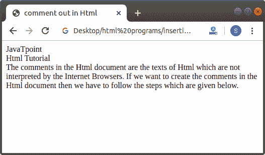

# 如何用 Html 评论？

> 原文：<https://www.javatpoint.com/how-to-comment-in-html>

Html 文档中的注释是不被互联网浏览器解释的 Html 文本。

如果我们想在 Html 文档中创建单行注释或多行注释，那么我们必须遵循下面给出的步骤。使用这些步骤，我们可以很容易地在 Html 文件中创建注释，这有助于描述该文件的代码。

**第一步:**首先，我们必须在任何文本编辑器中键入 Html 代码，或者在文本编辑器中打开现有的 [Html](https://www.javatpoint.com/html-tutorial) 文件，我们希望在其中创建文本作为注释。

```

<!Doctype Html>
<Html>   
<Head>    
<Title>   
comment out in Html
</Title>
</Head>
<Body> 
JavaTpoint   <br>
Html Tutorial   <br>
The comments in the Html document are the texts of Html which are not interpreted by the Internet Browsers. 
If we want to create the comments in the Html document then we have to follow the steps which are given below. Using these steps we can easily create the comments in the Html file which helps for describing the code of that file.  
</Body>
</Html>

```

**第 2 步:**现在，键入我们想要创建的文本，作为 Html 页面的注释。因此，在标签之间键入文本或代码，如下块所示:

```

<!-- Any code or text want to create as single line or multiple line comment -->

```

**第三步:**现在，我们要给出 Html 文件中的文本。然后，保存 Html 文件或代码。

```

<!Doctype Html>
<Html>   
<Head>    
<Title>   
comment out in Html
</Title>
</Head>
<Body> 
JavaTpoint   <br>
Html Tutorial   <br>
<!-- How to Comment Out in Html -->
The comments in the Html document are the texts of Html which are not interpreted by the Internet Browsers. 
If we want to create the comments in the Html document then we have to follow the steps which are given below.
<!-- Using these steps we can easily create the comments in the Html file which helps for describing the code of that file.  -->
</Body>
</Html>

```

[Test it Now](https://www.javatpoint.com/oprweb/test.jsp?filename=how-to-comment-in-html)

**第 4 步:**现在，运行代码，然后我们将在浏览器中看到输出。输出不包括写在 Html 文件或代码的注释中的文本。下面的截图显示了上述 Html 代码的输出:



* * *