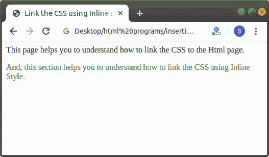
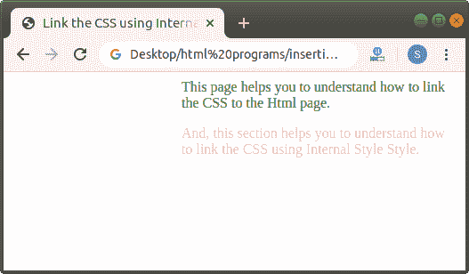
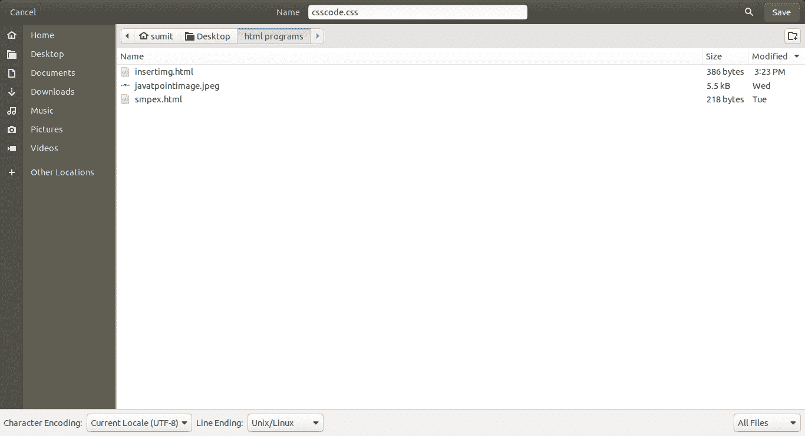
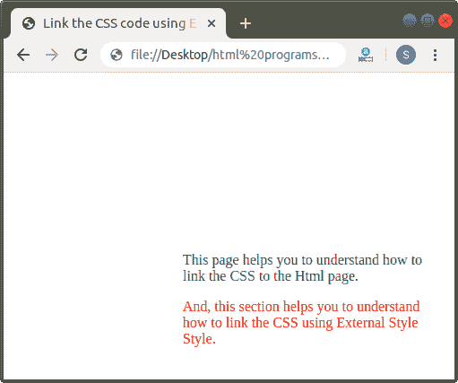

# 如何将 CSS 链接到 Html

> 原文：<https://www.javatpoint.com/how-to-link-css-to-html>

在 HTML 中，我们可以通过以下三种不同的方法轻松地将样式表链接到 Html 文档:

1.  使用内嵌样式
2.  使用嵌入样式或内部样式
3.  使用外部样式

## 使用内嵌样式

这是将 CSS 样式添加到我们的 Html 文档或代码中的最简单的方法。但是我们不能重用这个方法，所以重用性是这个方法的缺点。如果我们想使用内嵌样式将 CSS 添加到我们的 Html 文档中，那么我们必须遵循下面给出的步骤:

**第一步:**首先，我们必须在任何文本编辑器中键入 Html 代码，或者在文本编辑器中打开现有的 [Html](https://www.javatpoint.com/html-tutorial) 文件，我们希望在其中使用内联样式链接 [CSS](https://www.javatpoint.com/css-tutorial) 。

```html

<!Doctype Html>
<Html>   
<Head>    
<Title>   
Link the CSS using Inline style to Html
</Title>
</Head>
<Body> 
This page helps you to understand how to link the CSS to the Html page. <br>
<br>
And, this section helps you to understand how to link the CSS using Inline Style.
</Body>
</Html>

```

**第二步:**现在，我们必须在要使用 CSS 的文本的开始处使用 style 属性。因此，我们必须在一个特定的标签中键入 style 属性，以便使用内联样式将 CSS 链接到 Html，如下块所示:

```html

<p style=" ">   Any text    </p>

```

**第三步:**现在，我们必须给出样式属性中的属性，如下块所示:

```html

<!Doctype Html>
<Html>   
<Head>    
<Title>   
Link the CSS using Inline style to Html
</Title>
</Head>
<Body> 
This page helps you to understand how to link the CSS to the Html page. <br>
<p style="color:green;">
And, this section helps you to understand how to link the CSS using Inline Style.
</p>
</Body>
</Html>

```

[Test it Now](https://www.javatpoint.com/oprweb/test.jsp?filename=how-to-link-css-to-html1)

**第 4 步:**现在，保存 Html 代码，然后运行它。当代码在浏览器中成功执行时，它将显示输出。下面的截图显示了上述 Html 代码的输出:



## 使用内部样式表

那些只影响嵌入它们的 Html 文档的表单被称为**内部样式表**。这些样式表是在**<>**标签的开始和结束之间定义的。

如果我们想使用内部样式表将 CSS 添加到我们的 Html 文档中，那么我们必须遵循下面给出的步骤:

**第一步:**首先，我们必须在任何文本编辑器中键入 Html 代码，或者在文本编辑器中打开现有的 Html 文件，我们要在其中使用内部样式表链接 [CSS。](https://www.javatpoint.com/internal-css)

```html

<!Doctype Html>
<Html>   
<Head>    
<Title>   
Link the CSS using Inline style to Html
</Title>
</Head>
<Body> 
This page helps you to understand how to link the CSS to the Html page. <br>
<br>
And, this section helps you to understand how to link the CSS using Internal Style Style.
</Body>
</Html>

```

**第二步:**现在，我们必须将样式标签放在<头>标签的开始和结束处，就在<标题>标签之后。我们在以下模块中描述了这一步骤:

```html

<Head>    
<Title>   
Link the CSS using Internal Style Sheet to Html
</Title>
<style>
.....
.....
</style>
</Head>

```

**第三步:**现在，我们必须使用名称为“type”的 style tag 的属性。所以，我们必须始终这样开始<风格的>标签:

```html

<style type="text/css">

```

**第 4 步:**现在，我们必须在同一个 Html 页面中的文本上添加我们想要使用的元素。我们可以在<头部>标签中定义的样式标签中添加这些元素。

```html

<!Doctype Html>
<Html>   
<Head>    
<Title>   
Link the CSS using Internal Style Sheet to Html
</Title>
<style>
Body
{
color:green;
margin-left:200px;
}
p
{
color:pink;
}
</style>
</Head>
<Body> This page helps you to understand how to link the CSS to the Html page. 
<p>
And, this section helps you to understand how to link the CSS using Internal Style Style.
</p>
</Body>
</Html>

```

[Test it Now](https://www.javatpoint.com/oprweb/test.jsp?filename=how-to-link-css-to-html2)

**第五步:**最后保存 Html 文件并运行。当浏览器成功执行代码时，它将显示输出。下面的截图提供了上述 Html 代码的输出:



## 使用外部样式

那些只包含 CSS 格式或代码的文件被称为外部样式表文件或 CSS 文件。这些文件的扩展名必须以。css 扩展。这些文件不同于 Html 文件，可以使用 **<链接>** 标签轻松包含在 Html 文件中。

如果我们想使用外部样式表将 CSS 添加到我们的 Html 文档中，那么我们必须遵循下面给出的步骤:

**第一步:**首先，我们要在任何文本编辑器中键入 Html 代码，或者在我们想要链接 CSS 文件的文本编辑器中打开现有的 Html 文件:

```html

<!Doctype Html>
<Html>   
<Head>    
<Title>   
Link the CSS code using External style sheet to Html
</Title>
</Head>
<Body> 
This page helps you to understand how to link the CSS to the Html page. <br>
<br>
And, this section helps you to understand how to link the CSS using External Style Style.
</Body>
</Html>

```

第二步:现在，我们必须创建 CSS 文件。因此，打开文本编辑器，在文件中键入 CSS 代码。

```html

Body
{
color:green;
margin-left:200px;
}
p
{
color:pink;
}

```

步骤 3:然后，将文件与。css 扩展。



**第四步:**再次来到 Html 文件。然后，我们必须将光标放在<头>标签的开始和结束处，就在<标题>标签之后。然后，键入带有属性及其值的<标签>。我们在以下模块中对其进行了描述:

```html

<!Doctype Html>
<Html>   
<Head>    
<Title>   
Link the CSS code using External style sheet to Html
</Title>
<link rel="stylesheet" href="csscode.css">
</Head>
<Body> 
This page helps you to understand how to link the CSS to the Html page. 
<p>
And, this section helps you to understand how to link the CSS using External Style Style.
</p>
</Body>
</Html>

```

**第五步:**现在，我们要把 Html 文件保存在保存 CSS 文件的同一个位置或目录下。然后，在浏览器中运行 Html 文件。上面 html 代码的输出显示在下面的截图中:



* * *