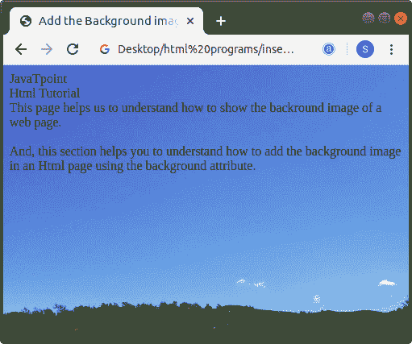
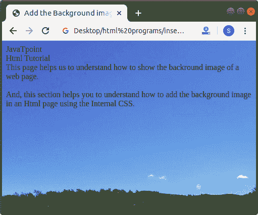

# 如何在 Html 中添加背景图片

> 原文:[https://www . javatpoint . com/如何在 html 中添加背景图像](https://www.javatpoint.com/how-to-add-background-image-in-html)

在 HTML 中，我们可以使用以下两种不同的方法轻松地在要显示在网页上的 Html 文档中添加背景图像:

1.  使用背景属性(Html 标记)
2.  使用内部样式表

## 使用背景属性

#### 注意:HTML 5 不支持标签的背景属性，所以我们必须使用内部 CSS 选项在 HTML 文档中添加背景。

如果我们想使用背景属性在 Html 文档中添加背景图像，那么我们必须遵循下面给出的步骤。使用这些步骤，我们可以轻松查看网页上的图像:

**第一步:**首先，我们必须在任何文本编辑器中键入 Html 代码，或者在文本编辑器中打开现有的 [Html](https://www.javatpoint.com/html-tutorial) 文件，我们希望在其中使用背景属性。

```

<!Doctype Html>
<Html>   
<Head>    
<Title>   
Add the Background image using background attribute 
</Title>
</Head>
<Body> 
JavaTpoint   <br>
Html Tutorial   <br>
This page helps us to understand how to show the backround image of a web page. <br>
<br>
And, this section helps you to understand how to add the background image in an Html page using the background attribute.
</Body>
</Html>

```

**第二步:**现在，在我们的 Html 文档中，将光标移动到**开始的<正文>标签**内。然后输入**背景属性**，如下图所示:

```

<Body background=" "> 

```

**第三步:**之后，我们要给出想要添加的图像的路径。因此，在**背景**属性中键入图像的路径。如果我们的图像存储在存储 HTML 文件的同一目录中，请键入以下路径:

```

<Body background="filename.extension">

```

```

<Body background="image.jpg"> <br>

```

如果我们的图像存储在任何其他目录中，请键入该图像的正确路径，以便浏览器可以轻松读取图像，如下块所述。

```

<Body background="/home/sumit/Desktimg/image.jpg"> 

```

如果我们的图像在互联网上，那么我们也可以使用网址添加图像，如下图所示。

```

<Body background="https://1.bp.blogspot.com/-sTxAHAxirGM/WVbAe2098nI/AAAAAAABENs/_I5sYMYgLOUzaIE7FfF4qdGX-hoAkq9SgCLcBGAs/s1600/Blog_20170624_113552.jpg"> 

```

**第四步:**最后，我们要在文本编辑器中保存 Html 文件或者 Html Code。

```

<!Doctype Html>
<Html>   
<Head>    
<Title>   
Add the Background image using background attribute 
</Title>
</Head>
<Body background="https://1.bp.blogspot.com/-sTxAHAxirGM/WVbAe2098nI/AAAAAAABENs/_I5sYMYgLOUzaIE7FfF4qdGX-hoAkq9SgCLcBGAs/s1600/Blog_20170624_113552.jpg"> 
JavaTpoint   <br>
Html Tutorial   <br>
This page helps us to understand how to show the backround image of a web page. <br>
<br>
And, this section helps you to understand how to add the background image in an Html page using the background attribute.
</Body>
</Html>

```

[Test it Now](https://www.javatpoint.com/oprweb/test.jsp?filename=how-to-add-background-image-in-html)

下面的截图显示了上述代码的输出:



## 使用内部样式表

如果我们想使用[内部 CSS](https://www.javatpoint.com/internal-css) 在 Html 文档中添加背景图像，那么我们必须遵循下面给出的步骤。使用这些步骤，我们可以轻松查看网页上的图像:

**第一步:**首先，我们必须在任何文本编辑器中键入 Html 代码，或者在文本编辑器中打开现有的 Html 文件，其中我们想要使用内部 [CSS](https://www.javatpoint.com/css-tutorial) 选项来添加背景图像。

```

<!Doctype Html>
<Html>   
<Head>    
<Title>   
Add the Background image using Internal Style sheet
</Title>
</Head>
<Body> 
JavaTpoint   <br>
Html Tutorial   <br>
This page helps us to understand how to show the backround image of a web page. <br>
<br>
And, this section helps you to understand how to add the background image in an Html page using the Internal CSS.
</Body>
</Html>

```

**第二步:**现在，我们必须将光标放在**头标签**中，就在结束 Html 文档中的标题标签之后，然后定义 **<样式>** 标签的开始和结束标签，如下块所示。

```

<Head>    
<Title>   
Add the Background image using Internal Style sheet
</Title>
<style>
........
.........
......
</style>
</Head>

```

**第三步:**现在，我们必须在样式标签中键入元素体。然后输入**背景图像**属性，如下图所示:

```

<!Doctype Html>
<Html>   
<Head>    
<Title>   
Add the Background image using Internal Style sheet
</Title>
<style>
body
{
background-image:url("https://1.bp.blogspot.com/-sTxAHAxirGM/WVbAe2098nI/AAAAAAABENs/_I5sYMYgLOUzaIE7FfF4qdGX-hoAkq9SgCLcBGAs/s1600/Blog_20170624_113552.jpg");
}
</style>
</Head>
<Body> 
JavaTpoint   <br>
Html Tutorial   <br>
This page helps us to understand how to show the backround image of a web page. <br>
<br>
And, this section helps you to understand how to add the background image in an Html page using the Internal CSS.
</Body>
</Html>

```

**第四步:**最后，我们必须在文本编辑器中保存 Html 代码并运行代码。执行后，我们将看到 html 文档中指定的图像作为网页的背景。下面的截图提供了上述 Html 代码的输出:



* * *