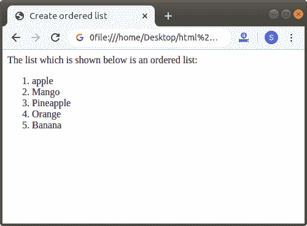
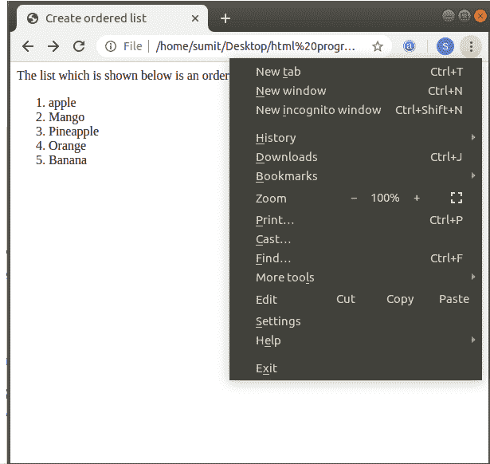
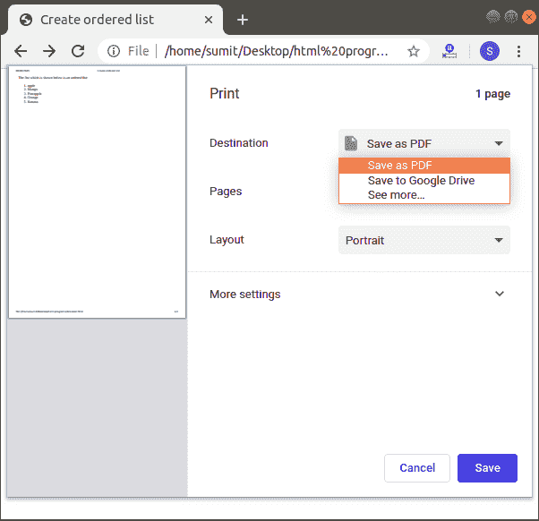
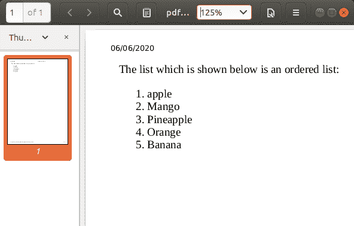

# 如何将 Html 转换成 PDF

> 原文:[https://www.javatpoint.com/how-to-convert-html-to-pdf](https://www.javatpoint.com/how-to-convert-html-to-pdf)

如果我们想把 Html 页面转换成 PDF，那么我们必须遵循下面给出的步骤。使用以下步骤，我们可以轻松转换:

**第一步:**首先我们要双击文件打开 [Html](https://www.javatpoint.com/html-tutorial) 文件。该文件在我们系统的默认浏览器中打开。

**第二步:**现在，我们要点击位于[浏览器](https://www.javatpoint.com/browsers) [窗口](https://www.javatpoint.com/windows)右上角的菜单选项。

**第三步:**然后我们要从下拉列表中点击打印选项。

**第四步:**现在，我们要从目的地列表中选择‘另存为 PDF’选项，如下图截图所示。然后，点击**保存**选项。

**第五步:**点击后，我们要指定一个 PDF 的名称和位置。

**第六步:**现在，我们的 Html 页面成功转换为 [PDF](https://www.javatpoint.com/pdf-full-form) 。我们可以通过双击文件来查看 PDF。

* * *