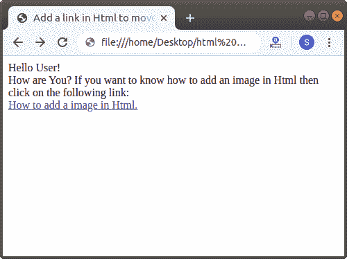
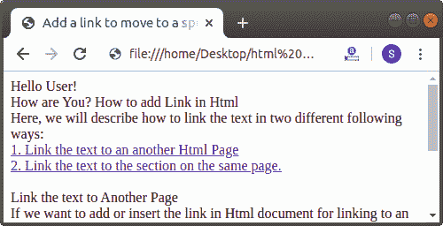

# 如何在 Html 中添加链接

> 原文：<https://www.javatpoint.com/how-to-add-link-in-html>

在这里，我们将描述如何以以下两种不同的方式链接文本:

1.  将文本链接到另一个 Html 页面
2.  将文本链接到同一页上的部分。

## 将文本链接到另一页

如果我们想在 Html 文档中添加或插入链接，以链接到另一个带有当前工作页面的 Html 页面，那么我们必须遵循下面给出的步骤。使用以下步骤，我们可以轻松地链接到另一个 Html 页面。

**第一步:**首先，我们必须在任何文本编辑器中键入 [Html](https://www.javatpoint.com/html-tutorial) 代码，或者在我们想要添加另一个 Html 页面链接的文本编辑器中打开现有的 Html 文件。

```html

<!Doctype Html>
<Html>   
<Head>    
<Title>   
Add a link in Html to move on another Web Page
</Title>
</Head>
<Body> 
Hello User! <br>
How are You?
If you want to know how to add an image in Html then click on the following link:
<br>
How to add an image in Html.    
</Body>
</Html>

```

**步骤 2:** 现在，将光标移动到我们想要创建为链接的文本的开始处。然后，在该点键入锚 **<一个>** 标记。

```html

<a> That Text which we want to create as a link 

```

**第三步:**然后，你必须关闭文本末尾的[锚点< /a >标签](https://www.javatpoint.com/html-anchor)，我们想要创建如下块所示的链接。

```html

<a> That Text which we want create as link </a>

```

**第四步:**现在我们要添加名为**【href】**的主播标签属性。所以，在起始的 **<一个>** 标签内输入 href 属性。然后，我们必须给出我们想要添加的 html 页面的路径。因此，在 **href** 属性中键入路径，如下块或 Html 代码所述。

```html

<!Doctype Html>
<Html>   
<Head>    
<Title>   
Add a link in Html to move on another Web Page
</Title>
</Head>
<Body> 
Hello User! <br>
How are You?
If you want to know how to add an image in Html then click on the following link:
<br>
<a href="https://www.javatpoint.com/how-to-insert-image-in-html"> How to add a image in Html. </a>    
</Body>
</Html>

```

[Test it Now](https://www.javatpoint.com/oprweb/test.jsp?filename=how-to-add-link-in-html1)

**第五步:**最后，我们必须将 Html 代码保存在保存链接的 Html 页面的同一个目录或同一个位置，然后运行代码。下面的截图显示了上述 Html 代码的输出:



## 将文本链接到同一页的部分

如果我们想将文本链接到同一页面的特定部分，请按照下面给出的步骤操作。使用以下步骤，我们可以很容易地在同一页面中链接另一个部分。

**第一步:**首先，我们必须在任何文本编辑器中键入 Html 代码，或者在文本编辑器中打开现有的 Html 文件，在该文件中，我们希望在同一 Html 页面中的特定部分上移动。

**步骤 2:** 现在，将光标放在我们想要链接的部分的开始处。然后，我们必须使用带有 id 属性的<锚标签。

```html

<a id="any_text_or_character">The Section of a page we want to link</a>

```

**步骤 3:** 现在，将光标放在我们想要创建为链接的文本的开始处。然后，在该点键入锚 **<一个>** 标记。

```html

<a> That Text which we want to create as a link for reaching the specific part 

```

**第 4 步:**然后，您必须关闭我们想要创建为链接的文本末尾的锚 **< /a >** 标签，如下块所示。

```html

<a> That Text which we want to create as a link for reaching the specific part </a>

```

**第五步:**现在我们要添加名为**【href】**的主播标签属性。因此，在起始的 **< /a >** 标签内输入 **href** 属性。然后，我们必须给出同一页面特定部分的 id。因此，在 href 属性中键入 id 后跟#号。如下块或 Html 代码所述。

```html

<!Doctype Html>
<Html>   
<Head>    
<Title>   
Add a link to move to a specific prt on same page. 
</Title>
</Head>
<Body> 
Hello User! <br>
How are You?
How to add Link in Html <br>
Here, we will describe how to link the text in two different following ways: <br> 
<a href="#1">1\. Link the text to an another Html Page <br>
</a>
<a href="#2">2\. Link the text to the section on the same page.
</a>
<br>
<br>
<a id="1"> Link the text to Another Page </a> <br>
If we want to add or insert the link in Html document for linking to an another Html page with the current working page then we have to follow the steps which are given below. Using the following steps we can easily link the another Html page.<br>
<br>
<a id="2">Link the text to section on the same page</a>
<br>
If we want to link a text to the particular part of the same page follow the steps which are given below. Using the following steps we can easily link the another section in the same page.
</Body>
</Html>

```

**第六步:**最后，我们必须保存 Html 文件，然后执行该文件。下面的截图显示了上述 Html 代码的输出:



* * *