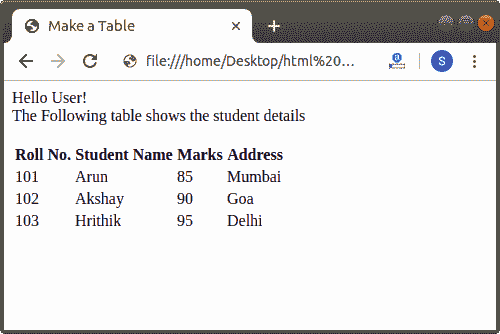

# 如何用 Html 制作表格

> 原文:[https://www.javatpoint.com/how-to-make-a-table-in-html](https://www.javatpoint.com/how-to-make-a-table-in-html)

如果我们想在将要显示在网页上的 Html 文档中制作一个表格，我们必须遵循下面给出的步骤。使用这些步骤，我们可以轻松制作任何表格:

**第一步:**首先，我们必须在任何文本编辑器中键入 [Html](https://www.javatpoint.com/html-tutorial) 代码，或者在我们想要制作表格的文本编辑器中打开现有的 Html 文件。

```

<!Doctype Html>
<Html>   
<Head>    
<Title>   
Make a Table
</Title>
</Head>
<Body> 
Hello User! <br>
The Following table shows the student details
</Body>
</Html>

```

**步骤 2:** 现在，将光标放在 body 标签之间我们想要在页面上显示表格的点上。然后，在那一点上输入[**<**>标记。](https://www.javatpoint.com/html-table)

```

<Body> 
Hello User! <br>
The Following table shows the student details
<table>
</Body>

```

**第三步:**然后我们要在下一行输入 **< tr >** 标记，表示表格行。它是表中第一个**T8【tr>T5】标签。因此，它指示表的第一行。**

```

<Body> 
Hello User! <br>
The Following table shows the student details
<table>
<tr>
</Body>

```

**第 4 步:**现在，我们必须使用 **<第>** 标签，该标签指示表格的标题。所以，在下一行输入**<>**标记。

```

<Body> 
Hello User! <br>
The Following table shows the student details
<table>
<tr>
<th>
</Body>

```

**第五步:**现在，我们必须键入第一个标题的名称，该标题将插入第一行的第一个单元格中。打字后，我们必须通过 **< /th >** 标签关闭表格标题。

```

<Body> 
Hello User! <br>
The Following table shows the student details
<table>
<tr>
<th>
Roll No.
</th>
</Body>

```

**步骤 6:** 与步骤 5 相同，我们也可以使用<第>标签插入其他表格标题。当所有的表格标题完成后，我们必须通过关闭 **< /tr >** 标签来关闭第一行。

```

<Body> 
Hello User! <br>
The Following table shows the student details
<table>
<tr>
<th>
Roll No.
</th>
<th>
Student Name
</th>
<th>
Marks
</th>
<th>
Address
</th>
</tr>
</body>

```

**第 7 步:**现在，我们必须创建一个新行，用于根据列的名称输入值。所以，在下一行输入 **< tr >** 标记。

```

<Body> 
Hello User! <br>
The Following table shows the student details
<table>
<tr>
<th>
Roll No.
</th>
<th>
Student Name
</th>
<th>
Marks
</th>
<th>
Address
</th>
</tr>
<tr>
</Body>

```

**步骤 8:** 现在，我们必须使用**<【TD】>**标签，该标签指示要输入到表格的一个单元格中的数据或信息。因此，如下块所示，在下一行中键入**<【TD】>**标记。

```

<Body> 
Hello User! <br>
The Following table shows the student details
<table>
<tr>
<th>
Roll No.
</th>
<th>
Student Name
</th>
<th>
Marks
</th>
<th>
Address
</th>
</tr>
<tr>
<td>
</Body>

```

**第九步:**然后，我们要给出第二行第一个单元格中第一列的值。输入数值后，我们必须关闭< /td >标签。

```

<Body> 
Hello User! <br>
The Following table shows the student details
<table>
<tr>
<th>
Roll No.
</th>
<th>
Student Name
</th>
<th>
Marks
</th>
<th>
Address
</th>
</tr>
<tr>
<td>
 101
</td>
</Body>

```

**第 10 步:**与第 8 步和第 9 步相同，我们也可以使用< td >标签插入其他列的值。当插入第二行的所有值时，我们必须通过关闭< tr >标签来关闭第二行。

```

<Body> 
Hello User! <br>
The Following table shows the student details
<table>
<tr>
<th>
Roll No.
</th>
<th>
Student Name
</th>
<th>
Marks
</th>
<th>
Address
</th>
</tr>
<tr>
<td> 101
</td>
<td>
 Arun 
</td>
<td>
 85
</td>
<td>
 Mumbai
</td>
</tr>
</Body>

```

**步骤 11:** 当所有的值都被插入到所有的行中时，那么我们必须通过</表格>标签来关闭表格。

```

<!Doctype Html>
<Html>   
<Head>    
<Title>   
Make a Table
</Title>
</Head>
<Body> 
Hello User! <br>
The Following table shows the student details <br><br>
<table>  <!-- The table tag which allows page to create a table. -->
<tr> <!-- First Row in the table -->
<th>  <!-- First cell in first row which holds the column1 heading in the table -->
Roll No.
</th>
<th>   <!-- second cell in first row which holds the column2 heading in the table -->
Student Name
</th>
<th>   <!-- Third cell in first row which holds the column3 heading in the table -->
Marks
</th>
<th>   <!-- Fourth cell in first row which holds the column1 heading in the table -->
Address
</th>
</tr>  <!-- First Row is closed -->
<tr>   <!-- Second Row starts in the table for entering the values of columns -->
<td>  <!-- value in first Column -->
101
</td>
<td>  <!-- value in Second Column -->
Arun 
</td>
<td>   <!-- value in third Column -->
85
</td>
<td>   <!-- value in fourth Column -->
Mumbai
</td>
</tr>  <!-- Second row is closed-->
<tr>    <!-- Third Row starts in the table -->
<td>  
102
</td>
<td> 
Akshay  
</td>
<td> 
90
</td>
<td> 
Goa
</td>
</tr>    <!-- Third Row is closed -->
<tr>     <!--Fourth Row starts in the table -->
<td>
103
</td>
<td> 
Hrithik
</td>
<td> 
95
</td>
<td> 
Delhi
</td>
</tr>    <!-- fourth row is closed -->
</table>
</Body>
</Html>

```

[Test it Now](https://www.javatpoint.com/oprweb/test.jsp?filename=how-to-make-a-table-in-html)

**第 12 步:**最后，我们必须保存 Html 代码，然后运行文件。下面的截图显示了上述 Html 代码的输出:



* * *