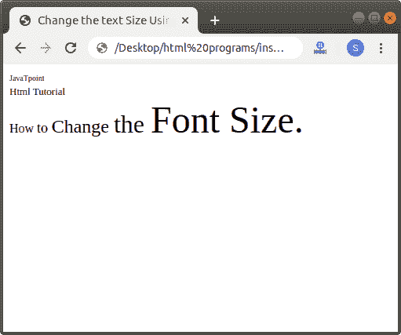
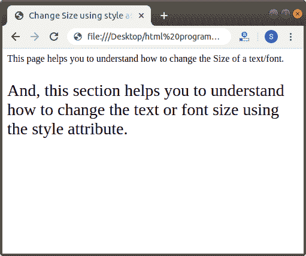
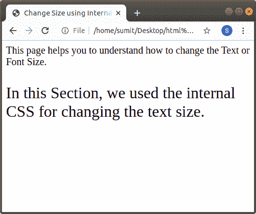

# 如何在 Html 中改变字体大小

> 原文:[https://www.javatpoint.com/how-to-change-font-size-in-html](https://www.javatpoint.com/how-to-change-font-size-in-html)

在 HTML 中，我们可以使用以下不同的方式来更改任何文本的大小:

1.  使用 HTML 标记
2.  使用内联样式属性
3.  使用内部 CSS

## 使用 HTML 标记

#### 注意:HTML 5 不支持字体的大小属性，所以我们必须使用内联样式属性和内部 CSS 选项来更改文本的大小。

如果我们想使用 [Html 标签](https://www.javatpoint.com/html-tags-list)来改变要显示在网页上的文本的大小，我们必须遵循下面给出的步骤。使用这些步骤，我们可以轻松更改任何文本的大小:

**第一步:**首先，我们必须在任何文本编辑器中键入 [Html](https://www.javatpoint.com/html-tutorial) 代码，或者在文本编辑器中打开现有的 Html 文件，我们希望在其中使用 Html 标签来更改字体大小。

```

<!Doctype Html>
<Html>   
<Head>    
<Title>   
Change the text Size Using HTML tag
</Title>
</Head>
<Body> 
JavaTpoint   <br>
Html Tutorial   <br>
How to Change the Font size in Html
</Body>
</Html>

```

**第二步:**现在，将光标移动到我们想要改变大小的文本的开始处。然后，在那个位置输入 Html **<字体>** 标签。

```

<font> Single Line text and statements

```

第三步:然后，我们要关闭想要改变大小的文本末尾的[字体标签](https://www.javatpoint.com/html-font-tag)。

```

<font> Single Line text and statements </font>

```

**第四步:**现在我们要添加名为**【大小】**的字体标签的属性。所以，在开始的 **<字体>** 标签内输入大小属性。然后，我们必须给出我们想要在文本上使用的大小。我们可以给出大小从 1 到 7 的值。因此，在**尺寸属性**中键入数字，如下图所示。

```

<!Doctype Html>
<Html>   
<Head>    
<Title>   
Change the text Size Using HTML tag
</Title>
</Head>
<Body> 
<font size="1">
JavaTpoint   <br>  
</font>
<font size="2">
Html Tutorial   <br>
</font>
<font size="3">
How  
</font>
<font size="4">
to  
</font>
<font size="5">
Change  
</font>
<font size="6">
the 
</font>
<font size="7">
Font Size. 
</font> 
</Body>
</Html>

```

**第五步:**最后，我们必须在文本编辑器中保存 Html 代码并运行代码。执行后，我们将在浏览器中看到输出。下面的截图显示了上述 Html 代码的输出:



## 使用内嵌样式属性

如果我们想使用要在网页上显示的内联样式属性来改变文本的大小，我们必须遵循下面给出的步骤。使用这些步骤，我们可以轻松更改文本大小。

**第一步:**首先，我们必须在任何文本编辑器中键入 Html 代码，或者在文本编辑器中打开现有的 Html 文件，我们希望在其中使用 style 属性来更改文本的大小。

```

<!Doctype Html>
<Html>   
<Head>    
<Title>   
Change Size using style attribute
</Title>
</Head>
<Body> 
This page helps you to understand how to change the Size of a text/font.
And, this section helps you to understand how to change the text or font size using the style attribute.
</Body>
</Html>

```

**第二步:**现在，将光标放在我们想要改变大小的文本的开始处。然后，在任何元素中键入内联样式属性。在这里，我们用 [< p >(段)标记](https://www.javatpoint.com/html-paragraph):

```

<p style="font-size: ; "> Any Text whose font we want to Change

```

**第三步:**这一步，我们要给出尺寸。因此，在 style 属性的 font-size 属性中键入大小。

```

<p style="font-size:14px ; "> Any Text whose font we want to Change

```

**第四步:**然后，我们必须关闭文本末尾想要改变大小的元素。

```

<p style="font-size:14px ; "> Any Text whose font we want to Change </p>

```

**第五步:**最后保存使用 [CSS](https://www.javatpoint.com/css-tutorial) 样式属性改变文本/字体大小的 Html 代码。

```

<!Doctype Html>
<Html>   
<Head>    
<Title>   
Change Size using style attribute
</Title>
</Head>
<Body> 
This page helps you to understand how to change the Size of a text/font.
<p style="font-size:28px ;">
And, this section helps you to understand how to change the text or font size using the style attribute. </p>
</Body>
</Html>

```

[Test it Now](https://www.javatpoint.com/oprweb/test.jsp?filename=how-to-change-font-size-in-html)

下面的截图显示了上述代码的输出:



## 使用内部 CSS

如果我们想使用将在网页上显示的[内部级联样式表](https://www.javatpoint.com/internal-css)来更改文本或字体大小，我们必须遵循下面给出的步骤。使用这些步骤，我们可以轻松更改任何文本的大小。

**第一步:**首先，我们必须在任何文本编辑器中键入 Html 代码，或者在文本编辑器中打开现有的 Html 文件，我们希望在其中使用内部 CSS 来更改文本的大小。

```

<!Doctype Html>
<Html>   
<Head>    
<Title>   
Change Size using Internal CSS
</Title>
</Head>
<Body> 
This page helps you to understand how to change the Text or Font Size.
In this Section, we used the internal CSS for changing the text size 
</Body>
</Html>

```

**第二步:**现在，我们必须将光标放在 Html 文档的标题标签中，然后定义 [**<样式>** 标签](https://www.javatpoint.com/html-style)内的样式，如下图所示。然后在元素选择器中输入**字号**属性。

```

<Head>
<style>
Body
{
font-size: 20px;
}
p
{
font-size:xx-large;
}
</style>
</Head>

```

**第三步:**现在，我们必须在要更改大小的文本之前键入定义的元素选择器。

```

<!Doctype Html>
<Html>   
<Head>    
<Title>   
Change Size using Internal CSS
</Title>
<style>
Body
{
font-size: 20px;
}
p
{
font-size:xx-large;
}
</style>
</Head>
<Body> 
This page helps you to understand how to change the Text or Font Size.
<p>
In this Section, we used the internal CSS for changing the text size. </p>
</Body>
</Html>

```

[Test it Now](https://www.javatpoint.com/oprweb/test.jsp?filename=how-to-change-font-size-in-html2)

下面的截图显示了上述代码的输出:



* * *