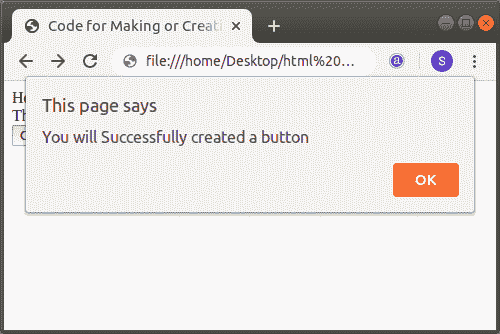

# 如何用 Html 制作按钮

> 原文:[https://www.javatpoint.com/how-to-make-a-button-in-html](https://www.javatpoint.com/how-to-make-a-button-in-html)

如果我们想在 Html 文档中制作一个按钮，在浏览器中显示在网页上，我们必须遵循下面给出的步骤。使用这些步骤，我们可以很容易地制作一个调用 [JavaScript 函数](https://www.javatpoint.com/javascript-function)的按钮。

**第一步:**首先，我们要在任何文本编辑器中键入 Html 代码，或者在我们想要制作按钮的文本编辑器中打开现有的 Html 文件。

```

<!Doctype Html>
<Html>   
<Head>    
<Title>   
Code for Making or Creating a Button
</Title>
</Head>
<Body> 
Hello User! <br>
The following Tag helps us to make a button:
</Body>
</Html>

```

**第二步:**现在，将光标移动到我们想要在网页上显示按钮的地方。然后，在该点键入 [Html](https://www.javatpoint.com/html-tutorial) **<按钮>** 标记。

```

<button>Any text we want to show on the button </button>

```

**第三步:**现在我们要添加[按钮标签](https://www.javatpoint.com/html-button-tag)的属性，名称为**【类型】**。所以，在起始 **<按钮>** 标签内输入**‘type’**属性。然后，我们必须给出属性值。因此，我们必须在 type 属性中键入按钮值，如下块所述。

```

<button type ="button" >Any text we want to show on the button </button>

```

**第四步:**现在，我们要使用 **<按钮>** 的另一个属性，标签的名字是“onclick”。因此，在开始的 **<按钮>** 标签内的类型属性之后键入 onclick 属性。然后，我们必须键入当用户点击按钮时要显示的消息。因此，在 onclick 属性中键入消息作为值。

```

<button type="button"   onclick="javascript code or function"> Any text we want to show on the button </button>

```

**第五步:**最后，我们必须保存 Html 代码，然后运行它。执行后，如果我们按顺序执行上述步骤，我们将在网页上看到按钮。

```

<!Doctype Html>
<Html>   
<Head>    
<Title>   
Code for Making or Creating a Button
</Title>
</Head>
<Body> 
Hello User! <br>
The following Tag helps us to make a button:  <br>
<button type="button"   onclick="alert('You will Successfully created a button')"> 
Click Here 
</button>
</Body>
</Html>

```

上述 Html 代码的输出如下图所示:



* * *