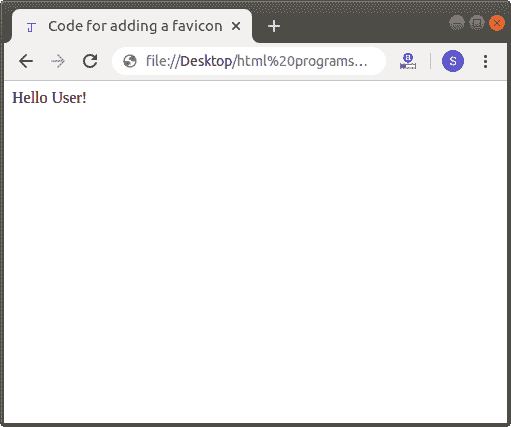

# 如何在 Html 中添加收藏夹图标

> 原文：<https://www.javatpoint.com/how-to-add-a-favicon-in-html>

如果我们想在 Html 文档中添加一个 favicon，显示在浏览器中页面标题的前面，我们必须遵循下面给出的步骤。使用这些步骤，我们可以轻松地添加一个 favicon。

**第一步:**首先，我们要创建一个 favicon，我们想把它添加到 Html 文档中。因此，使用[https://www.favicon.cc/](https://www.favicon.cc/)链接，我们可以创建一个收藏夹图标。

**第二步:**当我们成功获取了 favicon，那么我们就要通过点击下载 favicon 选项来下载了。

**第三步:**现在，复制下载的[收藏夹图标](https://www.javatpoint.com/html-favicon)并保存到保存 Html 文档的位置。

**第四步:**现在，我们必须在任何文本编辑器中键入 [Html](https://www.javatpoint.com/html-tutorial) 代码，或者在我们想要添加收藏夹图标的文本编辑器中打开现有的 Html 文件。

```html

<!Doctype Html>
<Html>   
<Head>    
<Title>   
Code for adding a favicon
</Title>
</Head>
<Body> 
Hello User! <br>
</Body>
</Html>

```

**第五步:**现在，我们必须将光标放在 Html 文档的标题标签中，然后在标题标签关闭后定义 **<链接>** 标签，如下图所示。然后，我们要在 **<链接>** 标签内使用[链接标签](https://www.javatpoint.com/html-link-tag)的属性。

```html

<Head>    
<Title>   
Code for adding a favicon
</Title>
<link rel="shortcut icon" href="favicon.ico" type="image/x-icon">
</Head>

```

**第六步:**最后，我们必须保存 Html 文档，然后运行它。

```html

<!Doctype Html>
<Html>   
<Head>    
<Title>   
Code for adding a favicon
</Title>
<link rel="shortcut icon" href="faviconJTP.ico" type="image/x-icon">
</Head>
<Body> 
Hello User! <br>
</Body>
</Html>

```

下面的截图显示了上述 Html 代码的输出:



* * *