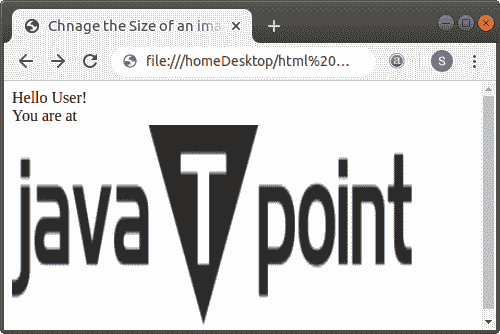
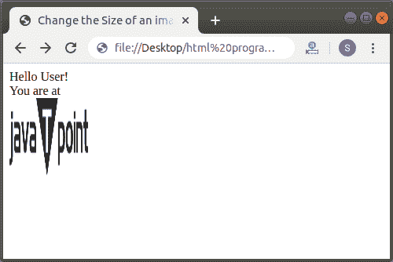
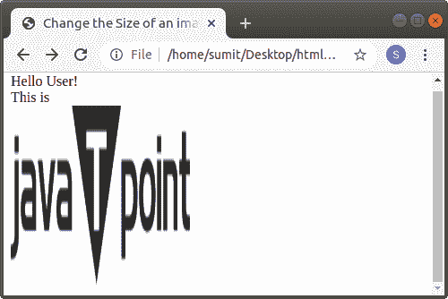

# 如何在 Html 中更改图像大小

> 原文:[https://www.javatpoint.com/how-to-change-image-size-in-html](https://www.javatpoint.com/how-to-change-image-size-in-html)

在 HTML 中，我们可以使用以下不同方式更改任何图像的大小:

1.  使用 HTML 标记
2.  使用内联样式属性
3.  使用内部 CSS

## 使用 HTML 标记

#### 注意:HTML 5 不支持的高度和宽度属性，所以我们必须使用内嵌样式属性和内部 CSS 选项来更改图像或图片大小。

如果我们想使用 [Html 标签](https://www.javatpoint.com/html-tags)改变文档中图像的大小，该标签将显示在网页上，我们必须遵循下面给出的步骤。使用这些步骤，我们可以轻松更改图像大小:

**第一步:**首先，我们必须在任何文本编辑器中键入 [Html](https://www.javatpoint.com/html-tutorial) 代码，或者在文本编辑器中打开现有的 Html 文件，我们要在其中更改图像的大小。

```

<!Doctype Html>
<Html>   
<Head>    
<Title>   
Chnage the Size of an image
</Title>
</Head>
<Body> 
Hello User! <br>
You are at <br>
 <br> 
</Body>
</Html>

```

**步骤 2:** 现在，将光标放在 img 标签内。然后，我们必须使用 img 标签的高度和宽度属性来改变图像的大小。因此，我们必须输入这些属性:

```


```

**第三步:**最后，我们必须保存 Html 文件，然后运行它。

```

<!Doctype Html>
<Html>   
<Head>    
<Title>   
Chnage the Size of an image
</Title>
</Head>
<Body> 
Hello User! <br>
You are at <br>
 <br> 
</Body>
</Html>

```

[Test it Now](https://www.javatpoint.com/oprweb/test.jsp?filename=how-to-change-image-size-in-html)

下面的截图显示了上述 Html 代码的输出:



## 使用内嵌样式属性

如果我们想要使用一个内嵌样式属性来改变一个图像的大小，它将被显示在一个网页上，我们必须遵循下面给出的步骤。使用这些步骤，我们可以轻松更改图片大小。

**第一步:**首先，我们必须在任何文本编辑器中键入 Html 代码，或者在文本编辑器中打开现有的 Html 文件，我们希望在其中使用 style 属性来更改图像的大小。

```

<!Doctype Html>
<Html>   
<Head>    
<Title>   
Change the Size of an image using inline style attribute
</Title>
</Head>
<Body> 
Hello User! <br>
You are at <br>
 <br> 
</Body>
</Html>

```

**第二步:**现在，将光标放在我们想要改变尺寸的图像的 [img 标签](https://www.javatpoint.com/html-image)内。然后，我们必须在 src [属性](https://www.javatpoint.com/html-attributes)之后键入样式属性。然后，我们必须在 style 属性中键入宽度和高度属性，如下块所示:

```

 <br> 

```

**第三步:**最后我们必须保存这个 Html 文件，然后运行它。

```

<!Doctype Html>
<Html>   
<Head>    
<Title>   
Change the Size of an image using inline style attribute
</Title>
</Head>
<Body> 
Hello User! <br>
You are at <br>
 <br> 
</Body>
</Html>

```

[Test it Now](https://www.javatpoint.com/oprweb/test.jsp?filename=how-to-change-image-size-in-html2)

上述 Html 代码的输出如下图所示:



## 使用内部 CSS

如果我们想使用要在网页上显示的[内部级联样式表](https://www.javatpoint.com/internal-css)来更改图像或图片的大小，我们必须遵循下面给出的步骤。使用这些步骤，我们可以轻松更改任何图像的大小。

**第一步:**首先，我们必须在任何文本编辑器中键入 Html 代码，或者在文本编辑器中打开现有的 Html 文件，其中我们希望使用内部 CSS 来更改图像的大小。

```

<!Doctype Html>
<Html>   
<Head>    
<Title>   
Change the Size of an image using internal CSS
</Title>
</Head>
<Body> 
Hello User! <br>
This is 
 <br> 
</Body>
</Html>

```

**第二步:**现在，我们必须将光标放在 Html 文档的头部标签中，然后在 **<样式>** 标签中定义样式，如下图所示。然后，在 id 选择器中输入**宽度和高度**属性。

```

<Head>
<style>
#imagesize
{
width:100px;
height:100px;
}
</style>
</Head>

```

**步骤 3:** 现在，我们必须在图像的 img 标签中键入 id，我们要更改其大小:

```

<!Doctype Html>
<Html>   
<Head>    
<Title>   
Change the Size of an image using internal CSS
</Title>
<style>
#imagesize
{
width:200px;
height:200px;
}
</style>
</Head>
<Body> 
Hello User! <br>
This is <br>
 <br> 
</Body>
</Html>

```

[Test it Now](https://www.javatpoint.com/oprweb/test.jsp?filename=how-to-change-image-size-in-html3)

**第五步:**现在，我们必须保存 Html 文件，然后运行该文件。下面的截图显示了上述 Html 代码的输出:



* * *