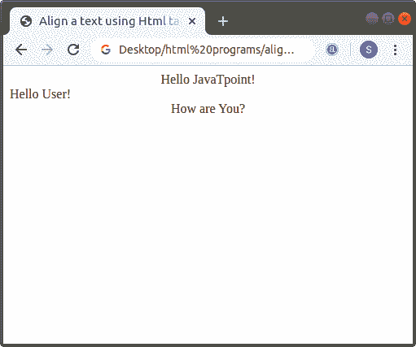
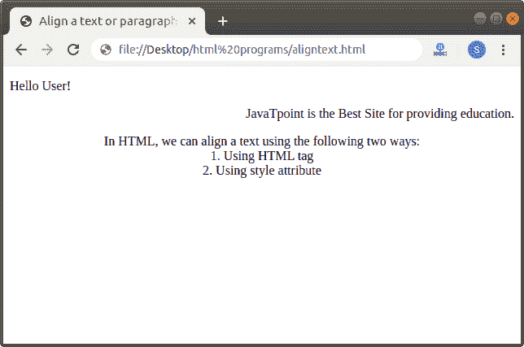

# 如何在 Html 中对齐文本

> 原文:[https://www.javatpoint.com/how-to-align-text-in-html](https://www.javatpoint.com/how-to-align-text-in-html)

在 HTML 中，我们可以使用以下两种方式对齐文本:

1.  使用 HTML 标记(

    <center>标记)</center>

2.  使用样式属性

## 使用 HTML 标记

如果我们想使用要在网页上显示的 [Html 标签](https://www.javatpoint.com/html-tags)在中心位置移动文本，我们必须遵循下面给出的步骤。

**第一步:**首先，我们必须在任何文本编辑器中键入 [Html](https://www.javatpoint.com/html-tutorial) 代码，或者在文本编辑器中打开现有的 Html 文件，在该文件中我们想要将文本居中对齐:

```

<!Doctype Html>
<Html>   
<Head>    
<Title>   
Align a text using Html tags
</Title>
</Head>
<Body> 
Hello JavaTpoint! <br>
Hello User! <br>
How are You?  
</Body>
</Html>

```

**第二步:**现在，将光标移动到我们要指定其对齐方式为中心的文本的开始处。然后，在这一点上输入 Html 标签。

```

<Center> Single Line text and statements

```

**第三步:**然后，我们必须关闭文本末尾的[中心标签](https://www.javatpoint.com/html-center-tag)，我们要将它放在中心位置。

```

<center> Single Line text and statements </font>

```

**第 4 步:**最后，保存 Html 文件，然后运行该文件。

```

<!Doctype Html>
<Html>   
<Head>    
<Title>   
Align a text using Html tags
</Title>
</Head>
<Body> 
<Center>Hello JavaTpoint! <br></center>
Hello User! <br>
<center>How are You?  </center>
</Body>
</Html>

```

[Test it Now](https://www.javatpoint.com/oprweb/test.jsp?filename=How-to-align-text-in-Html-1)

上述代码的输出如下图所示:



## 使用样式属性

如果我们想使用内联样式属性来对齐要在网页上显示的文本，我们必须遵循下面给出的步骤。

**第一步:**首先，我们必须在任何文本编辑器中键入 Html 代码，或者在文本编辑器中打开现有的 Html 文件，我们希望在其中使用样式属性来对齐文本或段落。

```

<!Doctype Html>
<Html>   
<Head>    
<Title>   
Align a text or paragraph using style attribute
</Title>
</Head>
<Body> 
Hello User!
JavaTpoint is the Best Site for providing education. <br>
In HTML, we can align a text using the following two ways:
1\. Using HTML tag 
2\. Using style attribute 
</Body>
</Html>

```

**步骤 2:** 现在，将光标移动到我们要指定对齐方式的文本的开始处。然后，在 [< p >(段落)标签](https://www.javatpoint.com/html-paragraph)内输入 [CSS](https://www.javatpoint.com/css-tutorial) **样式**属性。

```

<p style="text-align:center/left/right;"> Any Text or paragraph

```

**第四步:**最后，保存改变文本或段落位置的 Html 代码。

```

<!Doctype Html>
<Html>   
<Head>    
<Title>   
Align a text or paragraph using style attribute
</Title>
</Head>
<Body> 
<p style="text-align:left;"> Hello User! </p>
<p style="text-align:right;"> JavaTpoint is the Best Site for providing education. 
</p>
<p style="text-align:Center;"> In HTML, we can align a text using the following two ways: <br>
1\. Using HTML tag  <br>
2\. Using style attribute </p> 
</Body>
</Html>

```

[Test it Now](https://www.javatpoint.com/oprweb/test.jsp?filename=How-to-align-text-in-Html-2)

下面的截图显示了上述 Html 代码的输出:



* * *