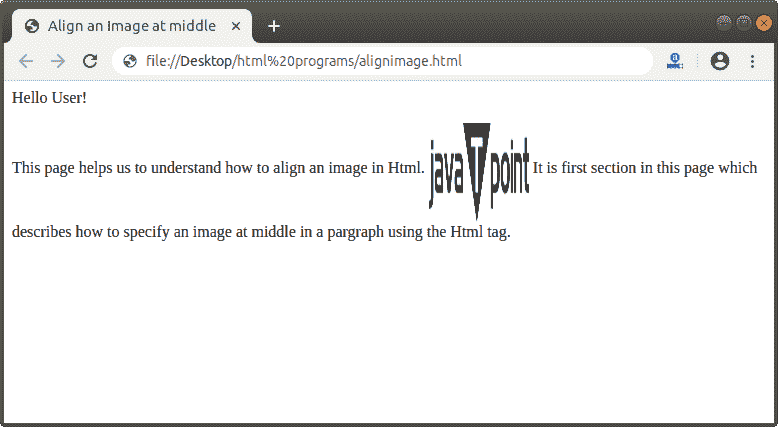
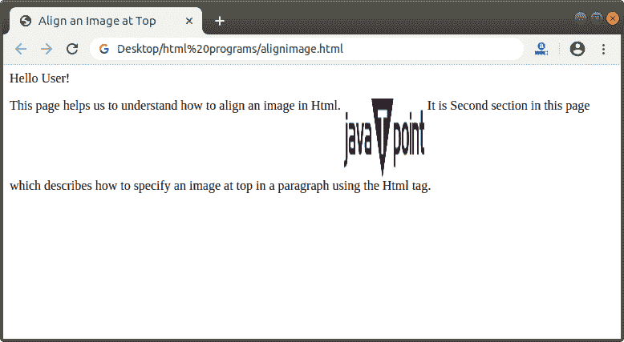
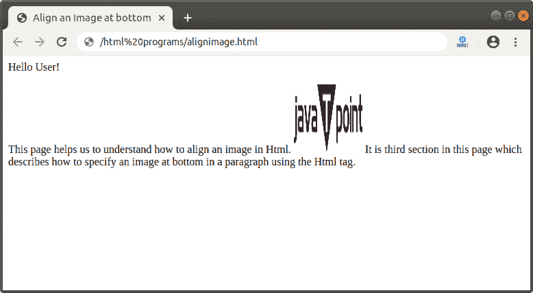
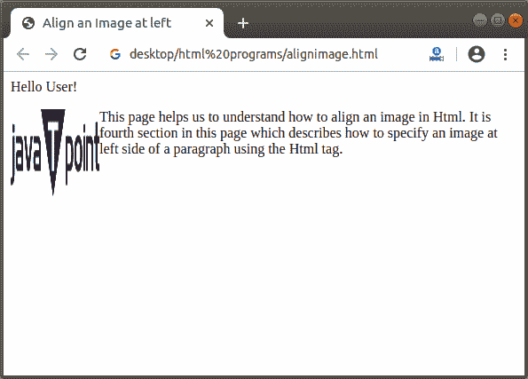
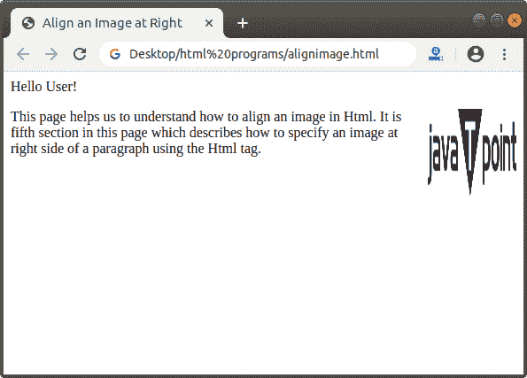

# 如何在 Html 中对齐图像

> 原文:[https://www.javatpoint.com/how-to-align-image-in-html](https://www.javatpoint.com/how-to-align-image-in-html)

如果我们想使用 Html 标签将图像移动到网页上的不同位置，我们必须遵循下面给出的步骤。

**第一步:**首先，我们必须在任何文本编辑器中键入 [Html](https://www.javatpoint.com/html-tutorial) 代码，或者在文本编辑器中打开我们想要对齐图像的现有 Html 文件:

```

<!Doctype Html>
<Html>   
<Head>    
<Title>   
Align an Image
</Title>
</Head>
<Body> 
Hello User!
This page helps us to understandhow to specify an image at a particular position in a pargraph using the Html tag.  
 
</Body>
</Html>

```

**步骤 2:** 现在，将光标放在我们要对齐的图像的< img >标签内。然后，我们必须使用 img 标签的 align 属性来指定位置。因此，我们必须键入 align 属性，如下块所述。

```


```

**第三步:**指定位置后，我们要保存好 Html 代码，然后运行文件。下面是不同的 Html 代码，在不同的位置显示了段落中的图像:

### 1.中间

该对齐值将图像设置在中间。

```

<!Doctype Html>
<Html>   
<Head>    
<Title>   
Align an Image at middle
</Title>
</Head>
<Body> 
Hello User!
<p>This page helps us to understand how to align an image in Html. 
 
It is first section in this page which describes how to specify an image at middle in a pargraph using the Html tag.</p> 
</Body>
</Html>

```

[Test it Now](https://www.javatpoint.com/oprweb/test.jsp?filename=How-to-align-image-in-Html-1)

上述 Html 代码的输出如下图所示:



### 2.顶端

该对齐值将图像设置在顶部。

```

<!Doctype Html>
<Html>   
<Head>    
<Title>   
Align an Image at Top
</Title>
</Head>
<Body> 
Hello User!
<p>This page helps us to understand how to align an image in Html. 
 
It is Second section in this page which describes how to specify an image at top in a paragraph using the Html tag.</p> 
</Body>
</Html>

```

[Test it Now](https://www.javatpoint.com/oprweb/test.jsp?filename=How-to-align-image-in-Html-2)

上述 Html 代码的输出如下图所示:



### 3.底部

该对齐值将图像设置在底部。

```

<!Doctype Html>
<Html>   
<Head>    
<Title>   
Align an Image at bottom
</Title>
</Head>
<Body> 
Hello User!
<p>This page helps us to understand how to align an image in Html. 
 
It is third section in this page which describes how to specify an image at bottom in a paragraph using the Html tag.</p> 
</Body>
</Html>

```

[Test it Now](https://www.javatpoint.com/oprweb/test.jsp?filename=How-to-align-image-in-Html-3)

上述 Html 代码的输出如下图所示:



### 4.左边的

此对齐值设置左侧的图像。

```

<!Doctype Html>
<Html>   
<Head>    
<Title>   
Align an Image at left
</Title>
</Head>
<Body> 
Hello User!
<p>This page helps us to understand how to align an image in Html. 
 
It is fourth section in this page which describes how to specify an image at left side of a paragraph using the Html tag.</p> 
</Body>
</Html>

```

[Test it Now](https://www.javatpoint.com/oprweb/test.jsp?filename=How-to-align-image-in-Html-4)

上述 Html 代码的输出如下图所示:



### 5.对吧

该对齐值将图像设置在右侧。

```

<!Doctype Html>
<Html>   
<Head>    
<Title>   
Align an Image at Right
</Title>
</Head>
<Body> 
Hello User!
<p>This page helps us to understand how to align an image in Html. 
 
It is fifth section in this page which describes how to specify an image at right side of a paragraph using the Html tag.</p> 
</Body>
</Html>

```

[Test it Now](https://www.javatpoint.com/oprweb/test.jsp?filename=How-to-align-image-in-Html-5)

上述 Html 代码的输出如下图所示:



* * *