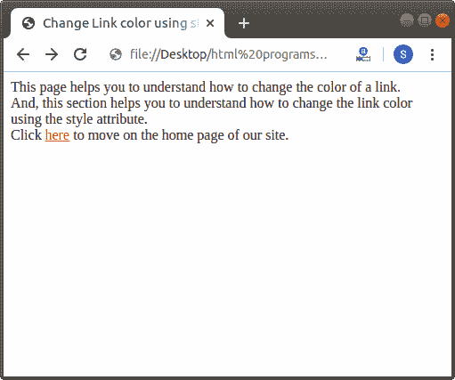

# 如何在 Html 中更改链接颜色

> 原文：<https://www.javatpoint.com/how-to-change-link-color-in-html>

如果我们想使用一个用于链接到另一个页面的内嵌样式属性来改变链接颜色，那么我们必须遵循下面给出的步骤。使用这些步骤，我们可以轻松地更改链接的颜色。

**第一步:**首先，我们必须在任何文本编辑器中键入 [Html](https://www.javatpoint.com/html-tutorial) 代码，或者在文本编辑器中打开现有的 Html 文件，我们希望在其中使用样式属性来更改链接颜色。

```html

<!Doctype Html>
<Html>   
<Head>    
<Title>   
Change Link color using style attribute
</Title>
</Head>
<Body> 
This page helps you to understand how to change the link color using the style attribute.
<br>
Click <a href="https://www.javatpoint.com/">here</a> to move on the home page of our site. 
</Body>
</Html>

```

**第二步:**现在，将光标放在我们想要更改其链接颜色的起始[锚点标签](https://www.javatpoint.com/html-anchor)内。然后，在该标记中键入内联样式属性。

```html

Click <a href="https://www.javatpoint.com/" style="">here</a>

```

**第三步:**现在，我们必须在样式属性中键入颜色属性。然后，我们必须指定要显示的颜色名称。

```html

Click <a href="https://www.javatpoint.com/" style="color:red">here</a>

```

**第四步:**最后，我们必须保存 Html 文件，然后运行该文件。

```html

<!Doctype Html>
<Html>   
<Head>    
<Title>   
Change Link color using style attribute
</Title>
</Head>
<Body> 
This page helps you to understand how to change the link color using the style attribute.
<br>
Click <a href="https://www.javatpoint.com/" style="color:red">here</a> to move on the home page of our site. 
</Body>
</Html>

```

[Test it Now](https://www.javatpoint.com/oprweb/test.jsp?filename=How-to-Change-Link-color-in-Html-1)

上述 Html 代码的输出如下图所示:



* * *