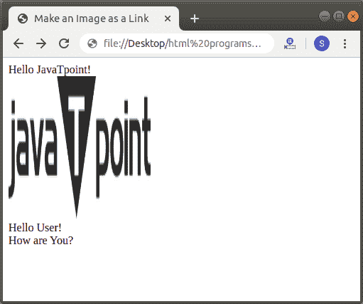

# 如何在 Html 中使图像成为链接

> 原文：<https://www.javatpoint.com/how-to-make-an-image-a-link-in-html>

如果我们想把图片作为链接另一个 Html 页面的链接，那么我们必须遵循下面给出的步骤。使用这些步骤，我们可以轻松地将任何图像作为链接:

**第一步:**首先，我们要在任何文本编辑器中键入 Html 代码，或者在文本编辑器中打开现有的 Html 文件，我们要在其中制作一个图像作为链接。

```html

<!Doctype Html>
<Html>   
<Head>    
<Title>   
Make an Image as a Link
</Title>
</Head>
<Body> 
Hello JavaTpoint! <br>
 <br>
Hello User! <br>
How are You?  
</Body>
</Html>

```

**第二步:**现在，将光标放在 [Html](https://www.javatpoint.com/html-tutorial) 文档中的 [< img >标签](https://www.javatpoint.com/html-image)之前。然后，我们必须使用[锚标签](https://www.javatpoint.com/html-anchor)，用于链接另一个页面。因此，在该点键入< a >标记。

```html

<a>
 </a>

```

**第三步:**现在，我们要添加名为“ **href** 的锚标签的属性。所以，在起始 **<内输入 **href** 属性一个>** 标记。然后，我们必须给出我们想要与图像链接的 html 页面的路径。因此，在 href 属性中键入路径，如下面的块或 Html 代码中所述。

```html

<a>
 </a>

```

**第四步:**最后，我们必须保存 Html 文件，然后在浏览器中运行该文件。

```html

<!Doctype Html>
<Html>   
<Head>    
<Title>   
Make an Image as a Link
</Title>
</Head>
<Body> 
Hello JavaTpoint! <br>
<a href="https://www.javatpoint.com/">
 
</a>
<br>
Hello User! <br>
How are You?  
</Body>
</Html>

```

[Test it Now](https://www.javatpoint.com/oprweb/test.jsp?filename=How-to-make-an-Image-a-Link-in-Html-1)

下面的截图显示了上述 Html 代码的输出:



* * *