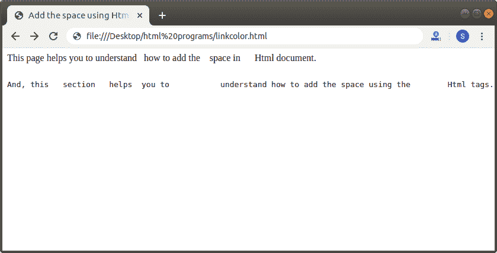
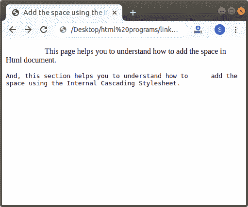

# 如何在 Html 中添加空格

> 原文：<https://www.javatpoint.com/how-to-add-space-in-html>

在 HTML 中，我们可以使用以下不同的方式轻松地在文档中添加空间:

1.  使用 Html
2.  使用内部 CSS

## 使用 Html

如果我们想使用 [Html 标记](https://www.javatpoint.com/html-tags)在文档中添加空格来显示文本前后的空格，那么我们必须按照下面给出的步骤操作。使用这些步骤，我们可以轻松添加空间:

**第一步:**首先，我们必须在任何文本编辑器中键入 [Html](https://www.javatpoint.com/html-tutorial) 代码，或者在我们想要添加空格的文本编辑器中打开现有的 Html 文件。

```

<!Doctype Html>
<Html>   
<Head>    
<Title>   
Add the space using Html tags
</Title>
</Head>
<Body> 
This page helps you to understand how to add the space in Html document.
And, this section helps you to understand how to add the space using the Html tags.
</Body>
</Html>

```

**第二步:**现在，将光标放在我们想要添加空格的地方。然后，我们必须按键盘上的空格键。基本上，网页在两个单词之间只显示一个空格。不管我们按了多少空格键。

**第三步:**如果我们想在网页上的文本前后显示多个空格，那么我们必须给出以下标签:

```

&nbsp;    This tag is used for displaying only one space between the text. 

```

**第 4 步:**如果我们想插入/添加更长的空格，那么我们也可以使用以下标签来显示网页文本之间的两个或四个空格:

```

&ensp;       This tag is used for displaying two spaces.

&emsp;       This tag is used for displaying four spaces.

```

**第五步:**我们还可以添加< pre >标签，该标签在网页上显示的文本与在 Html 文档中输入的文本相同。

```

<pre>   Any text or paragraph </pre>

```

**第六步:**当我们在文档中成功添加了空间后，我们就要保存 Html 文件并运行该文件。

```

<!Doctype Html>
<Html>   
<Head>    
<Title>   
Add the space using Html tags
</Title>
</Head>
<Body> 
This page helps you to understand  <!-- This tag shows one space between the 'understand' and 'how' words. -->
how to add the &emsp; <!-- This tag shows two space between the 'the' and 'space' words. --> space in  &ensp; <!-- This tag shows four space between the 'in' and 'Html' words. -->
 Html document.
<pre> <!-- This tag shows the same content which is written between the pre tags. -->
And, this   section   helps  you to           understand how to add the space using the        Html tags.</pre>
</Body>
</Html>

```

上述 Html 代码的输出如下图所示:



## 使用内部 CSS

如果我们想使用[内部级联样式表](https://www.javatpoint.com/internal-css)在文档中添加空格来显示文本前后的空格，我们必须遵循下面给出的步骤。使用这些步骤，我们可以轻松添加空间。

**第一步:**首先，我们要在任何文本编辑器中键入 Html 代码，或者在文本编辑器中打开现有的 Html 文件，在其中我们要使用**内部 CSS** 来添加空格。

```

<!Doctype Html>
<Html>   
<Head>    
<Title>   
Add the space using the Internal Cascading StyleSheet
</Title>
</Head>
<Body> 
This page helps you to understand how to add the space in Html document.
And, this section helps you to understand how to add the space using the Internal Cascading Stylesheet.
</Body>
</Html>

```

**第二步:**现在，我们必须将光标放在 Html 文档的 [**头标签**](https://www.javatpoint.com/html-head) 上，然后定义 [**<样式>** 标签](https://www.javatpoint.com/html-style)内的样式，如下图所示。然后，我们必须在 [**段落**](https://www.javatpoint.com/html-paragraph) 元素中键入**文本缩进**属性。

```

<Head>    
<Title>   
Add the space using the Internal Cascading StyleSheet
</Title>
<style>
p
{
text-indent: 5em;
}
.tab1 { 
            tab-size: 2; 
        } 
</style>
</Head>

```

**第三步:**现在，我们必须在 Html 的 [< pre >标签](https://www.javatpoint.com/html-pre-tag)中键入段落标签和类标签 1。最后，我们必须保存 Html 文件，然后运行该文件。

```

<!Doctype Html>
<Html>   
<Head>    
<Title>   
Add the space using the Internal Cascading StyleSheet
</Title>
<style>
p
{
text-indent:5em;
}
.tab1 { 
            tab-size: 2; 
        } 
</style>
</Head>
<Body> 
<p>This page helps you to understand how to add the space in Html document.
<pre class="tab1">
And, this section helps you to understand how to   	  add the  <br>space using the Internal Cascading Stylesheet.</pre> </p>
</Body>
</Html>

```

[Test it Now](https://www.javatpoint.com/oprweb/test.jsp?filename=How-to-add-Space-in-Html-2)

下面的截图显示了上述 Html 代码的输出:



* * *