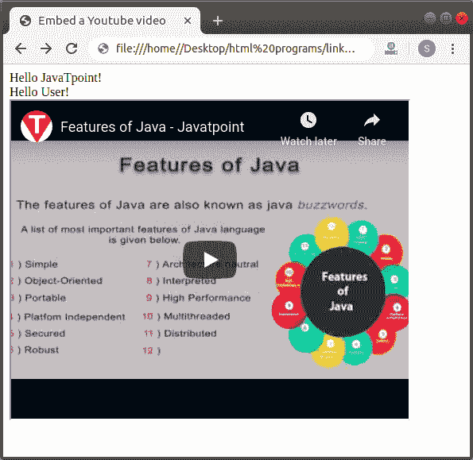
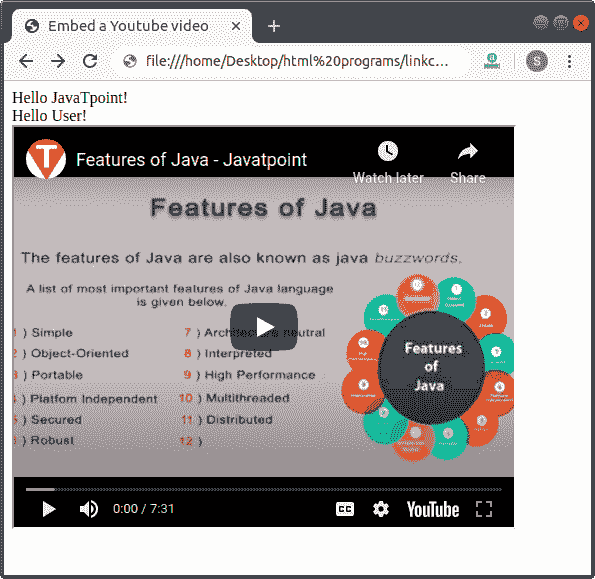

# 如何在 Html 中嵌入 Youtube 视频

> 原文：<https://www.javatpoint.com/how-to-embed-youtube-video-in-html>

如果我们想在 Html 文档中嵌入 Youtube 视频，我们必须遵循下面给出的步骤。使用这些步骤，我们可以很容易地在网页上显示一个 Youtube 视频。

**第一步:**首先，我们要在 Youtube 上传一段视频，然后在网页上展示。然后我们要拍下那个视频的 Id。

**第二步:**现在，我们必须在任何文本编辑器中键入 Html 代码，或者在文本编辑器中打开现有的 [Html](https://www.javatpoint.com/html-tutorial) 文件，我们希望在其中[嵌入](https://www.javatpoint.com/html-embed-tag)视频。

```

<!Doctype Html>
<Html>   
<Head>    
<Title>   
Embed a Youtube video
</Title>
</Head>
<Body>
Hello JavaTpoint! <br>
Hello User! <br> 
</Body>
</Html>

```

**第三步:**然后，我们必须将光标放在我们想要显示视频的那个点上。之后，我们要定义 [< iframe >标签](https://www.javatpoint.com/html-iframes)在这一点上。

```

<!Doctype Html>
<Html>   
<Head>    
<Title>   
Embed a Youtube video
</Title>
</Head>
<Body>
Hello JavaTpoint! <br>
Hello User! <br> 
<iframe> 
</iframe> 
</Body>
</Html>

```

**第三步:**现在我们要添加名为“ **src** 的 **iframe** 标签的属性。所以，在 **< iframe >** 标签内输入 **src** 属性。

```

<!Doctype Html>
<Html>   
<Head>    
<Title>   
Embed a Youtube video
</Title>
</Head>
<Body>
Hello JavaTpoint! <br>
Hello User! <br> 
<iframe src=""> 
</iframe> 
</Body>
</Html>

```

**第四步:**之后，我们要给出想要嵌入的那个 Youtube 视频的 [URL](https://www.javatpoint.com/url-full-form) 。所以，在 **src** [属性](https://www.javatpoint.com/html-attributes)中输入视频的网址。

```

<iframe 
src="Url of Youtube Video"> 
</iframe> 

```

**第五步:**之后，我们还可以使用两个不同的属性来设置玩家的尺寸(宽度和高度)，如下图所示:

```

<iframe 
src="Url of Youtube Video" height="400" width="500"  > 
</iframe> 

```

**第六步:**最后，我们必须在文本编辑器中保存 Html 文件或 Html 代码。然后运行文件。

```

<!Doctype Html>
<Html>   
<Head>    
<Title>   
Embed a Youtube video
</Title>
</Head>
<Body>
Hello JavaTpoint! <br>
Hello User! <br> 
<iframe height="400" width="500"  
src="https://www.youtube.com/embed/O5hShUO6wxs"> 
</iframe> 
</Body>
</Html>

```

[Test it Now](https://www.javatpoint.com/oprweb/test.jsp?filename=How-to-Embed-Youtube-Video-in-Html-1)

上述 Html 代码的输出如下图所示:



## Youtube 视频自动播放

如果我们想在访问有 youtube 视频的网页时自动开始播放视频。然后，我们可以很容易地使用 Html 文档中的自动播放选项来自动启动视频。

```

<!Doctype Html>
<Html>   
<Head>    
<Title>   
Embed a Youtube video
</Title>
</Head>
<Body>
Hello JavaTpoint! <br>
Hello User! <br> 
<iframe height="400" width="500"  
src="https://www.youtube.com/embed/O5hShUO6wxs?autoplay=1"> 
</iframe> 
</Body>
</Html>

```

[Test it Now](https://www.javatpoint.com/oprweb/test.jsp?filename=How-to-Embed-Youtube-Video-in-Html-2)

上述 Html 代码的输出显示在下面带有自动播放功能的屏幕截图中:



* * *