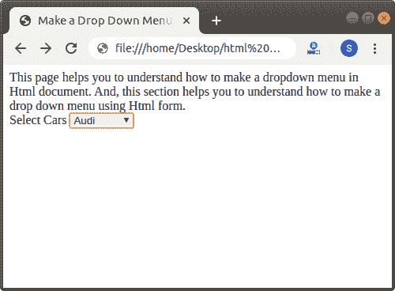

# 如何用 Html 制作下拉菜单

> 原文:[https://www . javatpoint . com/如何制作 html 下拉菜单](https://www.javatpoint.com/how-to-make-a-dropdown-menu-in-html)

在 HTML 中，我们可以使用以下不同的方法轻松地在 Html 文档中制作下拉菜单:

1.  使用 Html 表单
2.  使用内部 CSS

## 使用 Html 表单

如果我们想使用表单在 Html 文档中制作一个下拉菜单，我们必须遵循下面给出的步骤。使用这些步骤，我们可以轻松制作下拉菜单:

**第一步:**首先，我们必须在任何文本编辑器中键入 Html 代码，或者在文本编辑器中打开现有的 [Html](https://www.javatpoint.com/html-tutorial) 文件，我们希望在其中使用表单来制作下拉菜单。

```

<!Doctype Html>
<Html>   
<Head>    
<Title>   
Make a Drop Down Menu using Html Form
</Title>
</Head>
<Body> 
This page helps you to understand how to make a dropdown menu in Html document.
And, this section helps you to understand how to make a drop-down menu using Html form.
</Body> 
</Html>

```

**步骤 2:** 现在，我们必须将光标放在 Html 文档的主体标签中我们想要显示下拉菜单的那个点上。然后，我们必须在这一点上输入 [<表格>标签](https://www.javatpoint.com/html-form)。

```

<Body> 
This page helps you to understand how to make a dropdown menu in the Html document.
And, this section helps you to understand how to make a drop-down menu using Html form.
<form>

</form>
</Body>

```

**第三步:**现在，我们要定义 [<标签>标签](https://www.javatpoint.com/html-label-tag)和 [<选择>标签](https://www.javatpoint.com/html-select-tag)在开始和结束表单标签之间。

```

<form>
<label> Select Cars </label>
<select>

</select>
</form>

```

**步骤 4:** 现在，我们必须根据下拉菜单中显示的值的数量来定义选项标签。

```

<form>
<label> Select Cars </label>
<select>
<option value = "BMW"> BMW 
</option>
<option value = "Mercedes"> Mercedes 
</option>
<option value = "Audi"> Audi
</option>
<option value = "Skoda"> Skoda
</option>
</select>
</form>

```

**第五步:**最后，我们必须保存 Html 文件，然后运行该文件。

```

<!Doctype Html>
<Html>   
<Head>    
<Title>   
Make a Drop Down Menu using Html Form
</Title>
</Head>
<Body> 
This page helps you to understand how to make a dropdown menu in Html document.
And, this section helps you to understand how to make a drop down menu using Html form.
<form>
<label> Select Cars </label>
<select>
<option value = "BMW"> BMW 
</option>
<option value = "Mercedes"> Mercedes 
</option>
<option value = "Audi"> Audi
</option>
<option value = "Skoda"> Skoda
</option>
</select>
</form>
</Body> 
</Html>

```

[Test it Now](https://www.javatpoint.com/oprweb/test.jsp?filename=How-to-Make-a-Dropdown-Menu-in-Html-1)

下面的截图显示了上述 Html 代码的输出:



## 使用内部 CSS

如果我们想使用内部级联样式表在 Html 文档中制作一个下拉菜单，我们必须遵循下面给出的步骤。使用这些步骤，我们可以轻松制作下拉菜单:

**第一步:**首先，我们必须在任何文本编辑器中键入 Html 代码，或者在文本编辑器中打开现有的 Html 文件，在其中我们要使用[内部 CSS](https://www.javatpoint.com/internal-css) 来制作下拉菜单。

**第二步:**现在，我们必须将光标放在 Html 文档的**标题标签**中标题标签刚刚结束之后，然后定义 **<样式>** 标签内的样式，如下块所示。

现在，我们必须创建下拉菜单本身。因此，首先我们必须定义一个具有不同属性的类 dropbtn，如下块所示:

```

<style>
.dropbtn {
    background-color: yellow;
    color: black;
    padding: 10px;
    font-size: 12px;
}
</style>

```

**步骤 3:** 然后，我们必须使用另一个类来定义下拉列表。

```

.dropdown {
    display: inline-block;
    position: relative
}

```

**第 4 步:**现在，我们要创建另一个类，用来描述下拉菜单是如何出现的。该类包含各种属性，如下图所示。

```

.dropdown-content {
    position: absolute;
    background-color: lightgrey;
    min-width: 200px;
    display: none;
    z-index: 1;
}

```

**第 5 步:**现在我们必须在下拉菜单中添加另一个类来定义文本的颜色和大小。

```

.dropdown-content a {
    color: black;
    padding: 12px 16px;
    text-decoration: none;
    display: block;
}

```

**第 6 步:**最后在一个[风格的标签](https://www.javatpoint.com/html-style)中，我们必须编辑下拉菜单的悬停行为。因此，我们可以很容易地在样式标签中使用下面的代码进行编辑。

```

.dropdown-content a:hover {
    background-color: orange;
}
.dropdown:hover .dropdown-content {
    display: block;
}
.dropdown:hover .dropbtn {
    background-color: grey;
}

```

**第 7 步:**现在，我们必须将光标放在要显示下拉菜单的 body 标签中。然后，我们必须在 body 标签中插入以下代码。

```

<div class="dropdown">
<button class="dropbtn"> JavaTpoint Web Desiging Tutorials</button>
<div class="dropdown-content">
<a href="https://www.javatpoint.com/html-tutorial"> Html </a>
<a href="https://www.javatpoint.com/css-tutorial"> CSS </a>
<a href="https://www.javatpoint.com/javascript-tutorial"> JavaScript </a>
</div>
</div>

```

**第八步:**最后，我们要保存 Html 文件，然后在浏览器中运行该文件。

```

<!Doctype Html>
<Html>   
<Head>    
<Title>   
Make a Dropdown Menu using Internal CSS
</Title>
<style>
.dropbtn {
    background-color: yellow;
    color: black;
    padding: 10px;
    font-size: 12px;
}
.dropdown {
    display: inline-block;
    position: relative
}
.dropdown-content {
    position: absolute;
    background-color: lightgrey;
    min-width: 200px;
    display: none;
    z-index: 1;
}
.dropdown-content a {
    color: black;
    padding: 12px 16px;
    text-decoration: none;
    display: block;
}
.dropdown-content a:hover {
    background-color: orange;
}
.dropdown:hover .dropdown-content {
    display: block;
}
.dropdown:hover .dropbtn {
    background-color: grey;
}
</style>
</Head>
<Body> 
This page helps you to understand how to make a dropdown menu in Html document.
And, this section helps you to understand how to make a dropdown menu using Internal CSS. <br>
<div class="dropdown">
<button class="dropbtn"> JavaTpoint Web Desiging Tutorials</button>
<div class="dropdown-content">
<a href="https://www.javatpoint.com/html-tutorial"> Html </a>
<a href="https://www.javatpoint.com/css-tutorial"> CSS </a>
<a href="https://www.javatpoint.com/javascript-tutorial"> JavaScript </a>
</div>
</div>
</Body> 
</Html>

```

[Test it Now](https://www.javatpoint.com/oprweb/test.jsp?filename=How-to-Make-a-Dropdown-Menu-in-Html-2)

上述 Html 代码的输出如下图所示:


* * *