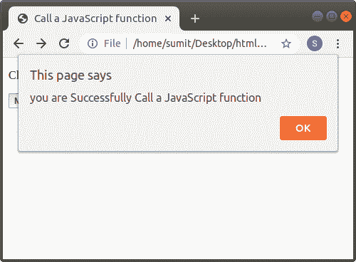

# 如何在 Html 中调用 JavaScript 函数

> 原文：<https://www.javatpoint.com/how-to-call-a-javascript-function-in-html>

如果我们想在 Html 中调用 JavaScript 函数，那么我们必须遵循下面给出的步骤。使用这些步骤，我们可以轻松访问 [JavaScript](https://www.javatpoint.com/javascript-tutorial) 功能。

**第一步:**首先我们要在 [<头部>标签](https://www.javatpoint.com/html-head)的开始和结束之间，就在标题标签之后键入脚本标签。然后，输入 [JavaScript 函数](https://www.javatpoint.com/javascript-function)。

```html

<Head>    
<Title>   
Call a JavaScript function
</Title>
<script type = "text/javascript">
         function msgprint() {
            alert("You are Successfully Called the JavaScript function");
         }
</script>
</Head>

```

**第二步:**之后，我们要调用 [Html](https://www.javatpoint.com/html-tutorial) 代码中的 javaScript 函数，在网页上显示信息或数据。因此，我们可以通过表单标签的输入标签中的名称来调用 JavaScript 的函数。

```html

<form>
         <input type = "button" onclick = "msgprint()" value = "Message Print"> 
      </form>   

```

**第三步:**最后，我们必须保存 Html 文件，然后运行调用 JavaScript 函数的文件。

```html

<!Doctype Html>
<Html>   
<Head>    
<Title>   
Call a JavaScript function
</Title>
<script type = "text/javascript">
         function msgprint() {
            alert("You are Successfully Called the JavaScript function");
         }
</script>
</Head>
<Body> 
<p>Click on the following button for calling the function: </p>      
      <form>
         <input type = "button" onclick = "msgprint()" value = "Message Print"> 
      </form>     
      <p>
</Body> 
</Html>

```

[Test it Now](https://www.javatpoint.com/oprweb/test.jsp?filename=how-to-call-a-javascript-function-in-html-1)

上述 Html 代码的输出如下图所示:



* * *