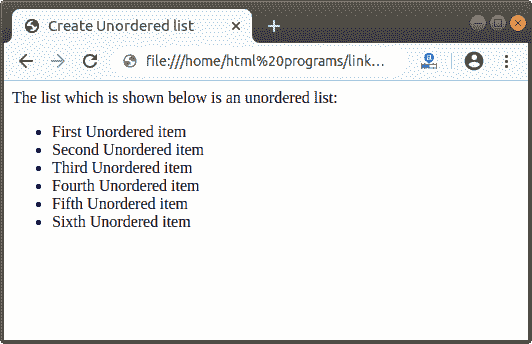
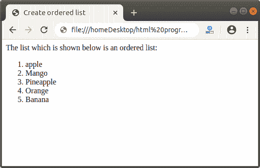
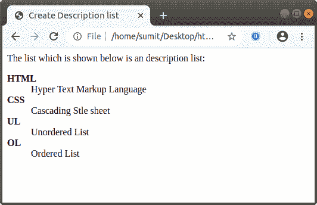

# 如何用 Html 制作列表

> 原文:[https://www.javatpoint.com/how-to-make-a-list-in-html](https://www.javatpoint.com/how-to-make-a-list-in-html)

在 Html 中，我们可以创建三种类型列表:

1.  无序列表
    *   有序列表
        1.  描述列表

        ## 无序列表

        无序列表是其顺序或顺序无关紧要的一个集合或一组项目。如果我们想在 [Html](https://www.javatpoint.com/html-tutorial) 文档中创建无序列表来显示网页上的项目，那么我们必须遵循下面给出的步骤。使用这些步骤，我们可以轻松创建一个[无序列表](https://www.javatpoint.com/html-unordered-list)。

        **第一步:**首先，我们必须在任何文本编辑器中键入 Html 代码，或者在我们想要创建无序列表的文本编辑器中打开现有的 Html 文件。

        ```

        <!Doctype Html>
        <Html>   
        <Head>    
        <Title>   
        Create Unordered list
        </Title>
        </Head>
        <Body> 
        The list which is shown below is an unordered list:
        </Body> 
        </Html>

        ```

        **第二步:**现在，我们必须将光标放在 [<正文>标签](https://www.javatpoint.com/html-body-tag)中我们想要显示无序列表的那个点上。然后，我们必须键入< ul >标签，用于创建无序列表。

        ```

        <Body> 
        <ul>
        </Body> 

        ```

        **第三步:**之后，我们要定义想要在网页上显示为无序的项目。为此，我们必须使用[><Li>标记](https://www.javatpoint.com/html-lists)。因此，在输入项目之前，请输入开头的< li >标签。并且，在输入每个项目后，我们必须关闭< li >标签。

        ```

        <Body> 
        <ul>
        <li> First Unordered item </li>
        <li> Second Unordered item </li>
        </Body> 

        ```

        **第 4 步:**当我们键入所有项目时，我们必须通过关闭标签来关闭列表。

        ```

        <Body> 
        <ul>
        <li> First Unordered item </li>
        <li> Second Unordered item </li>
        <li> Third Unordered item </li>
        <li> Fourth Unordered item </li>
        <li> Fifth Unordered item </li>
        <li> Sixth Unordered item </li>
        </ul> 
        </Body> 

        ```

        **第五步:**最后，我们要保存 Html 文件，然后在浏览器中运行该文件。

        ```

        <!Doctype Html>
        <Html>   
        <Head>    
        <Title>   
        Create Unordered list
        </Title>
        </Head>
        <Body> 
        The list which is shown below is an unordered list:
        <ul>
        <li> First Unordered item </li>
        <li> Second Unordered item </li>
        <li> Third Unordered item </li>
        <li> Fourth Unordered item </li>
        <li> Fifth Unordered item </li>
        <li> Sixth Unordered item </li>
        </ul>
        </Body> 
        </Html>

        ```

        [Test it Now](https://www.javatpoint.com/oprweb/test.jsp?filename=how-to-make-a-list-in-html-1)

        下面的截图显示了上述 Html 代码的输出:

        

        ## 有序列表

        如果我们想在 Html 文档中创建[有序列表](https://www.javatpoint.com/html-ordered-list)来按顺序显示网页上的项目，那么我们必须遵循下面给出的步骤。使用这些步骤，我们可以轻松创建有序列表。

        **第一步:**首先，我们必须在任何文本编辑器中键入 Html 代码，或者在我们想要创建有序列表的文本编辑器中打开现有的 Html 文件。

        ```

        <!Doctype Html>
        <Html>   
        <Head>    
        <Title>   
        Create ordered list
        </Title>
        </Head>
        <Body> 
        The list which is shown below is an ordered list:
        </Body> 
        </Html>

        ```

        **第二步:**现在，我们必须将光标放在<主体>标签中我们想要显示有序列表的那个点上。然后，我们必须输入< ol >标签，该标签用于以某种顺序显示项目。

        ```

        <Body> 
        <ol>
        </Body> 

        ```

        **第三步:**之后，我们要定义想要在网页上按顺序显示的项目。为此，我们必须使用< li >标签。所以，我们必须在输入每一项之前输入开头的< li >标签。并且，在输入每个项目之后，我们必须关闭< li >标签。

        ```

        <Body> 
        <ol>
        <li> apple </li>
        <li> Mango </li>
        </Body> 

        ```

        **第 4 步:**当我们键入所有项目时，我们必须通过关闭标签来关闭列表。

        ```

        <Body> 
        <ol>
        <li> apple </li>
        <li> Mango </li>
        <li> Pineapple </li>
        <li> Orange </li>
        <li> Banana </li>
        </ol>
        </Body> 

        ```

        **第五步:**最后，我们要保存 Html 文件，然后在浏览器中运行该文件。

        ```

        <!Doctype Html>
        <Html>   
        <Head>    
        <Title>   
        Create ordered list
        </Title>
        </Head>
        <Body> 
        The list which is shown below is an ordered list:
        <ol>
        <li> apple </li>
        <li> Mango </li>
        <li> Pineapple </li>
        <li> Orange </li>
        <li> Banana </li>
        </ol>
        </Body> 
        </Html>

        ```

        [Test it Now](https://www.javatpoint.com/oprweb/test.jsp?filename=how-to-make-a-list-in-html-2)

        下面的截图显示了上述 Html 代码的输出:

        

        ## 描述列表

        [描述列表](https://www.javatpoint.com/html-description-list)是项目及其描述和定义的列表。

        如果我们想在 Html 文档中创建描述列表来显示网页上的项目及其描述，那么我们必须遵循下面给出的步骤。使用这些步骤，我们可以轻松创建描述列表。

        **第一步:**首先，我们必须在任何文本编辑器中键入 Html 代码，或者在我们想要创建描述列表的文本编辑器中打开现有的 Html 文件。

        ```

        <!Doctype Html>
        <Html>   
        <Head>    
        <Title>   
        Create Description list
        </Title>
        </Head>
        <Body> 
        The list which is shown below is an description list:
        </Body> 
        </Html>

        ```

        **第二步:**现在，我们必须将光标放在<主体>标签中我们想要显示描述列表的那个点上。然后，我们必须输入< dl >标签，用于显示项目和描述。

        ```

        <Body> 
        <dl>
        </Body> 

        ```

        **第三步:**之后，我们必须定义我们想要在网页上的描述列表中显示的术语。为此，我们必须使用 **< dt >** 标记。因此，我们必须在键入每个术语之前键入开头的< dt >标签。并且，在输入每个项目之后，我们必须关闭< dt >标签。

        ```

        <Body> 
        The list which is shown below is an description list:
        <dl>
        <dt> <b> 
        HTML 
        </b> </dt>
        </Body> 

        ```

        **第四步:**然后，我们要定义每个术语的描述。为了定义描述，我们必须使用< dd >标签。因此，我们必须在每个术语的结束标记之后键入开始的<和>标记。并且，在输入每个描述之后，我们必须关闭<和>标签。

        ```

        <Body> 
        The list which is shown below is an description list:
        <dl>
        <dt> HTML </dt>
        <dd>
        Hyper Text Markup Language </dd>
        <dt> CSS </dt>
        <dd> Cascading Stle sheet </dd>
        <dt> UL </dt>
        <dd> Unordered List </dd>
        </Body> 

        ```

        **第 5 步:**当我们键入所有的术语及其描述时，我们必须通过关闭标签来关闭列表。

        ```

        <Body> 
        The list which is shown below is an description list:
        <dl>
        <dt> HTML </dt>
        <dd>
        Hyper Text Markup Language </dd>
        <dt> CSS </dt>
        <dd> Cascading Stle sheet </dd>
        <dt> UL </dt>
        <dd> Unordered List </dd>
        </dl>
        </Body> 

        ```

        **第六步:**最后，我们要保存 Html 文件，然后在浏览器中运行该文件。

        ```

        <!Doctype Html>
        <Html>   
        <Head>    
        <Title>   
        Create Description list
        </Title>
        </Head>
        <Body> 
        The list which is shown below is an description list:
        <dl>
        <dt> <b> 
        HTML 
        </b> </dt>
        <dd>
        Hyper Text Markup Language
        </dd>
        <dt> <b>
        CSS
        </b>
        </dt>
        <dd>
        Cascading Stle sheet
        </dd>
        <dt> <b>
        UL
         </b> </dt>
        <dd>
        Unordered List
        </dd>
        <dt> <b>
        OL
        </b>
        </dt>
        <dd>
        Ordered List
        </dd>
        </dl>
        </Body> 
        </Html>

        ```

        [Test it Now](https://www.javatpoint.com/oprweb/test.jsp?filename=how-to-make-a-list-in-html-3)

        上述 Html 代码的输出如下图所示:

        

        * * *