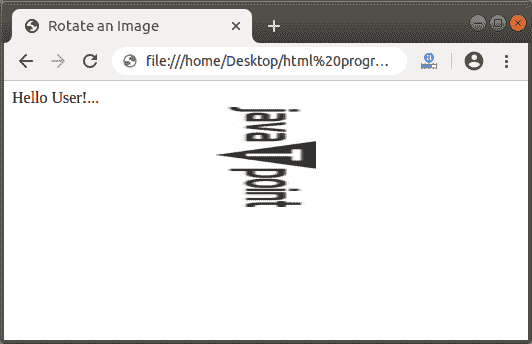

# 如何在 Html 中旋转图像

> 原文：<https://www.javatpoint.com/how-to-rotate-image-in-html>

如果我们想在 Html 中旋转图像，那么我们必须遵循下面给出的步骤。使用这些步骤，我们可以轻松地旋转图像。

**第一步:**首先，我们必须在任何文本编辑器中键入 [Html](https://www.javatpoint.com/html-tutorial) 代码，或者在我们想要旋转图像的文本编辑器中打开现有的 Html 文件。

```html

<!Doctype Html>
<Html>   

<Head>    
<Title>   
Rotate an Image
</Title>
</Head>
<Body> 
Hello User!... <br> <center>
 </center>
</Body> 
</Html>

```

**第二步:**现在，我们必须将光标放在 Html 文档的标题标签中，然后定义 **<样式>** 标签中的样式，如下图所示。然后，在任意类中输入**不同的**属性。CSS [样式标签](https://www.javatpoint.com/html-style)中的以下类包含有助于旋转图像的不同属性。

```html

<Head>    
<Title>   
Rotate an Image
</Title>
<style>
.rotate90 {
  -webkit-transform:rotate(90deg);
  -moz-transform: rotate(90deg);
  -ms-transform: rotate(90deg);
  -o-transform: rotate(90deg);
  transform: rotate(90deg);
}
</style>
</Head>

```

**第三步:**然后，我们必须在想要旋转的图像的< img >标签中定义类别。

```html


```

**第四步:**最后，我们要保存好这个 Html 文件，然后在[浏览器](https://www.javatpoint.com/browsers)中运行这个文件。

```html

<!Doctype Html>
<Html>   
<Head>    
<Title>   
Rotate an Image
</Title>
<style>
.rotate90 {
  -webkit-transform:rotate(90deg);
  -moz-transform: rotate(90deg);
  -ms-transform: rotate(90deg);
  -o-transform: rotate(90deg);
  transform: rotate(90deg);
}
</style>
</Head>
<Body> 
Hello User!... <br> <center>
 </center>
</Body>   
</Html>

```

[Test it Now](https://www.javatpoint.com/oprweb/test.jsp?filename=how-to-rotate-image-in-html-1)

上述 Html 代码的输出如下图所示:



* * *