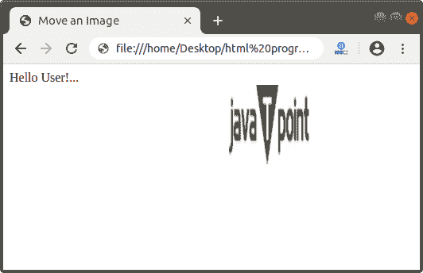

# 如何在 Html 中移动图像

> 原文:[https://www.javatpoint.com/how-to-move-image-in-html](https://www.javatpoint.com/how-to-move-image-in-html)

如果我们想在 Html 中移动图像，那么我们必须遵循下面给出的步骤。使用这些步骤，我们可以轻松移动图像。

**第一步:**首先，我们必须在任何文本编辑器中键入 [Html](https://www.javatpoint.com/html-tutorial) 代码，或者在我们想要移动图像的文本编辑器中打开现有的 Html 文件。

```

<!Doctype Html>
<Html>   
<Head>    
<Title>   
Move an Image
</Title>
</Head>
<Body> 
Hello User!... <br> <center>
 </center>
</Body> 
</Html>

```

**第二步:**现在，我们必须将光标放在想要移动的图像的 [< img >标签](https://www.javatpoint.com/html-image)之前。然后，我们必须键入 [<字幕>标签](https://www.javatpoint.com/marquee-html)。字幕标签用于移动网页上的东西。

```

<marquee>


```

第三步:在标记之后，我们必须关闭<marquee>标记。</marquee>

```

<marquee>
 </marquee>

```

第四步:最后，我们必须保存 Html 文件，然后在[浏览器](https://www.javatpoint.com/browsers)中运行该文件。

```

<!Doctype Html>
<Html>   
<Head>    
<Title>   
Move an Image
</Title>
</Head>
<Body> 
Hello User!... <br> <center>
<marquee>
 </marquee> </center>
</Body> 
</Html>

```

[Test it Now](https://www.javatpoint.com/oprweb/test.jsp?filename=how-to-move-image-in-html)

下面的截图显示了上述 Html 代码的输出:



* * *