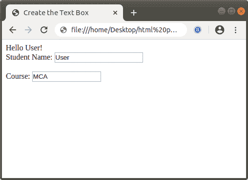

# 如何在 Html 中创建文本框

> 原文：<https://www.javatpoint.com/how-to-create-text-box-in-html>

如果我们想在 Html 文档中创建文本框，由用户在网页上插入字符，那么我们必须遵循下面给出的步骤。使用这些步骤，任何用户都可以轻松创建文本框。

**第一步:**首先，我们必须在任何文本编辑器中键入 [Html](https://www.javatpoint.com/html-tutorial) 代码，或者在我们想要创建文本框的文本编辑器中打开现有的 Html 文件。

```

<!Doctype Html>
<Html>
<Head>
<Title>
Create the Text Box
</Title>
</Head>
<Body>
Hello User! <br>
</Body>
</Html>

```

**第二步:**创建文本框首先要定义 [<表单>标签](https://www.javatpoint.com/html-form)，如果代码中没有定义的话。现在，我们必须将光标放在<表单>标签中想要创建文本框的位置。然后，我们要输入 [<，输入>标记](https://www.javatpoint.com/html-input-tag)。

```

<form>
Student Name:
<input >
<br> <br>
Course:
<input >
</form>

```

**第三步:**写完<输入>标签后，我们要用它的属性名为**的类型**。该属性指定要输入的数据类型。因此，为了创建文本框，我们必须在 type 属性中给出值“text”。

```

<form>
Student Name:
<input type="text" name="Name">
<br> <br>
Course:
<input type="text" name="Course">
</form>

```

**第四步:**如果我们想定义文本框的宽度，那么可以借助 size 属性来定义。

```

<form>
Student Name:
<input type="text" name="Name" size="20">
<br> <br>
Course:
<input type="text" name="Course" size="15">
</form>

```

**第五步:**最后，我们要保存 Html 文件，然后在浏览器中运行该文件。

```

<!Doctype Html>
<Html>   
<Head>    
<Title>   
Create the Text Box
</Title>
</Head>
<Body> 
Hello User! <br> 
<form>
Student Name:
<input type="text" name="Name" size="20">
<br> <br>
Course:
<input type="text" name="Course" size="15">
</form>
</Body> 
</Html>

```

[Test it Now](https://www.javatpoint.com/oprweb/test.jsp?filename=how-to-create-text-box-in-html)

上述 Html 代码的输出如下图所示:



* * *