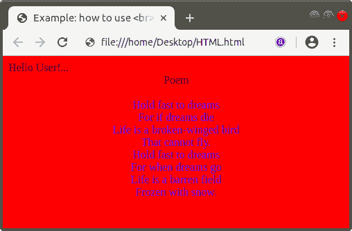
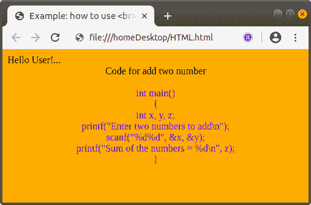

# 在 html 中，br 是什么意思

> 原文:[https://www.javatpoint.com/what-does-br-mean-in-html](https://www.javatpoint.com/what-does-br-mean-in-html)

br 是 Html 中的一个标记。Html **< br >** 标签用来断一行文字。当用户必须写诗、地址和代码样本时，这个标签很有用。

**< br >** 标签为空标签或未贴标签，即无需关闭该标签。但是在 [XHTML](https://www.javatpoint.com/xhtml-tutorial) 的代码中，我们必须关闭 [< br >标签](https://www.javatpoint.com/html-br-tag)。

我们可以通过一个例子很容易地理解 br 标签。所以，我们将提供以下两个例子。

**例 1:** 本例展示了如何在诗中使用< br >标签进行断链的代码。

```

<!Doctype Html>
<Html>   
<Head>    
<Title>   
Example: how to use <br> tag in poem
</Title>
</Head>
<Body bgcolor="red"> 
Hello User!...
<center>
Poem 
<br> <br>
<font color="blue">
Hold fast to dreams <br>    
For if dreams die <br>  
Life is a broken-winged bird <br>  
That cannot fly. <br>  
Hold fast to dreams <br>    
For when dreams go <br>    
Life is a barren field <br>    
Frozen with snow. <br>  
</center>
</Body> 
</Html>

```

[Test it Now](https://www.javatpoint.com/oprweb/test.jsp?filename=what-does-br-mean-in-html1)

以上 [Html](https://www.javatpoint.com/html-tutorial) 代码的输出如下截图所示:



**示例 2:** 该示例显示了如何在代码示例中使用< br >标签进行换行的代码。

```

<!Doctype Html>
<Html>   
<Head>    
<Title>   
Example: how to use <br> tag in code sample
</Title>
</Head>
<Body bgcolor="orange"> 
Hello User!...
<center>
Code for add two number
<br> <br>
<font color=" blue">
int main() <br> 
{ <br>
int x, y, z; <br>
printf("Enter two numbers to add\n"); <br>
scanf("%d%d", &x, &y);<br>
printf("Sum of the numbers = %d\n", z);<br>
}<br>
</center>
</Body> 
</Html>

```

[Test it Now](https://www.javatpoint.com/oprweb/test.jsp?filename=what-does-br-mean-in-html2)

上述 Html 代码的输出如下图所示:



* * *