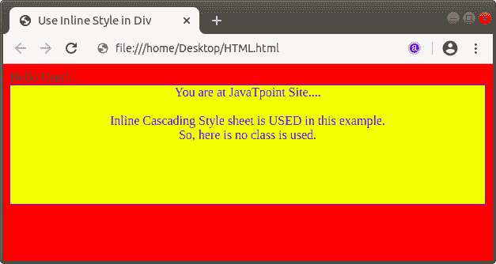
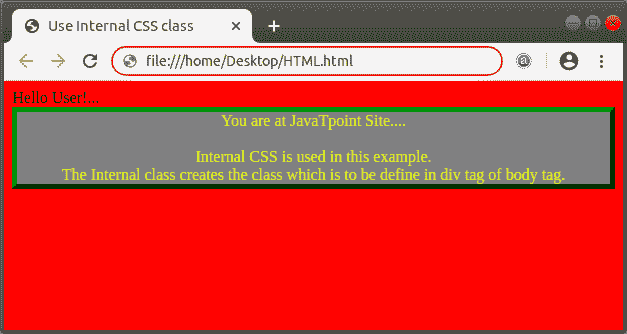

# Div 在 Html 中是什么意思

> 原文：<https://www.javatpoint.com/what-does-div-mean-in-html>

Div 是 Html 中的一个标签。Html **< Div >** 标签用于对网页中的内容进行划分或分段。 **< Div >** 标签是配对标签，因此必须关闭此标签。如果我们使用这个标签，那么对网页的布局或内容没有影响。

这个标签是一个通用容器和一个块级标签。这个标签基本上是用来对各种各样的 Html 标签进行分组或者集合，这样就可以创建划分，借助 [CSS](https://www.javatpoint.com/css-tutorial) 就可以轻松的将样式应用到它们上面。

#### 注意:标记不能应用在

段落标记内，因为如果我们在任何一点使用

标记，那么该标记会从该点断开段落。因此，如果我们想在段落内部应用样式，那么我们必须使用标签，它与内联元素一起使用。

我们可以通过例子很容易地理解 [< div >标签](https://www.javatpoint.com/html-div-tag)。因此，我们将提供以下各种示例。

**示例 1:** 本示例直接使用< div >标签中的内嵌 CSS 样式属性。

```

<!Doctype Html>
<Html>   
<Head>    
<Title>   
Use Inline Style in Div
</Title>
</Head>
<Body bgcolor="red"> 
Hello User!...
<div style="height:150px; width:600px; color:blue; 
            border:1px solid; background-color: yellow;">
<center>
You are at JavaTpoint Site.... 
<br> <br> 
Inline Cascading Style sheet is USED in this example. 
<br>
So, here is no class is used.
</center>
</div>
</Body> 
</Html>

```

[Test it Now](https://www.javatpoint.com/oprweb/test.jsp?filename=what-does-div-mean-in-html1)

以上 [Html](https://www.javatpoint.com/html-tutorial) 代码的输出如下截图所示:



**示例 2:** 本示例使用[内部 CSS](https://www.javatpoint.com/internal-css) 创建类，该类在 div 标签中使用。

```

<!Doctype Html>
<Html>   
<Head>    
<Title>   
Use Internal CSS class
</Title>
<style>	
.Divclass {
  border: 5px outset green;
  background-color: gray;    
  text-align: center;
  color: yellow;
}
</style>
</Head>
<Body bgcolor="red"> 
Hello User!...
<div class="Divclass">
You are at JavaTpoint Site.... 
<br> <br> 
Internal CSS is used in this example. <br>
The Internal class creates the class which is to be define in div tag of body tag.  
</div>
</Body> 
</Html>

```

[Test it Now](https://www.javatpoint.com/oprweb/test.jsp?filename=what-does-div-mean-in-html2)


* * *