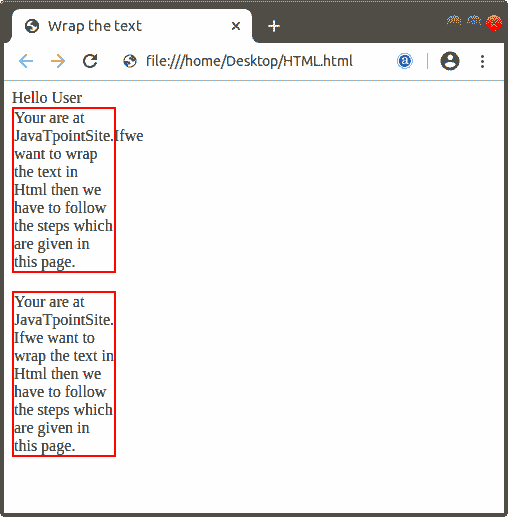

# 如何在 Html 中换行

> 原文：<https://www.javatpoint.com/how-to-wrap-text-in-html>

如果我们想用 Html 包装文本，那么我们必须遵循下面给出的步骤。使用这些步骤，任何用户都可以轻松地包装要在网页上显示的任何文本。

**第一步:**首先，我们必须在任何文本编辑器中键入 [Html](https://www.javatpoint.com/html-tutorial) 代码，或者在我们想要包装文本的文本编辑器中打开现有的 Html 文件。

```html

<!Doctype Html>
<Html>   
<Head>    
<Title>   
Wrap the text
</Title>
</Head>
<Body> 
 Hello User 
 Your are at JavaTpoint Site .
If we want to wrap the text in Html, then we have to follow the steps which are given on this page. 
</Body> 
</Html>

```

**第二步:**现在，我们必须使用**换行**属性。因此，我们必须将光标放在标题标签之后的标题标签之间。然后，我们必须在 [<样式>标记](https://www.javatpoint.com/html-style)中定义一个类和 [< div >标记](https://www.javatpoint.com/html-div-tag)扇区，如下图所示。

```html

<Head>    
<Title>   
Wrap the text
</Title>
<style>
div {
  width: 100px; 
  border: 2px solid red;
}
div.class_name {
  word-wrap: normal;
}
</style>
</Head>

```

**第三步:**现在，我们必须在文本之前定义那个类，我们想要包装它。

```html

<div class="a">Any text which we want to wrap </div> 

```

**第四步:**最后，我们必须保存文件并在[浏览器](https://www.javatpoint.com/browsers)中运行文件。

```html

<!Doctype Html>
<Html>   
<Head>    
<Title>   
Wrap the text
</Title>
<style>
div {
  width: 100px; 
  border: 2px solid red;
}
div.a {
  word-wrap: normal;
}
div.b {
  word-wrap: break-word;
}
</style>
</Head>
<Body> 
 Hello User 
 <div class="a">Your are at JavaTpointSite.Ifwe want to wrap the text in Html then we have to follow the steps which are given in this page. </div> <br>
   <div class="b">Your are at JavaTpointSite.Ifwe want to wrap the text in Html then we have to follow the steps which are given in this page. </div>
</Body> 
</Html>

```

[Test it Now](https://www.javatpoint.com/oprweb/test.jsp?filename=how-to-wrap-text-in-html1)

上述 Html 代码的输出如下图所示:



* * *